{0}------------------------------------------------

# TM

# TM

# RU L ES REFERENCE

VERSION 1.5.0 EFFECTIVE 12/11/2020

#### Summary of Changes

Changes are noted in blue text.

- Updated Glossary, Pages 2–22
- Incorporated Errata Section, Pages 23–31

# U S I N G T H I S RU L E S REFERENCE

This document is a reference for all *Star Wars: Armada* rules queries. Unlike the Learn to Play booklet, the Rules Reference booklet does not teach players how to play the game. Players should first read the Learn to Play booklet in its entirety and play the learning scenario, using this Rules Reference booklet when necessary.

This booklet contains four major sections:

#### GLOSSARY...................................... PAGE 2

The majority of this document is the glossary. This lists detailed rules and clarifications in alphabetical order by topic.

#### ERRATA AND FAQ.......................PAGE 23

This section includes errata to previously-published cards and rules as well as answers to rules questions that are not necessarily covered in the Glossary.

#### OPTIONAL RULES .......................PAGE 51

This section describes optional rules that players may agree to use, such as playing without a round limit and playing with more than two players.

#### INDEX.............................................PAGE 52

This section contains a comprehensive list of topics including some terms not listed as section headers in the glossary.

#### QUICK REFERENCE.....................PAGE 54

The back page of this reference lists the phases of the game in an easyto-reference format.

- Incorporated Frequently Asked Questions, Pages 32–36
- Incorporated Card Clarifications, Page 36–50
- Updated Quick Reference, Page 54
- Added Permission to Print or Photocopy, Page 54

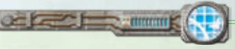

#### The Golden Rules

This Rules Reference booklet is the definitive source of rules information for *Star Wars: Armada*. If something in this booklet contradicts the Learn to Play booklet or older versions of this booklet, the current Rules Reference booklet is correct.

Effects on components such as cards sometimes contradict rules found in the Learn to Play or Rules Reference booklets. In these situations, the component's effect takes precedence.

If a card effect uses the word "cannot," that effect is absolute.

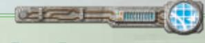

#### Ship and Upgrade Card Sizes

*Star Wars: Armada* ship and upgrade cards were printed at different sizes prior to the introduction of the Galactic Republic and Separatist Alliance factions (tarot-size for ship cards; minisize for upgrade cards). For all factions, future cards of these types are being printed in a standard-sized card format to match other card types in the game.

Regardless of their size, previously printed ship and upgrade cards remain legal game components. However, tournament players are expected to familiarize themselves with the errata that have been made to some upgrade cards (see pages 23–27). The *Star Wars: Armada Upgrade Card Collection* provides updated versions of all upgrades previously printed as mini cards, including these errata.

1

{1}------------------------------------------------

# G L O S S A RY

This glossary provides players with detailed rules for all *Star Wars: Armada* gameplay terms and phrases. Glossary entries are organized in alphabetical order by topic. If a player is unable to find a topic, use the index on page 52.

#### ACTIVATION

See "Ship Activation" and "Squadron Activation."

#### ARMAMENT

The attacker's armament indicates the color and number of dice that can be used during an attack. Anti-squadron armament is used when attacking a squadron. Battery armament is used when attacking a ship.

- Each hull zone of a ship has its own battery armament that it uses when the ship attacks from that hull zone.
- Each squadron has a single battery armament
- A ship has one anti-squadron armament that is used regardless of which hull zone is attacking.
- A battery armament or anti-squadron armament with a "–" value has no dice.

**Related Topics:** Attack, Attack Pool, Attack Range

#### ATTACK

To perform an attack with a squadron or ship, resolve the following steps:

- 1. **Declare Target:** The attacker declares the defender and the attacking hull zone, if any. If the defender is a ship, the attacker declares the defending hull zone. Measure line of sight to the defender to ensure the attack is possible and to determine if it is obstructed.

  - ◊ If the attacker is a ship, the defending squadron or hull zone must be inside the attacking hull zone's firing arc and at attack range of the attacking hull zone.
  - ◊ If the attacker is a squadron, the defending squadron or hull zone must be at distance 1.

- 2. **Roll Attack Dice:** Gather attack dice to form the attack pool and roll those dice. Gather only the dice that are appropriate for the range of the attack as indicated by the icons on the range ruler.

  - ◊ If the defender is a ship, gather the attack dice indicated in the attacking hull zone's or squadron's battery armament.
  - ◊ If the defender is a squadron, gather the attack dice indicated in the attacker's anti-squadron armament.
  - ◊ If the attacker cannot gather any dice appropriate for the range of the attack, the attack is canceled.

- 3. **Resolve Attack Effects:** The attacker can resolve attack effects as described below:

  - ◊ *Modify Dice:* The attacker can resolve any of its effects that modify its dice. This includes card effects and the P command.
  - ◊ *Spend Accuracy* **(**G**)** *Icons:* The attacker can spend one or more of its G icons to choose the same number of the defender's defense tokens. The chosen tokens cannot be spent during this attack.

- 4. **Spend Defense Tokens:** The defender can spend one or more of its defense tokens.

- 5. **Resolve Damage:** The attacker can resolve one of its critical effects. Then the attacker determines the total damage amount. Then the

- defending squadron or hull zone suffers that total damage, one point at a time.

- ◊ If the attacker or defender is a squadron, the damage is the sum of all F icons.

- ◊ If the attacker **and** defender are ships, the damage is the sum of all F and E icons.

- ◊ Each ship has the following standard critical effect: "E\*\*:\*\* If the defender is dealt at least one damage card by this attack, deal the first damage card faceup."

- 6. **Declare Additional Squadron Target:** If the attacker is a ship and the defender was a squadron, the attacker can declare another enemy squadron as a defender and repeat steps 2 through 6. The new defender must be inside the firing arc and at attack range of the same attacking hull zone, and the attacker must measure line of sight to it as normal. Each enemy squadron can be targeted only once per attack.

  - ◊ Treat each repetition of steps 2 through 6 as a new attack for the purposes of resolving card effects.

- A ship can perform two attacks during its activation, but it cannot attack from the same hull zone more than once per activation.

- A ship can attack the same target with different attacks.

- A ship can attack an engaged squadron.

- Ships and squadrons cannot attack friendly ships and squadrons.

**Related Topics:** Attack Range, Critical Effects, Damage, Engagement, Firing Arc, Line of Sight, Measuring Firing Arc and Range, Modifying Dice, Range and Distance

#### ATTACK POOL

During an attack, the attack pool is comprised of all dice being used for that attack. This includes the dice gathered prior to rolling as well as the dice after they are rolled.

**Related Topics:** Attack, Modifying Dice

#### ATTACK RANGE

Attack range is the range at which a squadron or a ship's hull zone can perform an attack as determined by the armament it is using.

- A hull zone's maximum attack range is close range if it has only black dice in its armament, medium range if it has at least one blue die, or long range if it has at least one red die.
- Each squadron's attack range is distance 1.

**Related Topics:** Measuring Firing Arc and Range, Range and Distance

#### ATTACKING STATIONS

Some objective cards refer to attacking the station, or to stations performing attacks. The "Armed Station" card is used when playing with those objectives to track damage to the stations and indicate their armament. © FFG © LFL

A station consists of a station token (from the *Armada Core Set* or a fleet expansion) and station card. A station card is similar to a squadron card, but it only has a hull value, anti-squadron armament, battery armament, and rules reminder text. Stations are treated as ships when resolving effects. Stations use the following rules when they are attacked or perform an attack: *Station Card*

Armed StAtion 13

{2}------------------------------------------------

- **Hull Zone:** A station is treated as a ship with one hull zone while it is attacking or defending.
  - **Damage:** When a station suffers damage, deal a facedown damage card to the station for each point of damage suffered. A station cannot have faceup damage cards. When a station has damage cards equal to or greater than its hull value, it is immediately destroyed. Ships and squadrons cannot resolve critical effects while attacking a station.
  - **Destroyed Stations:** When a station is destroyed, **do not** remove it from the play area. The station continues to obstruct line of sight, but counts as destroyed for the objective. A destroyed station cannot perform attacks and does not have the ability to discard damage cards or recover hull points for ships and squadrons that overlap it.
  - **Firing Arc:** Each station has a 360º firing arc.
  - **Line of Sight:** When tracing line of sight to or from a station, trace the line using the point of the token that is closest to the opposing squadron or hull zone.
    - ◊ The armed station may attack and draw line of sight to ships and squadrons overlapping it.
      - - While the armed station is attacking, if the defender is a ship overlapping the armed station, the armed station may attack and draw line of sight to any of the defender's hull zones.
    - ◊ Attacks that draw line of sight through a station are obstructed.
      - - The armed station cannot obstruct its own attacks.
    - ◊ A ship or squadron that is overlapping a station cannot declare an attack against that station.

**Related Topics:** Attack Range, Damage, Critical Effects, Firing Arc, Line of Sight, Measuring Firing Arc and Range, Obstacles, Obstructed, Range and Distance, Ship

#### CHAFF TOKENS

Some effects refer to chaff tokens. The player controlling the equipped ship places that token on one of that ship's hull zones to mark that effect.

The reverse side of this token is blue, and is referred to as a focus token.

*Chaff/Focus Token (Double Sided)*

**Related Topics:** Focus Tokens, Hull Zones

#### COMMAND DIALS

When a ship is activated, its owner reveals that ship's top command dial and places it next to the ship in the play area. It can be spent immediately to assign the corresponding command token to that ship, or it can be spent at the appropriate time to resolve that command.

- After a ship finishes its activation, if it did not spend its command dial, that dial is discarded.
- When a command dial is spent or discarded, it is placed faceup on the ship's ship card and remains there until it is assigned as a new command during the next Command Phase.
- A ship with a faceup command dial on its ship card cannot be activated.
- A player can look at their ships' facedown command dials at any time. When a player looks at a ship's command dials, they must preserve the order in which the command dials are stacked.
- When a ship gains an additional command dial from an effect during its activation, that dial can be spent immediately to assign the corresponding command token to that ship, or it can be spent at the appropriate time to resolve that command.

◊ A ship reveals only the top facedown command dial assigned to it. Additional dials that ship gains are not revealed for the purposes of resolving other effects.

**Related Topics:** Command Phase, Command Tokens, Commands

#### COMMAND PHASE

During this phase, players secretly and simultaneously choose commands on their command dials and assign them facedown to their ships.

- A ship must be assigned command dials until it has a number of command dials equal to its command value. This may require that more than one dial be assigned to a ship, such as during the first round of the game.
- When assigning a command dial to a ship, the dial is placed under any other command dials already assigned to that ship.

**Related Topics:** Commands, Command Dials, Command Tokens

#### COMMAND TOKENS

When a ship's command dial is revealed, that dial can be spent to assign the corresponding command token to that ship. Command tokens can be spent at the appropriate time to resolve the lesser effect of that command.

- A command token is assigned to a ship by placing it next to the ship in the play area.
- When a ship is assigned a command token, if it has more command tokens than its command value, it must immediately discard one of its command tokens.
- When a ship is assigned a command token, if it already has a copy of that command token, it must immediately discard that command token.
- A command token can be spent during the same round in which it was gained.
- When a command token is spent, return it to the supply.

**Related Topics:** Commands

#### COMMANDERS

A commander is a special type of upgrade card with the T icon on its card back and no upgrade icon in the lower-left corner of the card front.

- A commander can be equipped to any non-flotilla ship.
- A fleet cannot have more than one commander.
- A ship with a commander equipped is a flagship.

**Related Topics:** Flagship, Fleet Building, Flotillas, Upgrade Cards

#### COMMANDS

A ship can resolve the effect of a command by spending a command dial or command token with the matching icon at the appropriate time. The effect of the command is based on which component was spent:

- M **Navigate:** Resolve during the "Determine Course" step of movement.
  - ◊ **Dial:** Increase or decrease the ship's speed by one, and/or increase the yaw value of one joint by one for this maneuver.
  - ◊ **Token:** Increase or decrease the ship's speed by one.

{3}------------------------------------------------

- O **Squadron:** Resolve after revealing the ship's command dial.
  - ◊ **Dial:** Activate a number of friendly squadrons up to the ship's squadron value that are at close–medium range of the ship. Each squadron activated in this way can attack and move in either order. The squadrons are chosen and activated one at a time.
  - ◊ **Token:** Activate one squadron as described above.
- Q **Repair:** Resolve after revealing the ship's command dial.
  - ◊ **Dial:** Gain engineering points equal to the ship's engineering value and spend them on the following repair effects.
    - - **Move Shields:** Spend one point to move one shield by reducing one of the ship's hull zone's shield dials by one and then increasing another of its hull zone's shields by one (without exceeding its maximum shield value).
    - - **Recover Shields:** Spend two points to recover one shield on any of the ship's hull zones (without exceeding its maximum shield value).
    - - **Repair Hull:** Spend three points to choose and discard one of the ship's faceup or facedown damage cards.
  - ◊ **Token:** Gain engineering points equal to half of the ship's engineering value, rounded up, to spend on the above repair effects.
  - ◊ A ship can resolve repair effects in any order.
  - ◊ A ship can pay for and resolve each effect multiple times if it has the engineering points to do so.
  - ◊ When a ship resolves a Q command, it must completely resolve one repair effect before paying for and resolving another. For example, if a ship has five engineering points, it can discard one "Capacitor Failure" damage card and then recover one shield in a hull zone with no shields remaining.
  - ◊ After a ship resolves a Q command, it loses any remaining engineering points. Engineering points do not persist from round to round.
- P **Concentrate Fire:** Resolve during the "Resolve Attack Effects" step of an attack.
- ◊ **Dial:** Add one attack die to the attack pool. That die must be of a color that is already in the attack pool.
- ◊ **Token:** Reroll one attack die in the attack pool.
- A ship cannot resolve the same command more than once per round.
- A ship can spend both a command dial and a command token to combine their effects. Doing so counts as a single resolution of the command. For example, a ship can increase its speed twice by spending a M command dial and a M command token.
  - ◊ A ship must decide whether it is spending the dial, the token, or both before resolving that command's effects.
- A player can resolve numerous commands in the same round, such as by spending a Q command token and a O command token during the "Reveal Command Dial" step of activation, and then spending a M command dial during the "Determine Course" step of movement.
- A ship can resolve a command and choose not to produce its effect. It still counts as resolving that command, such as for the purpose of triggering upgrade cards.

**Related Topics:** Attack, Command Dials, Effect Use and Timing, Shields, Ship Movement, Upgrade Cards

#### CRITICAL EFFECTS

A critical effect, denoted by the "E:" header, can resolve if there is at least one E icon in the attack pool.

- The attacker can resolve only one critical effect per attack.
- The attacker does not spend a die icon to resolve a critical effect unless the effect says otherwise.
- Critical effects resolve at the beginning of the "Resolve Damage" step of an attack.
- The standard critical effect is "E: If the defender is dealt at least one damage card by this attack, deal the first damage card faceup."
- Squadrons cannot resolve or suffer critical effects unless otherwise specified.

**Related Topics:** Attack, Damage, Dice Icons, Modifying Dice

#### DAMAGE

Ships and squadrons can suffer damage from attacks, obstacles, and other game effects.

- When a squadron suffers damage, reduce its hull points by the damage amount. To indicate this, rotate its squadron disk so that the plastic pointer on the support peg points to the squadron's remaining hull points.
- When a ship suffers damage, it suffers that damage one point at a time. For each point, reduce the shields in the defending hull zone by one. If the defending hull zone has no shields to lose, deal a facedown damage card to the ship instead.
- When a ship has damage cards equal to its hull value, it is immediately destroyed.
- When a ship suffers damage and a hull zone isn't specified, the ship's owner chooses which hull zone suffers all of that damage.
- Faceup damage cards have either an effect that must be resolved immediately when the card is dealt or a persistent effect that applies while the card is faceup.
- Faceup damage cards remain faceup unless an effect flips them facedown. While a damage card is faceup, its effect applies to the ship.
- Facedown damage cards remain facedown unless an effect flips them faceup. While a damage card is facedown, players cannot look at its effect.
- Damage cards are dealt one at a time.
- If there are no cards remaining in the damage card deck when a damage card must be drawn or looked at, shuffle the discard pile to form a new damage deck.
- Each damage card has either the "Ship" or "Crew" trait. These traits have no inherent effect, but card effects may refer to them.

**Related Topics:** Attack, Destroyed Ships and Squadrons

#### DEFENSE TOKENS

Ships and unique squadrons gain the defense tokens indicated on their ship and squadron cards during setup and place them next to their corresponding cards. Defense tokens can be spent by the defender during the "Spend Defense Tokens" step of an attack to produce the effects described below:

• **Redirect** B\*\*:\*\* The defender chooses one of its hull zones adjacent to the defending hull zone. When the defender suffers damage from this attack, it may suffer any amount of damage on the chosen zone's

{4}------------------------------------------------

shields (up to the shields remaining on that zone) before it must suffer the remaining damage on the defending hull zone.

- **Evade** D\*\*:\*\* At long range, the defender cancels one attack die of its choice. At medium and close range, the defender chooses one attack die to be rerolled.
  - ◊ While defending at extreme range (beyond the length of the range ruler), the defender resolves the long-range effect and cancels one additional attack die.
  - ◊ While defending at distance 1–2, the defender resolves the effect for medium and close range.
  - ◊ When a ship spends an D token while defending against a ship of a larger size class, it may cancel or reroll one additional attack die, as appropriate for the attack's range. If it does, discard the spent token, whether it is readied or exhausted.
- **Contain** &**:** If the defender is a ship, the attacker is prevented from resolving the standard critical effect. The attacker can still resolve a non-standard critical effect, such as one granted by an upgrade card.
- **Salvo** e\*\*:\*\* If the defender is a ship, it performs a **salvo** attack after the "Resolve Damage" step of this attack. If the attacker was a ship, the defender performs a **salvo** attack against the attacking hull zone using the defender's printed rear battery armament. If the attacker was a squadron, the defender performs a **salvo** attack against the attacker using its printed anti-squadron armament.
  - ◊ The effect of the e defense token cannot be resolved during a **counter**, **salvo**, or **ignition** attack.
  - ◊ During a **salvo** attack, the attack range and line-of-sight are treated as the same as those of the original attack, and firing arcs are ignored.
  - ◊ Dice cannot be added to a **salvo** attack. (Other dice modifications still apply.)
  - ◊ During a **salvo** attack, only the standard critical effect can be resolved.
  - ◊ If the ship that spent the e defense token is destroyed before performing a **salvo** attack, it performs the **salvo** attack before it is removed.
- **Brace** C\*\*:\*\* When damage is totaled during the "Resolve Damage" step, the total is reduced to half, rounded up.
- **Scatter** A\*\*:\*\* The defender cancels all attack dice.
- Defense tokens begin the game on their readied side. When a readied defense token is spent, it is flipped to its exhausted side. When an exhausted defense token is spent, it is discarded.
- If the defender's speed is "0," it cannot spend defense tokens.
- The defender cannot spend more than one defense token of each type per attack.
- A defense token cannot be spent more than once during an attack.
- Defense tokens can be spent as part of a cost for upgrade card effects. If spent in this way, a defense token does not produce its normal effect.

**Related Topics:** Attack, Size Class, Status Phase, Range and Distance

#### DEPLOYMENT ZONE

A player's deployment zone is the portion of the setup area that is within distance 1–3 of their edge of the play area.

**Related Topics:** Play Area, Setup, Setup Area

#### DESTROYED SHIPS AND SQUADRONS

A ship is destroyed when it has damage cards equaling or exceeding its hull value. A squadron is destroyed when it is reduced to zero hull points. Additionally, a ship or squadron is destroyed if a portion of its base is outside the play area.

- When a squadron is destroyed, remove it from the play area and place it next to the matching squadron card.
- When a ship is destroyed, remove it from the play area and place it next to the matching ship card. Discard its damage cards to the discard pile and return its tokens and dials to the supply.
- Destroyed ships and squadrons are no longer in play. All ship and upgrade cards belonging to destroyed ships are inactive. All squadron cards belonging to destroyed unique squadrons are inactive. Squadrons cards for destroyed non-unique squadrons are inactive when the last non-unique squadron of that type is destroyed.
- When determining if a squadron or ship is outside the play area, ignore the squadron's activation slider and the ship's shield dials and the plastic portions of the base that frame the shield dials.

**Related Topics:** Damage, Play Area

#### DICE ICONS

Attack dice have the following effects during an attack:

- **Hit** F\*\*:\*\* This icon adds one damage to the damage total.
- **Critical** E\*\*:\*\* If the attacker and defender are ships, this icon adds one damage to the damage total and can trigger a critical effect.
- **Accuracy** G\*\*:\*\* The attacker can spend this icon to choose one of the defender's defense tokens. The chosen defense token cannot be spent during this attack.
- A blank face is a die face with no icons on it.
- If players are instructed to roll dice for a purpose other than an attack, the icons on the die have no inherent effects.

**Related Topics:** Attack, Critical Effects, Defense Tokens, Modifying Dice

#### DISTANCE

See "Range and Distance."

#### EFFECT USE AND TIMING

Each effect in the game has a timing during which it can resolve. This timing is usually specified within the effect, though some effects use the more specific timing described in this section.

- An effect that modifies attack dice can only be resolved during the "Resolve Attacks Effects" step of an attack unless another timing is specified.
- "E:" effects are critical effects that can be resolved at the start of the "Resolve Damage" step of an attack.
- Effects with a command icon as a header, such as "M:," can be resolved once while the ship is resolving the matching command.
- A "when" effect occurs at the moment that the specified event occurs and cannot occur again for that instance of the event.
- A "while" effect can be resolved during the specified event and cannot occur again during that instance of the event.
- A "before" effect occurs immediately before the specified event and cannot occur again for that instance of the event.
- An "after" effect occurs immediately after the specified event and cannot occur again for that instance of the event.

{5}------------------------------------------------

- If two or more of a player's effects have the same timing, that player can resolve those effects in any order.
- If both players have effects with the same timing, the first player resolves all of their effects with that timing first.
- Resolving an upgrade card effect is optional unless otherwise specified. All other card effects are mandatory unless otherwise specified.
- If a dial, token, die, or other component is spent as part of a card effect's cost, that component does not also produce its normal effect.
- Ships and squadrons cannot spend command dials, command tokens, or defense tokens belonging to other ships or squadrons.
- During setup, card effects can be resolved only if they are an objective card effect or an effect that specifies a timing during setup.
  - ◊ During setup, ships and squadrons that have not yet been deployed are in play, and their ship, squadron, and upgrade cards are active, unless that ship or squadron has been destroyed or set aside.
- When a card is discarded or flipped facedown, its effect is no longer active in the game.

**Related Topics:** Critical Effects, Modifying Dice, Squadron Keywords, Upgrade Cards

#### ENGAGEMENT

While a squadron is at distance 1 of one or more enemy squadrons, it is engaged with all of those enemy squadrons.

- An engaged squadron cannot move.
- When a squadron attacks, it must attack an engaged squadron if possible rather than an enemy ship.
- A squadron does not engage ships or friendly squadrons.
- If line of sight between two squadrons is obstructed, those squadrons are not engaged even if at distance 1 of each other, though they can still attack each other.
- A squadron is no longer engaged if the last squadron engaged with it is destroyed.
- Squadrons do not engage other squadrons while moving even if a portion of the range ruler is at distance 1 of an enemy squadron. Only the starting and final positions matter for engagement.

**Related Topics:** Obstructed, Squadron Movement

#### EXHAUSTED

Cards and defense tokens can be exhausted. Exhausted cards and defense tokens cannot be exhausted again.

- To exhaust an upgrade card, rotate it 90° clockwise.
- To exhaust a defense token, flip it from its readied side to its exhausted side.
- When a card or defense token is readied, it is no longer exhausted.

**Related Topics:** Defense Tokens, Readied, Status Phase, Upgrade Cards

#### FACTION

There are four factions in the game: the Rebel faction, the Imperial faction, the Galactic Republic faction, and the Separatist Alliance faction. A ship or squadron is aligned with a faction if its ship card or squadron card displays the faction's icon. An upgrade card is aligned with a faction if it displays the faction's icon next to the fleet point cost.

**Related Topics:** Fleet Building, Upgrade Cards

#### FIRING ARC

Each ship token has four printed firing arc lines which define its four firing arcs, one for each hull zone.

- Firing arcs are infinite; they do not end at the end of the range ruler.
- A firing arc includes the width of the firing arc lines that border it.
- Each squadron has a 360° firing arc.

**Related Topics:** Hull Zones, Measuring Firing Arc and Range

#### FIRST PLAYER

The first player is the player with initiative.

**Related Topics:** Initiative, Objective Cards, Second Player

#### FLAGSHIP

A flagship is a ship equipped with a commander card. Some objective cards include special rules for flagships.

- Any ship can be a flagship regardless of the upgrade icons in its upgrade bar.
- A fleet must have one flagship and cannot have more than one.
- Each flagship must be assigned a flagship ID token pair of the appropriate faction.

**Related Topics:** Commanders, ID Tokens, Objective Cards

#### FLEET BUILDING

Each player builds a fleet by choosing ships, squadrons, and upgrade cards whose total fleet point cost does not exceed the total agreed upon by the players. The fleet point cost of each ship, squadron, and upgrade is printed in the lower-right corner of the card.

As part of building a fleet, each player must choose three objective cards, one from each category.

- The standard fleet point total is 400 points. If playing with just the core set, the recommended fleet point total is 180.
- Players may build fleets of any fleet point total as long as they both agree on the total.
- A fleet must be aligned with a faction, such as Rebel-aligned or Imperial-aligned. It cannot contain any ships, squadrons, or upgrades that are aligned with another faction.
  - ◊ Some cards have a dual faction affiliation, indicated by a split faction symbol that shows both of the factions that card is affiliated with. A fleet of either of those factions can equip that card.
- A fleet must have one flagship and cannot have more than one flagship.
- A ship cannot equip more than one copy of the same upgrade card.
- A fleet cannot spend more than one third of its fleet points, rounded up, on squadrons.
- A fleet can contain **one** unique squadron with defense tokens for each 100 points of the agreed fleet-point total.

**Related Topics:** Commanders, Faction, Flagship, Objective Cards, Upgrade Cards

#### FLOTILLAS

Some ships are flotillas. Ships of this type feature two plastic ship models (instead of one). Flotillas follow the same rules as other ships with the following exceptions:

{6}------------------------------------------------

- When a flotilla would overlap another ship (or be overlapped by another ship), deal one facedown damage card to the flotilla. Do not deal a facedown damage card to the closest ship the flotilla overlapped (or that overlapped it) unless that ship is also a flotilla.
- A flotilla cannot equip a **(a)** (commander) upgrade card.

Related Topics: Overlapping, Ship

#### **FOCUS TOKENS**

Some effects refer to focus tokens. The player controlling the equipped ship places that token on one of that ship's hull zones to mark that effect.

The reverse side of this token is red, and is referred to as a chaff token.

Related Topics: Chaff Tokens, Hull Zones

#### FRIENDLY AND ENEMY

All ships and squadrons in the same fleet are friendly to each other. All ships and squadrons in an opposing fleet are enemy ships and squadrons.

A ship or squadron is friendly to itself and can be targeted by an\\neffect that specifies a friendly target unless it explicitly specifies
"another" ship or squadron.

Related Topics: Ship, Squadron, Upgrade Cards

#### **GRAV TOKENS**

Some upgrade cards refer to grav tokens. The player controlling the equipped ship places these tokens in the play area to mark that card's effect. These tokens are double-sided so players with the same upgrade can differentiate which token belongs to each player.

**Related Topics:** Play Area, Upgrade Cards

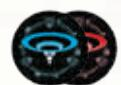

Grav Well Token

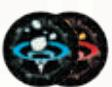

Grav Shif Token

#### **HUGE SHIP**

Huge ships follow all the rules governing ships. A huge ship consists of two ship bases, a ship model, a ship token, and a ship sheet. A ship sheet contains the same elements as other ship cards and is treated as a ship card for the purposes of rules and game effects.

Several additional rules are also used when playing with huge ships.

• Firing Arcs: A huge ship has six firing arcs. In addition to the front, left, right, and rear firing arcs, huge ships have two auxiliary firing arcs: right-auxiliary and left-auxiliary.

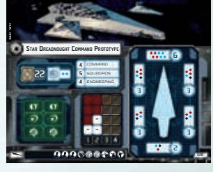

Star Dreadnought Command Prototype Ship Sheet

- Hull Zones: A huge ship has six
  Ship Sheet
  hull zones. In addition to the front, left, right, and rear zones, huge ships have two auxiliary hull zones: right-auxiliary and left auxiliary. These auxiliary hull zones are adjacent to the hull zones specified below.
  - The right-auxiliary hull zone is adjacent to the right and rear hull zones.
  - ♦ The left-auxiliary hull zone is adjacent to the left and rear hull zones

Game effects that specifically refer to the left or right hull zones do not apply their effects to the auxiliary hull zones.

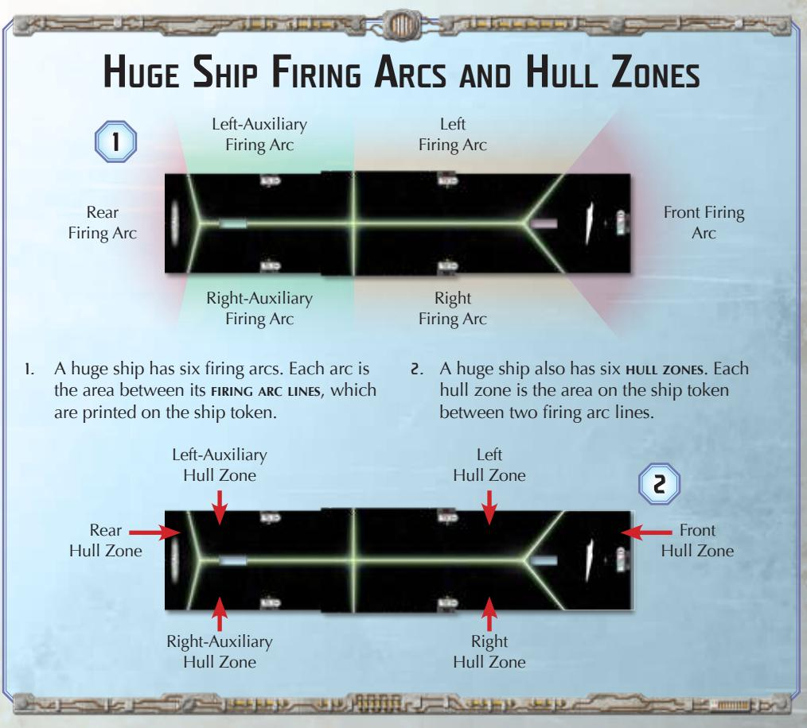

{7}------------------------------------------------

- **Setup:** During the "Deploy Ships" step, when a player deploys a huge ship, part of its base must be touching that player's play area edge. The huge ship may extend outside of that player's deployment zone but its base must be completely within the setup area.
  - ◊ A huge ship cannot be deployed overlapping obstacles.
  - ◊ Squadrons placed within distance 1–2 of a huge ship that extends beyond its player's deployment zone must also be placed within distance 1–2 of that player's deployment zone.

# Huge Ship Setup 1. The Imperial player deploys their ship so that the back-left corner of the ship's rear base is touching their edge. 2. The Imperial player later deploys two TIE Fighter squadrons so that the squadrons are within distance 1–2 of the ship and within distance 1–2 of their deployment zone. 1 2

- **Command Dials:** When a huge ship reveals its command dial, also assign the corresponding command token to that ship.

- **Attack:** A huge ship can perform up to three attacks during its activation (instead of up to two). It cannot attack from the same hull zone more than once per activation.

- **Ship Movement:** The following rules modify the ship movement rules and apply only to huge ships.

  - ◊ **Determine Course:** Due to the size of huge ships, some maneuvers cause the ship to overlap the maneuver tool whether it is placed on either side of the ship. When performing the determine course step of the ship's maneuver, any course that would cause the ship to overlap the maneuver tool is an illegal maneuver and cannot be performed. Determine a different course instead.

- ◊ **Move Ship:** When placing the maneuver tool, insert the guides of the first segment into the notches on one side of the **rear** ship base (instead of the front ship base). When placing the ship at the joint corresponding to its speed, slide the notches of the rear ship base over the guides at that joint.

- **Scoring:** When players determine their scores at the end of the game, a player's score includes half of the total fleet point cost (rounded up) of each **crippled** enemy huge ship in the play area. A huge ship is crippled if it has a number of damage cards equal to at least half of its hull value, rounded up. A crippled huge ship's fleet point cost includes the costs of all upgrade cards equipped to that ship.

- **Upgrade Bar:** A huge ship cannot equip upgrade cards that add upgrade icons to its upgrade bar.

**Related Topics:** Attack, Command Dials, Firing Arc, Hull Zones, Scoring, Setup, Ship, Ship Movement, Ship Phase, Squadron, Upgrade Cards

#### HULL ZONES

A hull zone is a section of a ship token delineated by the two firing arc lines that border it. It does **not** include any part of the plastic base.

- Each ship has four hull zones: front, left, right, and rear.
- Squadrons do not have hull zones.
- A hull zone is adjacent to another hull zone if those zones share a firing arc line.

**Related Topics:** Attack, Firing Arc, Shields

#### ID TOKENS

Players use ID tokens to distinguish their ships during a game. Each flagship must be assigned a flagship ID token pair of the appropriate faction. If a player has multiple copies of the same ship, they must assign ID tokens to each of those ships. If both players' fleets belong to the same faction, each player must assign ID tokens to each of their ships and squadrons. ID tokens are assigned during the "Gather Components" step of setup.

- A ship ID token is assigned to a ship by inserting the token into the ship's ID slot and placing the main ship ID token with the same number or icon on that ship's card.
- A squadron ID token is assigned to a squadron by inserting it into the squadron's ID slot.
- All of a fleet's ID tokens must display the same color and cannot display the color being used by the opposing fleet.

**Related Topics:** Faction, Setup

{8}------------------------------------------------

# Huge Ship Movement Example

Using the course pictured below, the Imperial player attempts to move their huge ship, which is moving at speed "2." The Imperial player has resolved the effect of the Moff Jerjerrod upgrade card and the dial effect of a M command to increase the yaw values on the first and second joints.

1. The Imperial player places the maneuver tool's flat end on the right side of the ship, aligned with the front of the rearmost ship base. They notice that the tool is overlapped by the base of the ship, so the maneuver is illegal and cannot be performed.

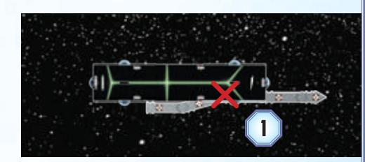

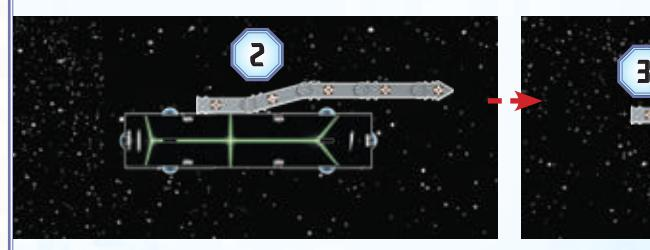

2. The Imperial player places the maneuver tool's flat end on the left side of the ship, aligned with the front of the rearmost ship base.

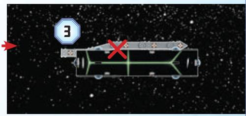

3. The Imperial player realizes that if they move the ship to the joint below the "2" speed number, it will overlap the maneuver tool at that position. Since the ship overlaps the maneuver tool when it is placed on either side of the ship, the maneuver is illegal.

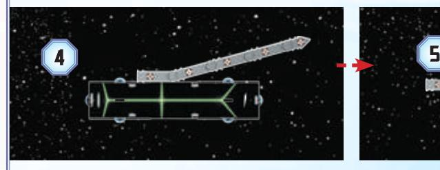

4. The Imperial player straightens the second joint of the maneuver tool, then places the tool's flat end on the left side of the ship, aligned with the front of the rearmost ship base.

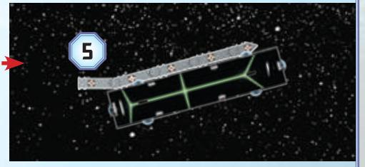

5. The ship does not overlap the tool at its current or final position, so the Imperial player presses down the maneuver tool and moves the ship to its final position at the joint below the "2" speed number.

#### IGNITION [RANGE] KEYWORD

At the end of a ship's activation, if it has the **ignition [range]** keyword, that ship may place the targeting token matching its ID token within its special firing arc and within the range specified by its **ignition** keyword.

- If a ship has multiple **ignition [range]** keywords, (such as those granted by upgrade cards) its targeting token can be placed within any of the specified ranges.
- At the beginning of a ship's "Attack" step, if its targeting token is in play, that ship must perform an **ignition** attack against a ship in the special firing arc that its targeting token is within as its first attack during this activation, if able. At the end of a ship's "Attack" step, or after it performs an **ignition** attack, remove its targeting token.
- While performing an ignition attack, firing arc, range, and line of sight are measured from the attacker's ship token as normal, with the following exceptions:

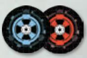

*Targeting Tokens*

- ◊ **Ignition** attacks can be declared against ships beyond the length of the range ruler, which is considered extreme range.
- ◊ Firing arc is measured using the attacker's special firing arc that the targeting token is within, instead of using that hull zone's standard firing arc.
- ◊ Attack dice are gathered from the attacker's special battery armament based on the range measured from the attacker's targeting token to any part of the defender's ship token (even another hull zone), instead of the attack range.
- Some critical effects contain the **ignition** keyword as part of their header. These critical effects can only be resolved during **ignition** attacks.

**Related Topics:** Attack, Line of Sight, Measuring Firing Arc and Range, Special Battery Armament and Firing Arc

{9}------------------------------------------------

# Ignition Attacks

To resolve an **ignition** attack:

1. Declare the defender and defending hull zone, measuring firing arc and line of sight as normal.

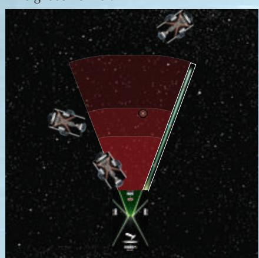

2. Gather dice based on the range from the attacker's targeting token to the defender, rather than based on the attack range.

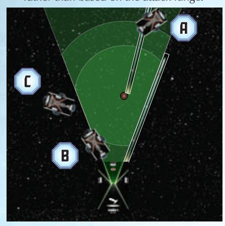

3. Continue resolving the attack as normal. The range from the targeting token is **only** used when gathering dice.

*Corvette A is at extreme range, but it is at medium range from the targeting token.*

*Corvette B is at close range, and it is also at close range from the targeting token (even though the defending hull zone is not).*

*Corvette C is at medium range, and is at close range from the targeting token, but is not in the special firing arc so cannot be declared as the defender.*

#### INITIATIVE

Initiative determines which player acts first during the Ship Phase and Squadron Phase. It is assigned to a player during the "Determine Initiative" step of setup. That player is the first player and takes the initiative token. That player's opponent is the second player.

• The first player retains initiative for the entire game.

**Related Topics:** First Player, Objective Cards, Second Player, Setup

#### IRREGULAR SQUADRON

Some squadrons are irregular squadrons. Squadrons of this type feature a single plastic fighter model (instead of three). Despite this difference in appearance, irregular squadrons follow all of the rules for normal squadrons.

• When an effect refers to an irregular squadron,it means a squadron that is physically represented by a model on a single peg (instead of a tree peg). For example, this includes squadrons such as YT-2400's or VT-49 Decimators, not A-wings or TIE Interceptors.

**Related Topics:** Squadron, Squadron Phase

#### LINE OF SIGHT

When resolving an attack, players measure line of sight between ships and squadrons in the play area to determine if an attack is possible and whether it is obstructed.

- To determine line of sight, a player uses the range ruler to trace a line between the attacking squadron or hull zone and the defending squadron or hull zone.
- When tracing line of sight to or from a squadron, trace the line using the point of the squadron's base that is closest to the opposing squadron or hull zone.
- When tracing line of sight to or from a hull zone, trace the line using the yellow targeting point printed in that hull zone.
- If line of sight or attack range is traced through a hull zone on the defender that is not the defending hull zone, the attacker does not have line of sight and must choose another target.
- If line of sight is traced through an obstacle token or through a ship that is not the attacker or defender, the attack is obstructed.
  - ◊ When tracing line of sight, ignore ships' shield dials and the plastic portions of the base that frame the shield dial
  - ◊ While a ship is overlapping an obstacle and the attacking hull zone's traced line of sight does not pass over a visible portion of that obstacle (or another obstacle or ship), that attack is not obstructed.
- ◊ If line of sight is traced through the attacking or defending hull zone's shield dial and that dial is also overlapping an obstacle, that attack is treated as obstructed.
- Squadrons do not block or obstruct line of sight.
- The attacker's hull zones do not block its line of sight.
- If players must trace a line that is longer than the range ruler, they can estimate the line extended from the end of the ruler.

**Related Topics:** Attack, Obstructed, Measuring Firing Arc and Range

{10}------------------------------------------------

#### MANEUVER TOOL

The maneuver tool is used to precisely move ships inside the play area.

- Each joint of the maneuver tool corresponds to the speed printed on the punchboard token inserted into the hole closest to the joint.
- When moving a ship, players ignore the segments of the tool that are beyond the final joint to which the ship moves. Those joints may be adjusted to facilitate easy placement and use of the tool.
- If the maneuver tool cannot be placed on the play area because it would overlap a ship or squadron, the player should hold the maneuver tool above the play area and estimate the final position of the moving ship.

**Related Topics:** Premeasuring, Ship Movement

#### MEASURING FIRING ARC AND RANGE

To measure a hull zone's firing arc, use the range ruler to extend the firing arc lines that are printed on the ship token around that hull zone. If a portion of any component is inside the area between those extended firing arc lines, that component is inside the firing arc.

To measure attack range from a ship, measure from the closest point of the attacking hull zone. To measure attack range to a ship, measure to the closest point of the defending hull zone. To measure attack range to or from a squadron, measure to or from the closest point of the squadron's base.

When measuring attack range for a ship, ignore any portion of the defender that is outside the attacking hull zone's firing arc, even if that portion is at a closer range.

If attack range is measured through a hull zone on the defender that is not the defending hull zone, the attacker does not have line of sight and must choose another target.

- Targeting points are not used when measuring range; they are exclusively for determining line of sight.
- When measuring non-attack range or distance between two components, measure from the closest point of the first component to the closest point of the second component.
- A ship or squadron is always at close range and distance 1 of itself.
- When measuring firing arc, range, or distance, ignore squadrons' activation sliders and ships' shield dials and the plastic portions of the base that frame the shield dial.

**Related Topics:** Attack, Firing Arc, Line of Sight

#### MODIFYING DICE

Dice can be modified in the following ways by game effects:

- **Reroll:** When a die is rerolled, the attacker picks it up and rolls it again. A die can be rerolled multiple times.
- **Add:** When a die is added, roll an unused die of the appropriate color into the attack pool.
  - ◊ The range restriction on dice color applies only when dice are gathered during the "Roll Attack Dice" step of an attack.
- **Change:** When a die is changed, rotate it to display the indicated face.
- **Spend:** When a die or die icon is spent, remove that die from the attack pool.
- **Cancel:** When a die or die icon is canceled, remove it from the attack pool.

**Related Topics:** Attack, Dice Icons

#### MOVEMENT

See "Squadron Movement" and "Ship Movement."

#### OBJECTIVE CARDS

Objectives alter each game of *Star Wars: Armada* with new conditions for the battle.

Each player chooses three objective cards as part of their fleet, and each of these cards must belong to a different category. During the "Choose Objective" step of setup, the first player looks at their opponent's objective cards and chooses one of those cards. The chosen card becomes the objective for the game; the unchosen objective cards and the first player's objective cards are not used this game.

- There are three categories of objectives:
  - ◊ **Assault:** Assault objectives typically identify one or more ships that are worth extra fleet points when damaged or destroyed.
  - ◊ **Defense:** Defense objectives alter the play area to provide a significant advantage to one player.
  - ◊ **Navigation:** Navigation objectives reward players who maneuver aggressively and precisely.
- When a ship is chosen as an objective ship, indicate this by placing an objective token next to its ship card.

**Related Topics:** Fleet Building, Scoring, Setup, Victory Tokens, Winning and Losing

#### OBJECTIVE TOKENS

Some objective cards and other effects refer to using objective tokens. These tokens are used to mark those effects by either placing them in the play area or assigning them to a ship.

**Related Topics:** Objective Cards, Obstacle and Token Movement

{11}------------------------------------------------

#### OBSTACLES

When a ship or squadron overlaps an obstacle after executing a maneuver, it resolves an effect that depends on the type of obstacle it overlapped:

- **Asteroid Field:** The ship is dealt one faceup damage card. Squadrons are unaffected.
- **Debris Field:** The ship suffers two damage on any one hull zone. Squadrons are unaffected.
- **Dust Field:** A ship that traces line of sight across a dust field while attacking a ship or squadron cannot perform that attack (but may declare another target). If a squadron traces line of sight across a dust field while attacking, that attack is obstructed.
  - ◊ When a ship traces line of sight to the defending hull zone of a ship that is overlapping a dust field but the traced line does not pass over a visible portion of that obstacle, the ship can perform that attack.

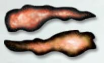

*Dust Field Tokens*

- - That attack cannot be performed if the line of sight is traced through the defending hull zone's shield dial and the dust field would otherwise be visible.
- ◊ When a ship would trace line of sight across a dust field but that obstacle is overlapped by a ship that is not the attacker or defender and the traced line of sight does not pass over a visible portion of that obstacle, the ship cannot perform that attack.
  - - If necessary, the overlapping ship's owner may mark that ship's position and lift it out of the way, then return it after the attacker determines whether the traced line passes over the dust field.
- **Exogorth:** Exogorths have specific placement rules. Exogorths also resolve different effects on ships and squadrons.
  - ◊ **Placing Exogorths:** An exogorth obstacle is placed touching another obstacle. When an exogorth is placed, it cannot overlap ships, other obstacles, or tokens in the play area. If an exogorth overlaps squadrons when it is placed, move any overlapped squadrons out of the way and place

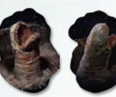

*Exogorth Tokens*

that exogorth. Then the player who did not place that exogorth places the overlapped squadrons, regardless of who owns them, in any position around that exogorth so that they touch it. They can place those squadrons in any order but cannot place them outside the play area.

- - A squadron that cannot be placed touching the exogorth must be placed touching another squadron that is touching the exogorth.
- ◊ **Exogorth Effects:** When a ship overlaps an exogorth, that ship suffers one damage.

At the start of each Squadron Phase, starting with the second player and alternating, each player chooses one exogorth. Each player must choose a different exogorth. The chosen exogorth performs an anti-squadron attack against each squadron at **distance 1**. While a squadron is defending, the opposing player (or team) resolves each step of that attack. An exogorth uses the following rules when it performs attacks:

- **Armament:** An exogorth is treated as if it is a ship with an antisquadron armament of three blue dice and is not friendly to any ship or squadron.

If a squadron suffers at least one damage from the exogorth's attack, its activation slider is toggled to the activated side (if able).

- - **Hull Zone:** An exogorth is treated as a ship with one hull zone while it is attacking.
- - **Firing Arc:** Each exogorth has a 360º firing arc.
- - **Line of Sight:** When tracing line of sight to or from an exogorth, trace the line using the point of the token that is closest to the opposing squadron. Attacks that draw line of sight through the exogorth itself or through an obstacle that the exogorth is touching are not obstructed.
- **Gravity Rift:** Gravity rifts resolve several effects depending on a ship or squadron's distance to the obstacle:
  - ◊ When a ship deploys at distance 1–2 of a gravity rift, its speed dial must be set to speed "0".

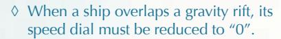

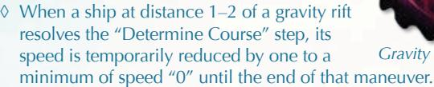

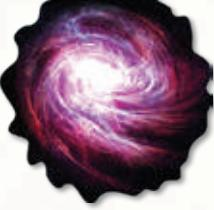

*Gravity Rift Token*

• **Purrgil:** When a ship overlaps a purrgil obstacle, that ship suffers an amount of damage equal to its speed. When a squadron overlaps a purrgil, that squadron suffers one damage.

At the end of each round, starting with the second player and alternating, each player chooses one purrgil obstacle and moves it to within distance 1–2 of its current location. Each player must choose a different purrgil obstacle to move.

*Purrgil Tokens*

• **Station:** The ship can discard one of its faceup or facedown damage cards. The squadron can recover one hull point.

- A ship or squadron overlaps an obstacle if part of its base is on top of the obstacle token after moving (excluding activation sliders). Ships and squadrons can move through obstacles without issue.
- If a ship overlaps more than one obstacle, it resolves the effects of each obstacle in any order.
- Attacks that draw line of sight through an obstacle token are obstructed.
- When playing a standard game with an objective card, players must use the six obstacle tokens from a core set or fleet expansion and add obstacles from a campaign expansion if specified by the chosen objective card.
  - ◊ Players must use the obstacle shapes provided in a core set or campaign expansion and cannot choose a different mix of shapes by combining multiple sets.

**Related Topics:** Line of Sight, Obstacle and Token Movement, Obstructed, Overlapping, Setup

{12}------------------------------------------------

#### OBSTACLE AND TOKEN MOVEMENT

Some objective cards, obstacle types, and other effects refer to moving obstacles or tokens. To move an obstacle or token, the player moving it proceeds through the following steps:

- 1. **Determine Direction:** Place the range ruler flat on the table with the distance side faceup. The center of the distance 1 end of the ruler must be in contact with the obstacle's edge. If the range ruler cannot be placed in the play area due to other ships and squadrons being in the way, hold the range ruler above the play area and estimate the obstacle or token's final position.

- 2. **Move Obstacle (or Token):** Pick up the obstacle or token and position it anywhere along the center of the ruler up to the line that marks the end of the distance band matching the specified maximum movement. The obstacle or token cannot be placed beyond that line. Then remove the range ruler and place the obstacle or token in its final position.

- An obstacle, at its final position, cannot overlap ships, squadrons, other obstacles, or tokens in the play area.

- An obstacle can be rotated as long as no part of that obstacle is beyond the specified maximum distance of its move from that obstacle's original position.

- An obstacle or token can move through ships, squadrons, and obstacles without issue. Only its starting and final positions matter.

- If an obstacle with a token placed on it due to an objective card or other effect is moved, that token remains on that obstacle.

- If an obstacle or token that is overlapped by a ship or squadron is moved, that ship or squadron remains in its current position after the obstacle is moved.

  - ◊ If necessary, that ship's owner may mark that ship's position and lift it out of the way, then return it after the token is moved.

- When an obstacle or token moves, the player moving it can choose for it to remain in its current position, unless a minimum movement distance is specified.

- **Toward:** Some effects direct players to move an obstacle or token toward a ship, squadron, obstacle, other token, or portion of the play area. When this is specified, the player moving the obstacle must also follow these restrictions:

  - ◊ This movement must be measured directly toward the other component, along a line from the closest point on the obstacle to the closest point on the other component.
  - ◊ That obstacle or token must be moved from its current position to at least the line that marks the end of the distance band matching the specified minimum movement.
  - ◊ If that obstacle or token cannot be moved its specified minimum distance, it must be moved from its current position as close as possible to the line that marks the end of the specified minimum distance's band.

**Related Topics:** Line of Sight, Measuring Firing Arc and Range, Objective Cards, Obstacles, Overlapping, Range and Distance

#### OBSTRUCTED

An attack is obstructed if line of sight is traced through an obstacle token or another ship that is not the defender.

If an attack is obstructed by one or more ships or obstacles, the attacker must choose and remove one die from their attack pool before they roll dice during the "Roll Attack Dice" step.

- Squadrons do not obstruct attacks.
- If line of sight is drawn over an obstacle, the attack is obstructed even if the bases of the attacker and defender are touching.
  - ◊ This includes ships' shield dials that are touching.

**Related Topics:** Attack, Line of Sight, Obstacles

# Moving Obstacles Example

While playing with the "Doomed Station" objective, the Imperial player moves a debris field obstacle toward the gravity rift obstacle.

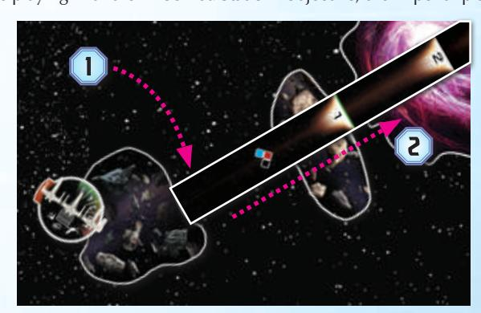

- 1. The Imperial player places the range ruler on the table with the distance 1 end in contact with edge of the debris field.
- 2. The Imperial player points the range ruler at the closest point on the gravity rift along a line from the closest point on the debris field.
- 3. The Imperial player removes the X-wing squadron from the debris field, then moves the debris field toward the distance 2

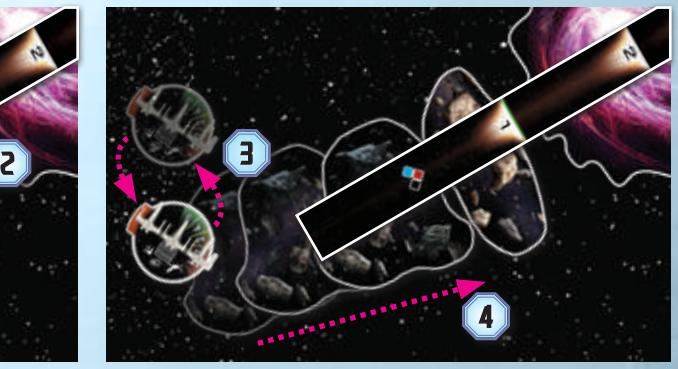

band. After the debris field is out of the way, the Imperial player replaces the X-wing in its original position.

4. The debris field cannot overlap the asteroid field at its final position, so the Imperial player moves as close as possible to the edge of the distance 1 band and places it touching the edge of the asteroid field.

{13}------------------------------------------------

#### OVERLAPPING

If a ship executes a maneuver and its final position overlaps one or more squadrons, move any overlapped squadrons out of the way and finish the ship's maneuver. Then the player who is **not** moving the ship places the overlapped squadrons, regardless of who owns them, in any position around that ship so that they touch the ship that moved. They can place those squadrons in any order, but they cannot place them outside the play area.

If a ship executes a maneuver and its final position would overlap another ship, it cannot finish its maneuver normally. Instead, temporarily reduce its speed by one (without changing the speed dial) and move the ship at the new speed. This process continues until the ship can finish its maneuver, even if that maneuver is to remain in place at speed "0." Then deal one facedown damage card to the ship that moved and the closest ship that it overlapped.

If a moving ship or squadron overlaps an obstacle token, it resolves an effect depending on the specific type of obstacle token that it overlapped.

- If a ship temporarily reduces its speed, its speed returns to the number indicated on the speed dial after it finishes executing its maneuver.
- Even if a ship does not change its position as a result of being at speed "0," it has still executed a maneuver and resolves any effects of overlapping obstacles and/or another ship.
- If a ship must execute a maneuver at a reduced speed due to overlapping another ship, it is allowed to overlap the maneuver tool in its final position.
- A squadron cannot be placed so that it would overlap another squadron or ship.
- Ships and squadrons can move through other ships and squadrons without issue.
- While placing squadrons overlapped by a ship, the opposing player must place as many squadrons as possible touching the ship.
  - ◊ A squadron that cannot be placed touching the ship must be placed touching another squadron that is touching the ship.
- If a squadron is placed on an obstacle as a result of being overlapped, it does not resolve the effects of overlapping.
- A ship's shield dials and the plastic portions that frame them count as part of the ship's base for the purposes of overlapping, but squadrons' activation sliders are ignored.
- If a ship overlaps another ship while moving, it has not executed its maneuver until it resolves the effects of overlapping that other ship, including being dealt damage cards.

**Related Topics:** Obstacles, Ship Movement, Squadron Movement

#### PASS TOKENS

A player receives one or more pass tokens at the beginning of the game if their opponent has more ships than they do. When it is a player's turn to activate during the Ship Phase, that player may spend a pass token to pass their turn instead of activating, and it becomes their opponent's turn to activate a ship. When a pass token is spent, it is discarded.

**Note:** These rules replace the pass token rules previously published in the *Super Star Destroyer* expansion. A huge ship no longer receives an additional pass token as described in those rules.

• Before the "Deploy Ships" step of setup, if one player has fewer total ships in their fleet, that player gains a number of pass tokens equal to the difference between their total ships and their opponent's total ships.

• If the first player has fewer ships, that player gains one fewer pass token.

**Related Topics:** Setup, Ship Phase

#### PLAY AREA

The play area is the shared space occupied by ships, squadrons, obstacle tokens and objective tokens. The recommended play area is 3' x 3' for the core set and

3' x 6' for a 300 fleet point game.

• If any portion of a ship's or squadron's base is outside the play area, that ship or squadron is destroyed. For this purpose, ignore activation sliders, shield dials, and the plastic portions of a ship's base that frame shield dials.

**Related Topics:** Fleet Building, Setup, Ship Movement, Squadron Movement

#### PREMEASURING

- Players can measure with either side of the range ruler at any time.
- The maneuver tool can be placed and adjusted freely during the "Determine Course" step of executing a maneuver to assist in determining a course. A ship is not committed to a course until the guides of the maneuver tool are inserted into the ship's base.
  - ◊ A player can only premeasure with the maneuver tool during their ship's Determine Course" step and only for that ship.

**Related Topics:** Maneuver Tool, Range and Distance

#### PROXIMITY MINE TOKENS

Some upgrade cards in this expansion refer to proximity mine tokens. When proximity mine tokens are placed, they must be placed beyond distance 1 of any other proximity mine tokens.

• When a ship ends its movement at distance 1 of a proximity mine token, remove that token from the play area and roll two blue dice. That ship is dealt one facedown damage card for each F or E icon rolled.

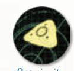

*Proximity Mine Token*

• **Attacking Proximity Mine Tokens:** When a ship performs an attack, it can declare one proximity mine token as a target instead of attacking a ship or squadrons. The defending mine token is treated as a squadron with one hull point that is not friendly to any ship or squadron and has no keywords or defense tokens. If that token suffers at least one point of damage, remove that token from the play area.

**Related Topics:** Attack, Damage, Range and Distance

#### RAID TOKENS

Some effects refer to raid tokens. While a ship has a raid token, it cannot resolve the command matching that raid token.

• When a ship with a raid token reveals a command dial, it may discard that dial to discard all of its raid tokens, or it may discard a command token to discard a matching raid token.

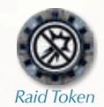

• A ship cannot have more than one raid token of each type.

**Related Topics:** Commands, Command Dials, Command Tokens

{14}------------------------------------------------

#### RANGE AND DISTANCE

The range ruler has two sides: the range side and the distance side. The range side is divided into three range bands: close, medium, and long. The distance side is divided into five distance bands labeled "1" through "5." The bottom of the ruler is the edge at the close-range end of the ruler.

- When measuring with the range ruler, use only a single edge of the ruler; do not factor in the width and thickness of the ruler.
- The lines on the ruler that divide two adjacent bands always count as part of the band closest to the bottom of the ruler.
- The following terms are used when discussing range and distance:
  - At: If any portion of a hull zone, base, or token is inside a specified band, that component is at that band.
  - Beyond: If no portion of a hull zone, base, or token is inside a specified band or a band closer to the bottom of the ruler, that component is beyond the specified band.
  - Within: If the entirety of a base or token is inside a specified band, that component is within that band.
  - Minimum-Maximum: This abbreviation encompasses the minimum band, maximum band, and all bands in-between, such as "distance 1-4."
  - ♦ Extreme Range: Extreme range is any range greater than the length of the range ruler.
- The ruler is 1' long.

**Related Topics:** Measuring Firing Arc and Range, IGNITION [RANGE] Keyword, Squadron Movement

#### READIED

Cards and defense tokens are readied during the Status Phase and begin the game readied. A readied card can be exhausted as part of the cost of an effect

- When an upgrade card is readied, rotate it 90° counterclockwise so that it is upright.
- When a defense token is readied, flip it from its exhausted side to its readied side.
- When a card or defense token is exhausted, it is no longer readied.
- Some upgrade cards that can be exhausted are marked with a RECUR
  (p) icon next to their name and are readied during the Status Phase.
- Some upgrade cards are marked with a NON-RECUR (→) icon next to their name. These cards do not ready during the Status Phase unless the owning player pays the cost to ready that card.

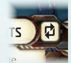

If both players can pay to ready cards during the Status Phase, they take turns readying one card at a time, starting with the first player, until one player has no more cards to ready.

Recur Icon

- While an upgrade card that is **not** marked with the ₱ icon or ₱ icon is exhausted, that card is treated as if it has the ₱ icon and is readied during the Status Phase.
  - This includes upgrade cards printed prior to the introduction of the Galactic Republic and Separatist Alliance factions, which are not marked with either icon.

**Related Topics:** Defense Tokens, Exhausted, Ready Cost, Status Phase, Upgrade Cards

#### READY COST

A ready cost is paid to ready an exhausted p upgrade card by spending the indicated number and type of command tokens.

- If a card has a ready cost it is indicated below the r→ icon by a numeral and one or more of the following icons over a red background:
  - Command icons: The owning player can pay the cost by spending the indicated number of each type of token shown.
    - If multiple command icons are separated by a horizontal bar below a single number at the top of the column, the owning player may pay the cost by spending that many command tokens of any of the indicated types, in any combination.

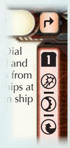

Non-recur Icon and Ready Cost

- ♦ Any Command icon (★): The owning player can pay the cost by spending any command token or mix of command tokens of the indicated number.
- An upgrade card's ready cost is paid by the ship that card is equipped to.
- If a token or other component is spent as part of card's ready cost, that component does not also produce its normal effect.

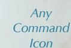

aust

ain

nip at

**Related Topics:** Exhausted, Status Phase, Readied, Upgrade Cards

#### ROUND

A single game round consists of four phases resolved in the following order: Command Phase, Ship Phase, Squadron Phase, and Status Phase.

Round tokens are used to track the current round of the game; the round number is equal to the highest number on the round tokens placed next to the play area. The round token marked "1" is placed next to the play area during setup, and the next highest round token is placed during each Status Phase.

The game ends after six rounds.

Related Topics: Setup, Status Phase, Winning and Losing

#### SCORING

Players determine their score at the end of the game. A player's score is the total fleet point cost of destroyed enemy ships and squadrons plus the fleet point value of any victory tokens that the player collected.

- A destroyed ship's fleet point cost includes the costs of all upgrade cards equipped to that ship.
- Discarded upgrade cards do not count toward a player's score unless they are equipped to a destroyed ship.
- Each victory token is worth the number of fleet points indicated in the lower-right corner of the objective card used for that game.

Related Topics: Objective Cards, Victory Tokens, Winning and Losing

#### SECOND PLAYER

The second player is the player who does not have initiative.

Related Topics: First Player, Initiative, Objective Cards, Setup

{15}------------------------------------------------

#### SET ASIDE SHIPS AND SQUADRONS

Some effects refer to ships or squadrons being set aside, typically before the "Deploy Ships" step of setup. The player controlling the setaside ship or squadron places it outside the play area near its ship or squadron card along its player's edge. These effects specify when those ships or squadrons can be deployed later in the game.

- A ship or squadron that is set aside can only be deployed or affected by the effect that set them aside.
- A set-aside ship or squadron can only be assigned objective tokens or chosen as an objective ship if that effect is resolved **before** the effect that sets that ship or squadron aside.
- If a player has set-aside ships or squadrons remaining but all of that player's ships in the play area are destroyed, the game immediately ends.

**Related Topics:** Effects, Objective Cards, Objective Tokens, Setup, Winning and Losing

#### SETUP

To set up a standard game of *Star Wars: Armada*, proceed through the following steps in order.

- 1. **Define Play Area and Setup Area:** Clear a 3' x 6' play area. Then, establish a 3' x 4' setup area by using the length of the range ruler to place the setup area markers 1' from the short edges of the play area. The players sit across from each other on the 6' edges of the play area.

- 2. **Gather Components:** Each player places their ships, squadrons, and cards next to the play area and near their edge. Set each shield dial and squadron disk to its maximum shield and hull values. Then set the activation slider of each squadron to display the blue end of the slider with the a icon. Assign the appropriate defense tokens to each ship and unique squadron. Gather enough command dials and speed dials for the fleet. Assign ID tokens to ships and squadrons as necessary.

- 3. **Determine Initiative:** The player whose fleet has the lowest total fleet point cost chooses which player is the first player. The first player places the initiative token next to their edge with the a side faceup. If the players are tied in fleet points, flip a coin to decide which player makes the choice.

- 4. **Choose Objective:** The first player looks at all three of their opponent's objective cards and chooses one to be the objective for the game.

- 5. **Place Obstacles:** Starting with the second player, the players take turns choosing and placing six obstacles into the play area. Obstacles must be placed within the setup area, beyond distance 3 of the edges of the play area and beyond distance 1 of each other.

  - ◊ The players place the three asteroid fields, two debris fields, and one station from an *Armada Core Set* or fleet expansion unless the objective card says otherwise.

- 6. **Deploy Ships:** Starting with the first player, the players take turns deploying their forces into the setup area. A single deployment turn consists of placing one ship or two squadrons.

  - ◊ Ships must be placed within their player's deployment zones. When a player places a ship, they must set its speed dial to a speed available on its speed chart.
  - ◊ Squadrons must be placed within distance 1–2 of a friendly ship and may be placed outside of deployment zones (but within the setup area).
  - ◊ If a player only has one squadron remaining when they must place two, they cannot place it until they have placed all of their ships.

- ◊ Ships and squadrons can be placed on top of the setup area markers as long as they remain entirely within the setup area.

- 7. **Prepare Other Components:** Shuffle the damage deck and place it next to the play area along with the command tokens, maneuver tool, range ruler, and the round token marked "1."

- 8. **Clean Up:** Remove the setup area markers from the play area.

**Related Topics:** Deployment Zone, ID Tokens, Initiative, Objective Cards, Obstacles, Play Area, Range and Distance, Setup Area

#### SETUP AREA

The setup area is the region of the play area in which ships, squadrons, obstacle tokens, and objective tokens are placed during setup.

The setup area for a 300 fleet point game is the 3' x 4' area in the center of the play area. If playing with a 3' x 3' play area, the entire play area is the setup area.

The setup area is marked by setup area markers. After setup is complete, the setup area markers are removed from the play area.

**Related Topics:** Deployment Zone, Play Area, Setup

#### SHIELDS

Each hull zone has its own shield dial and maximum shield value. The number displayed on the shield dial indicates the hull zone's remaining shields.

- Each ship begins the game with its shield dials set to the maximum shield values shown in the corresponding hull zones.
- When a ship spends, loses, or recovers shields, rotate the shield dial to indicate the shields remaining in that hull zone.
- A hull zone cannot have more shields than its maximum shield value, and it cannot recover a shield if it is at its maximum shield value.
- A hull zone cannot have fewer than zero shields, and it cannot lose a shield if it has none remaining.

**Related Topics:** Commands, Damage, Defense Tokens, Hull Zones

#### SHIP

A ship consists of a ship base, a ship model, a ship token, and a ship card. All components must match the ship's type, and the name on the ship card must match the name on the ship token.

- Each ship has a ship icon in the lower-left corner of its ship card and in the front hull zone of its ship token. This icon indicates the ship's type and is used to determine which title cards that ship can equip.
- Some ships have traits. These are italicized words listed on the back of their ship cards, beneath the ship's name. Traits do not have an effect, but some other game effects can refer to ship traits.
- Ship cards were printed as tarot-size cards prior to the introduction of the Galactic Republic and Separatist Alliance factions. These cards remain legal game components.
- Some plastic ship models extend beyond the plastic base. For this reason, the plastic ship model does not affect range measurement, firing arc, movement, overlapping, or any other game mechanic.

**Related Topics:** Ship Phase, Squadron, Titles

#### SHIP ACTIVATION

Ships are activated during the Ship Phase. When a ship is activated, its owner proceeds through the following steps.

{16}------------------------------------------------

- 1. **Reveal Command Dial:** Reveal the ship's top command dial. Then either place the dial next to the ship in the play area or spend the dial to place the corresponding command token next to the ship in the play area.
- 2. **Attack:** Perform up to two attacks with the ship from different hull zones.
- 3. **Execute Maneuver:** Move the ship at its current speed.
- After a ship activates, place its revealed command dial faceup on its ship card to track that it has activated.
- Each ship can activate only once per round.

**Related Topics:** Attack, Commands, Ship Movement

#### SHIP MOVEMENT

To execute a maneuver with a ship, its owner proceeds through the following steps:

- 1. **Determine Course:** Straighten the maneuver tool, then click the joints of the maneuver tool a number of times in either direction up to the corresponding yaw values indicated on the ship's speed chart for the current speed. The ship can resolve a M command to adjust speed and/or yaw.
- 2. **Move Ship:** Place the maneuver tool on the play area and insert the guides of the first segment into the notches on one side of the front of the ship's base. Then slide the ship away from the guides on the first segment and place the ship by sliding its notches over the guides on the joint that corresponds to the ship's speed.
- A ship can move through ships, squadrons, and obstacles without issue. Only its starting and final positions matter.
- A ship must be placed in its final position on the same side of the maneuver tool on which it started its maneuver.
- A ship cannot overlap the maneuver tool when the ship is placed in its final position. If it would overlap the maneuver tool, reset the ship's position, insert the maneuver tool into the opposite side of the ship, and move the ship.
- If a ship would not overlap the maneuver tool regardless of which side of the ship the tool is placed on, the ship's owner can choose which side to place the tool on.
- After the maneuver tool's guides are inserted into the ship, the joints of the tool cannot be adjusted.
- The maneuver tool can be placed on the play area and manipulated freely during the "Determine Course" step.
- If a ship executes a 0-speed maneuver, it does not move from its current position, but it is still considered to have executed a maneuver.

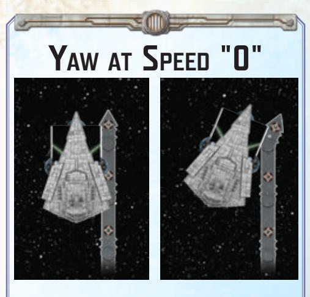

To resolve a 0-speed maneuver with one or more clicks of yaw:

- 1. Declare the direction and number of clicks of yaw for the maneuver.
- 2. Insert the guides of the last segment of the maneuver tool into the notches on the ship's base, then remove the ship.
- 3. Click the last joint in the declared direction, then place the ship in its final position.
- Some effects allow a ship to resolve clicks of yaw while executing a 0-speed maneuver, using the following rules:
  - ◊ During the ship's "Determine Course" step, that ship's owner declares the number of times and direction in which the last joint of the maneuver tool will be clicked.
  - ◊ During the ship's "Move Ship" step, the maneuver tool is straightened and the guides of the last segment are inserted into the notches on the side of the front of the ship's base that matches the declared direction. Then, the ship is slid away from those guides, the last joint of the maneuver tool is clicked the declared number of times in the declared direction, and the ship is placed by sliding its notches back over the last joint.
  - ◊ If the ship's final position would overlap another ship, it cannot finish its maneuver normally, and instead returns to its original position at speed "0" with no clicks of yaw. Both ships are dealt damage cards for overlapping as normal.

**Related Topics:** Maneuver Tool, Overlapping, Ship Activation, Yaw

#### SHIP PHASE

During this phase, the first player activates one of their ships. Then the second player activates one of their own ships. Players continue taking turns in this manner until all ships have been activated.

- Players cannot activate ships that have already been activated.
- If a player has no unactivated ships remaining, that player must pass their turn for the rest of the phase. Doing so does not require spending a pass token.
  - ◊ If a player has unactivated ships but they are prevented from activating those ships by game effects, that player must pass their turn. Doing so does not require spending a pass token.
- When a player passes their turn, it becomes their opponent's turn to activate a ship.

{17}------------------------------------------------

- When it is a player's turn to activate, if that player has any\\nunactivated ships, they can pass their turn by spending a pass token.
  When a pass token is spent, it is discarded.
- A player with unactivated ships remaining can pass their turn under the following conditions:
  - The first player may pass their turn if they have activated at least one ship and they have fewer unactivated ships than the second player.
  - ♦ The second player may pass their turn if they do not have more unactivated ships than the first player.
  - A player cannot spend a pass token on consecutive turns during the same Ship Phase.

**Example:** Anna is the first player and Max is the second player. After Anna activates the first ship, she has two unactivated ships remaining and Max has one unactivated ship. Max decides to pass and spends a pass token. Then, Anna activates another ship. After that ship is activated, Max cannot pass again even though he and Anna have an equal number of unactivated ships remaining, because Max cannot pass two consecutive turns to activate.

Related Topics: First Player, Pass Tokens, Round, Ship Activation

#### SHORT PLAYER EDGES SETUP

Some objective cards refer to the 3' edges of the play area becoming the player edges. Place the setup area markers at the corners of the play area when playing with these objectives. The setup area is the entire play area. Each player's deployment zone is within the distance measured by the length of two range rulers from that player's edge (see diagram on page 18).

Related Topics: Deployment Zone, Objective Cards, Play Area, Setup

#### SIZE CLASS

Each ship has a size class: small, medium, large, or huge. Small ships use the $43 , \\text{mm} \\times 71 , \\text{mm}$ base, medium ships use the $63 , \\text{mm} \\times 102 , \\text{mm}$ base, and large ships use the $77.5 , \\text{mm} \\times 129 , \\text{mm}$ base. Huge ships use one ship token placed on top of two $77.5 , \\text{mm} \\times 129 , \\text{mm}$ large ship bases.

- Small, medium, and large ships follow the same rules for attacking and moving. Huge ships also follow additional rules.

- Some effects specifically refer to ships by size.

  - ♦ A flotilla ship is of the size class defined by its base.

- The following ships are examples of small ships:

  - ♦ CR90 Corellian Corvette
  - ♦ Nebulon-B Frigate
  - ♦ Gladiator-class Star Destroyer
  - ♦ Consular-class Cruiser
  - ♦ Hardcell-class Transport

- The following ships are examples of medium ships:

  - ♦ Assault Frigate Mark II
  - ♦ Victory-class Star Destroyer
  - ♦ Acclamator-class Assault Ship
  - ♦ Munificent-class Frigate

- The following ships are examples of large ships:

  - ♦ MC80 Cruiser

- ♦ Imperial-class Star Destroyer

- The following ships are huge ships:

  - ♦ Executor-class Star Dreadnought

Related Topics: Flotillas, Huge Ship, Ship

#### SPECIAL BATTERY ARMAMENT AND FIRING ARC

Some ships have a special battery armament, indicated by dice icons in an additional shaded armament box not associated with a shield value, and one or more special firing arcs, indicated by dashed lines and shaded areas on their ship tokens.

- A ship's special battery armament and special firing arcs are used only when performing IGNITION attacks.
- IGNITION attacks.A ship with a special battery armament has the

Special Battery Armament Box on a Ship Card

A ship's special battery armament is associated with each of its special firing arcs.

IGNITION [CLOSE] keyword.

Each special firing arc is associated with the hull zone it is located in.

**Related Topics:** Attack, Attack Pool, Attack Range, IGNITION [RANGE] Keyword, Measuring Firing Arc and Range

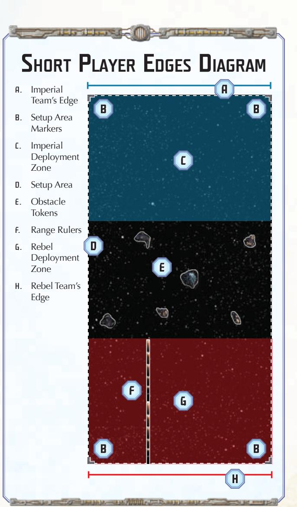

{18}------------------------------------------------

#### SPEED

A ship's speed determines how far it must move each activation; the ship's current speed is tracked on its speed dial. A squadron's speed value indicates the farthest distance band that the squadron can move into.

- A ship's speed is constant until the ship resolves a M command or uses an upgrade card effect to change speed.
- The minimum speed for all ships is 0. This is not on a ship's speed chart.
- Each ship's maximum speed is indicated on its speed chart. If a ship does not have any yaw values in a speed column, it cannot accelerate to that speed.
- When an effect **temporarily** changes a ship's speed during its "Execute Maneuver" step the ship's speed is temporarily increased or reduced as indicated by the effect that is resolved. The ship executes the maneuver by completing the "Determine Course" and "Move Ship" steps. The ship's current speed is still tracked by its speed dial, and the ship does not count as having changed its speed for the purposes of resolving other effects.
  - ◊ While a ship's speed is temporarily changed during its "Execute Maneuver" step, other effects resolved on that ship that temporarily increase or reduce its speed can change that ship's temporary speed as indicated, to a minimum of 0.
  - ◊ When an effect instructs a ship to execute an additional maneuver outside of its usual "Execute Maneuver" step, the ship's speed is temporarily set to the speed indicated by the effect that is resolved. The ship executes the maneuver by completing the "Determine Course" and "Move Ship" steps.

**Related Topics:** Commands, Ship Movement, Speed Chart, Squadron Movement, Yaw

#### SPEED CHART

Each ship has a speed chart on its ship card which indicates how far each joint can be clicked away from the center (straight) position. Each column on the chart corresponds to a specific speed as indicated by a number at the bottom of that column. Each box in a column represents a joint on the maneuver tool and the yaw value within each box indicates how many times its corresponding joint can be clicked in either direction (left or right) when moving at that column's speed.

**Related Topics:** Ship Movement, Speed, Yaw

#### SQUADRON

A squadron consists of a plastic squadron base, plastic fighters, a punchboard disk, a punchboard activation slider, and a squadron card. The disk, fighters, and squadron card must all correspond to the same squadron type.

- All copies of a non-unique squadron use a single squadron card.
- Each squadron costs fleet points equal to the fleet point cost on the matching squadron card.
- If a squadron's plastic fighters or activation slider impede the movement or placement of other components, rotate the squadron so that the fighters and slider do not impede.
- On squadron cards, the term "you" refers to the squadron resolving the effect.

**Related Topics:** Ship, Squadron Phase, Unique Names

#### SQUADRON ACTIVATION

Squadrons are activated during the Squadron Phase. Squadrons can also be activated during the Ship Phase when a ship resolves a O command.

- When a squadron is activated during the Squadron Phase, it can move or attack, but not both.
- When a squadron is activated by a O command, it can move and attack in any order.
- After a squadron activates, toggle its activation slider to track that it has activated.
- A squadron cannot activate if the color and icon of its activation slider do not match the initiative token.
- A squadron can activate and choose to end its activation without moving or attacking.

**Related Topics:** Attack, Commands, Engagement

#### SQUADRON KEYWORDS

Each squadron has one or more keywords with matching keyword icons. Each keyword produces the following effect for that squadron:

- k **Adept X:** While attacking, you may reroll up to X dice.
- n **AI: Battery X** and **AI: Anti-Squadron X:** While attacking with the indicated armament(s), if you are activated by a O command, you may add X dice to your attack pool of a color or colors that are already in your attack pool.
- b **Assault:** While attacking a ship, you may spend 1 die with a F icon. If you do, the defender gains 1 raid token of your choice.
- I **Bomber:** While attacking a ship, each of your E icons adds 1 damage to the damage total and you can resolve a critical effect.
- ) **Cloak:** At the end of the Squadron Phase, you may move up to distance 1, even if you are engaged.
- K **Counter X:** After a squadron performs a non-**counter** attack against you, you may attack that squadron with an anti-squadron armament of blue dice equal to X, even if you are destroyed.
- l **Dodge X:** While you are defending against a squadron, during the "Spend Defense Tokens" step, you may choose X dice to be rerolled.
- H **Escort:** Squadrons you are engaged with cannot attack squadrons that lack **escort** unless performing a **counter** attack.
- % **Grit:** You are not prevented from moving while you are engaged by only 1 squadron.
  - ◊ A squadron with **grit** is prevented from moving while engaged with multiple squadrons if at least 1 of those squadrons lacks **heavy**.
- L **Heavy:** You do not prevent engaged squadrons from attacking ships or moving.
- $ **Intel:** While a friendly squadron is at distance 1 of you, it has **grit**.
- ( **Relay X:** When a friendly ship resolves a O command, if you are in range to be activated, up to X of the squadrons it activates can be at distance 1–3 of you.
- # **Rogue:** You can move and attack during the Squadron Phase (in any order).
- m **Scout:** While deploying fleets, you can be placed outside of deployment zones and do not need to be at distance 1–2 of a friendly ship, but must be placed beyond distance 1–5 of enemy ships or squadrons.

{19}------------------------------------------------

- o **Screen:** While you are defending against a squadron, for each other friendly squadron the attacker is engaged with that lacks **screen**, up to 3, you gain **dodge 1**.
- ' **Snipe X:** You can attack squadrons at distance 2 with an antisquadron armament of blue dice equal to X. This attack ignores the **counter** keyword.
  - ◊ A **snipe** attack can be modified by effects that modify a standard attack, such as the **swarm** keyword.
  - ◊ A squadron with **snipe** that is engaged with a squadron with **escort** cannot perform a **snipe** attack against another squadron that lacks **escort**.
- \* **Strategic:** When you end your movement at distance 1 of 1 or more objective tokens, you may move 1 of those tokens so that it is at distance 1 of you.
  - ◊ A squadron with **strategic** cannot move objective tokens that are assigned to a ship.
- J **Swarm:** While attacking a squadron engaged with another squadron, you may reroll 1 die.
  - ◊ A **counter** attack can be modified by effects that modify a standard attack, such as the **swarm** keyword.
- Keywords with a numerical value (an "X" value) are cumulative with themselves. If a squadron that has a numerical-value keyword gains that keyword again through an effect, that keyword's total value is the sum of the value the squadron already had and the value gained.

*Example: a Delta-7* Aethersprite *squadron has the* **adept 1** *keyword. That squadron gains* **adept 1** *again from another effect. That squadron now has* **adept 2** *for the duration of that effect.*

• Keyword text on squadron cards is reminder text. The reminder text is not an exhaustive description of the rules for a keyword. If reminder text contradicts that keyword's rules found in this Rules Reference, the Rules Reference takes precedence.

**Related Topics:** Armament, Attack, Commands, Engagement, Obstacle and Token Movement, Raid Tokens, Setup

#### SQUADRON MOVEMENT

To move a squadron, its owner proceeds through the following steps:

- 1. **Determine Course:** Place the range ruler flat on the table with the distance side faceup. The center of the distance 1 end of the ruler must be in contact with the squadron's base.
- 2. **Move Squadron:** Pick up the squadron and position it anywhere along the center of the ruler up to the line that marks the end of the distance band matching the squadron's speed value. The squadron's base cannot be placed beyond that line. Then remove the range ruler and place the squadron in the final position.
- A squadron cannot be placed with any part of its base overlapping another squadron or ship.
- A squadron can move through ships, squadrons, and obstacles without issue. Only its starting and final positions matter.
- If the range ruler cannot be placed in the play area due to other ships and squadrons being in the way, hold the range ruler above the play area and estimate the squadron's final position.
- When a squadron moves, it can choose to remain in its current position and is still considered to have moved.

**Related Topics:** Commands, Engagement, Obstacles, Premeasuring, Range and Distance, Squadron Activation

#### SQUADRON PHASE

During this phase, the first player activates two of their squadrons. Then the second player activates two of their own squadrons. Players continue taking turns in this manner until all squadrons have been activated.

- A player does not choose the second squadron to activate until after they finish activating the first one.
- If a player only has one unactivated squadron remaining when they must choose their first squadron to activate, they only activate that squadron.
- If a player has no unactivated squadrons remaining, they must pass their turn for the rest of the phase.
- A squadron can either move or attack when activated during this phase; it cannot do both.

**Related Topics:** Attack, Squadron, Squadron Activation, Squadron Movement

#### STATUS PHASE

During this phase, the players ready all of their exhausted defense tokens by flipping them to their readied side. They also ready all of their exhausted upgrade cards by rotating them 90° counterclockwise. Then, the first player flips the initiative token to its other side.

• At the end of this phase, the first player places the round token with the next highest number to the side of the play area to indicate the number of the next round.

**Related Topics:** Defense Tokens, Initiative, Round, Upgrade Cards

#### SUPPLY

The supply consists of all tokens and dials that are not currently being used.

**Related Topics:** Command Tokens, Destroyed Ships and Squadrons

#### TARGETING POINT

See "Line of Sight."

#### TITLES

A title card is an upgrade card with a ship icon in the lower-left corner. A title card can be equipped to a ship only if the ship and title card share the same ship icon.

**Related Topics:** Commanders, Fleet Building, Upgrade Cards

#### UNIQUE NAMES

A card's name is unique if there is a bullet (•) to the left of the name.

- A fleet cannot contain more than one card with the same unique name, even if those cards are of different types.
- A fleet cannot contain more than one unique squadron with the same completely-italicized squadron type, even if those cards have different names.

*Example: Allison adds Lando Calrissian's* Millennium Falcon *card to her fleet. Allison cannot also add Han Solo's* Millennium Falcon *card. However, Allison can add both Luke Skywalker and Wedge Antilles' X-wing Squadron cards to her fleet.*

**Related Topics:** Fleet Building, Upgrade Cards

{20}------------------------------------------------

#### **UPGRADE CARDS**

When building a fleet, upgrade cards can be equipped to ships by adding their fleet point costs to the total fleet point cost. For each upgrade icon in a ship's upgrade bar, it may equip one upgrade card with the matching upgrade icon.

- Equipped upgrade cards are placed next to the ship card to which they are equipped.
- A Rebel ship cannot equip an Imperial or other faction's upgrade card, and an Imperial ship cannot equip a Rebel or other faction's upgrade card. A card's faction affiliation, if any, is indicated by the faction's symbol to the left of the fleet point cost.
  - ♦ Some cards have a dual faction affiliation, indicated by a split faction symbol that shows both of the factions that card is affiliated with. A ship of either of those factions can equip that card.
- Some upgrade cards have more than one upgrade icon. For each group of these icons in a ship's upgrade bar, it may equip one upgrade card with the matching upgrade icons. That group of icons cannot be used to equip additional upgrade cards.

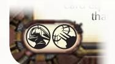

Upgrade Card with Multiple Icons

- Some upgrade cards have a restriction trait that limits them to being taken by certain ships. A ship cannot equip an upgrade card if that ship does not match that restriction trait, even if that ship has the correct upgrade icon or icons in its upgrade bar.
  - ♦ A ship cannot have more than one upgrade card with the "Modification" trait.
  - ♦ A ship cannot equip an upgrade card if that ship is not of a size class specified by that upgrade card's size restriction trait.
  - A ship cannot equip an upgrade card with the flagship restriction trait if that ship is not the flagship.
  - A ship cannot equip an upgrade card if that ship lacks a trait matching that upgrade card's ship-trait restriction trait. Some ships have traits listed on the back of their ship cards.
- A title card can be equipped to a ship only if the ship and the title card share the same ship icon.
  - Some title cards have an icon in the lower-left corner that does not match a specific ship icon. A ship can equip this upgrade card if that ship matches this card's faction affiliation and the ship's name matches this upgrade card's name-restriction trait.
  - ♦ Some title cards have a restriction trait that limits them to being taken by certain ship cards. A ship cannot equip an upgrade card if that ship's name does not match the upgrade card's name-restriction trait, even if its ship silhouette does match the silhouette on the upgrade card.

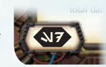

Name-Restricted Title Card

- ♦ A ship cannot have more than one title card.
- A commander card can be equipped to any non-flotilla ship of the appropriate faction.
- If a ship's upgrade card is discarded, it is flipped facedown but remains equipped for the purposes of scoring.
- On upgrade card effects, the term "you" refers to the ship that the upgrade is equipped to.
- An exhausted upgrade card cannot be exhausted again.
- Upgrade cards are readied during the Status Phase.

Upgrade cards were printed as mini-size cards prior to the introduction of the Galactic Republic and Separatist Alliance factions. These cards remain legal game components.

**Related Topics:** Commanders, Effect Use and Timing, Faction, Fleet Building, Readied, Scoring, Ship, Size Class, Titles, Unique Names

#### UPGRADE CARDS WITH TOKENS OR DIALS

Some upgrade cards begin the game with a number of command tokens or facedown command dials. These dials or tokens are chosen and placed on the card when that ship is deployed, during the Deploy Ships step of setup.

- If both players need to choose command tokens or dials, they take turns choosing and placing tokens for one card at a time, starting with the first player.
- If an upgrade card begins the game with command tokens or dials, it is indicated in the lower-left corner of that card by a numeral and one or more of the following icons over a blue background:

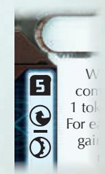

Upgrade Card with Command Tokens

- Command icons: The owning player places the indicated number of command tokens of the type shown on the card.
  - If multiple command icons are separated by a horizontal bar below a single number, the owning player places the indicated number of command tokens in any combination of those types that the player chooses.
- Any Command (\*) icon: The owning player chooses and places any command token or mix of command tokens of the indicated number.
- ♦ Command Dial (②, ③, 仓, or ②) icons: Command dials are indicated by a specific command icon surrounded by a block. The owning player sets the indicated number of command dials to the specific command shown and stacks them facedown on the card, similar to a ship's command stack.
- Any Dial (3) icon: The owning player sets the indicated number of command dials to any command or mix of commands and stacks them facedown on the card, similar to a ship's command stack
- Command tokens or dials on an upgrade card belong to that card and are not assigned to the ship that card is equipped to.
  - Command tokens or dials on an upgrade card can only be spent or discarded as indicated by that card's effect.

**Related Topics:** Commanders, Effect Use and Timing, Faction, Fleet Building, Flotillas, Scoring, Titles, Unique Names

{21}------------------------------------------------

#### UPGRADE ICONS

Each upgrade icon uses the corresponding name listed below:

T Commander \] Defensive Retrofit

U Officer a Experimental Retrofit

X Weapons Team \[ Turbolasers

Z Support Team Y Ion Cannons

\_ Fleet Command S Ordnance

^ Fleet Support f Superweapon

• Commander and title cards display their upgrade icons on their card backs only.

W Title

**Related Topics:** Commanders, Fleet Building, Titles, Upgrade Cards

#### VICTORY TOKENS

V Offensive Retrofit

Players may collect victory tokens as indicated by some objective cards and place them next to their ship cards. At the end of the game, each victory token increases the player's score by the amount indicated on the objective card.

**Related Topics:** Objective Cards, Scoring

#### WINNING AND LOSING

The game ends after six rounds. The players determine their scores and the player with the highest score wins.

- If both players have the same score after six rounds, the second player wins the game.
- If all ships in a fleet are destroyed, ignoring squadrons, the game immediately ends. The player with one or more ships remaining in the play area is the winner.
- If the last remaining ships in both fleets are destroyed at the same time, the player with the highest score wins. If both players have the same score, the second player wins.

**Related Topics:** Objective Cards, Round, Scoring

#### YAW

A yaw value indicates the maximum number of clicks from the center position that the corresponding joint on the maneuver tool can be clicked. A yaw value of "-" means that the joint must remain straight.

- Yaw values vary by ship and speed as displayed on a ship card's speed chart.
- When a yaw value of "-" increases by one, it becomes "I." When a yaw value of "I" increases by one, it becomes "II." The yaw value "II" cannot be increased.

**Related Topics:** Maneuver Tool, Ship Movement, Speed Chart

{22}------------------------------------------------

# E R R ATA

#### UPGRADE CARD MAJOR ERRATA

This section presents substantial errata changes to upgrade cards that were originally printed as mini-size cards. The mini-size versions of these upgrade cards remain legal game components but follow the text presented here.

The card images in this section have been updated to reflect their resized versions, which are available in the *Star Wars: Armada Upgrade Card Collection*. That product provides updated versions of all upgrades previously printed as mini cards, including these errata.

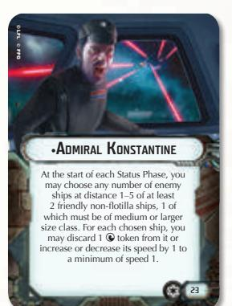

Updated Card

#### Admiral Konstantine

This upgrade card's effect should read:

"At the start of each Status Phase, you may choose any number of enemy ships at distance 1–5 of at least 2 friendly non-flotilla ships, 1 of which must be of medium or larger size class. For each chosen ship, you may discard 1 M token from it or increase or decrease its speed by 1 to a minimum of speed 1."

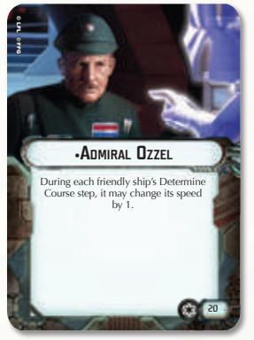

Updated Card

© FFG © LFL

#### Admiral Ozzel

This upgrade card's effect should read:

"During each friendly ship's Determine Course step, it may change its speed by 1."

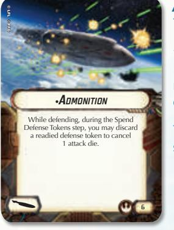

*Admonition*

This upgrade card's effect should read:

"While defending, during the Spend Defense Tokens step, you may discard a readied defense token to cancel 1 attack die."

This upgrade card's fleet point value should be "6".

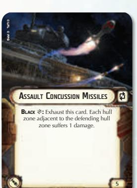

Updated Card

#### Assault Concussion Missiles

This upgrade card's effect should read:

"**Black** E\*\*:\*\* Exhaust this card. Each hull zone adjacent to the defending hull zone suffers 1 damage."

This upgrade card should have a p icon.

This upgrade card's fleet point value should be "5".

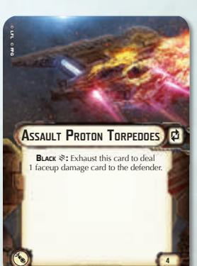

Updated Card

Updated Card

#### Assault Proton Missiles

This upgrade card's effect should read:

"**Black** E\*\*:\*\* Exhaust this card to deal 1 faceup damage card to the defender."

This upgrade card should have a p icon.

This upgrade card's fleet point value should be "4".

#### \*\*•\*\*AdmirAl rAddus

Before deploying fleets, you may set aside 1 other friendly ship with a command value of 3 or less. At the start of any round, you may deploy that ship at distance 1–2 of you. That ship cannot be deployed overlapping squadrons and cannot be the first ship

Updated Card

#### *Admiral Raddus*

This upgrade card's effect should read:

"Before deploying fleets, you may set aside 1 other friendly ship with a command value of 3 or less. At the start of any round, you may deploy that ship at distance 1–2 of you. That ship cannot be deployed overlapping squadrons and cannot be the first ship to activate that round."

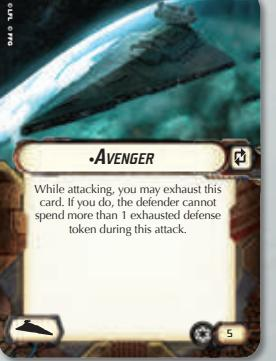

Updated Card

#### *Avenger*

This upgrade card's effect should read:

"While attacking, you may exhaust this card. If you do, the defender cannot spend more than 1 exhausted defense tokens during this attack."

This upgrade card should have a p icon.

{23}------------------------------------------------

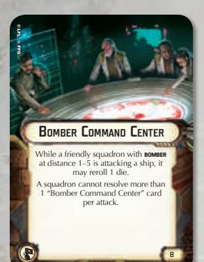

Updated Card

#### Bomber Command Center

This upgrade card's effect should be followed by this paragraph:

"A squadron cannot resolve more than 1 "Bomber Command Center" card per attack."

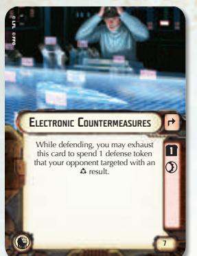

Updated Card

#### Electronic Countermeasures

This upgrade card's effect should read:

"While defending, you may exhaust this card to spend 1 defense token that your opponent targeted with an G result."

This upgrade card should have a q icon and a ready cost of 1 Q.

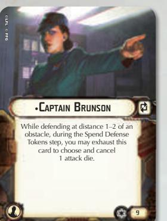

Updated Card

Captain Brunson

This upgrade card's fleet point value should be "9".

This upgrade card should have a p icon.

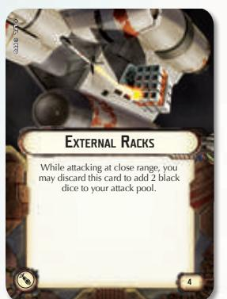

Updated Card

# External Racks This upgrade card's fleet point value should be "4"

### \*\*•\*\*commAnder sAto While a friendly ship is attacking a ship at distance 1 of a friendly squadron, before rolling attack dice, the attacker may replace up to 2 dice in its attack pool with an equal number of dice of any color or colors. © FFG © LFL

Updated Card

#### Commander Sato

This upgrade card's fleet point value should be "27".

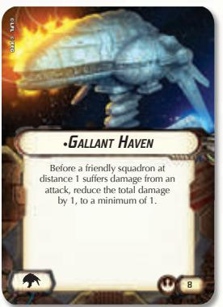

Updated Card

#### *Gallant Haven*

This upgrade card's effect should read:

"Before a friendly squadron at distance 1 suffers damage from an attack, reduce the total damage by 1, to a minimum of 1."

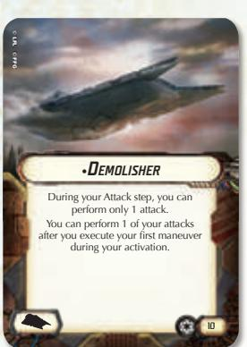

Updated Card

#### *Demolisher*

This upgrade card's effect should read:

"During your Attack step, you can perform only 1 attack.

You can perform 1 of your attacks after you execute your first maneuver during your activation."

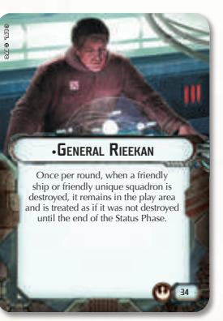

Updated Card

#### General Rieekan

This upgrade card's effect should read:

"Once per round, when a friendly ship or friendly unique squadron is destroyed, it remains in the play area and is treated as if it was not destroyed until the end of the Status Phase."

This upgrade card's fleet point value should be "34".

{24}------------------------------------------------

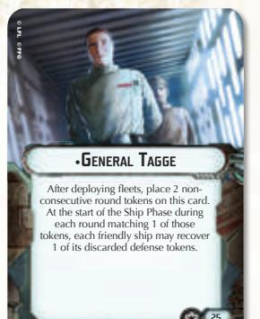

Updated Card

#### GENERAL TAGGE

This upgrade card's effect should read:

"After deploying fleets, place 2 nonconsecutive round tokens on this card. At the start of the Ship Phase during each round matching 1 of those tokens, each friendly ship may recover 1 of its discarded defense tokens."

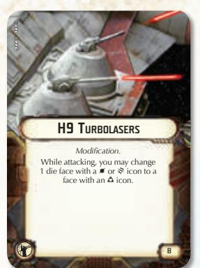

**Updated Card**

#### **H9** TURBOLASERS

This upgrade card should have the "Modification" trait.

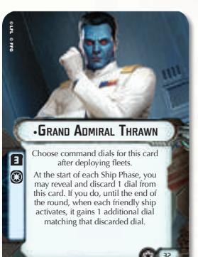

**Updated Card**

#### GRAND ADMIRAL THRAWN

This upgrade card's effect should read:

"Choose command dials for this card after deploying fleets.

At the start of each Ship Phase, you may reveal and discard 1 dial from this card. If you do, until the end of the round, when each friendly ship activates, it gains 1 additional dial matching that discarded dial."

This upgrade card should have a beginning dial value of 3 **②**.

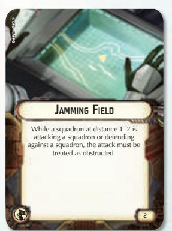

**Updated Card**

#### JAMMING FIELD

This upgrade card's effect should read:

"While a squadron at distance 1–2 is attacking a squadron or defending against a squadron, the attack must be treated as obstructed."

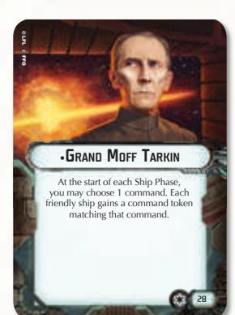

**Updated Card**

#### GRAND MOFF TARKIN

This upgrade card's fleet point value should be "28".

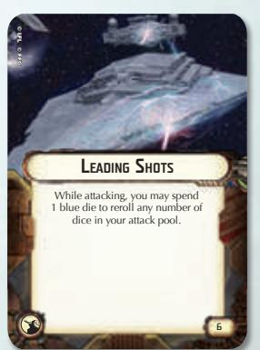

**Updated Card**

#### LEADING SHOTS

This upgrade card's fleet point value should be "6".

**Updated Card**

#### GUNNERY TEAM

This upgrade card's effect should read:

": The next attack you perform this activation can be performed from this hull zone.

Each of your hull zones cannot target the same ship or squadron more than once during your activation."

Updated Card

# LEIA ORGANA (COMMANDER) This upgrade card's fleet point value

should be "28".

{25}------------------------------------------------

# •Mon Karren @: While attacking a ship, the defender cannot spend more than 1 defense token during this attack.

**Updated Card**

#### MON KARREN

This upgrade card's effect should read:

": While attacking a ship, the defender cannot spend more than 1 defense token during this attack."

This upgrade card's fleet point value should be "6".

**Updated Card**

#### RAPID LAUNCH BAYS

This upgrade card's effect should read:

"Before deploying fleets, you may set aside a number of friendly squadrons up to your squadron value next to your ship card.

**②:** For each squadron you would activate with this command, you may place 1 of your set-aside squadrons within distance 1. It cannot move this activation."

Updated Card

#### Мом Мотнма

This upgrade card's effect should read:

"When a friendly ship resolves the

This upgrade card's fleet point value should be "27".

Updated Card

#### SLICER TOOLS

This upgrade card's effect should read:

"This card begins the game exhausted.

After you execute a maneuver, you may exhaust this card to choose an enemy ship at distance 1–3. You may choose a new command on its top command dial."

This upgrade card should have a ₱ icon and a ready cost of 1 ②.

**Updated Card**

#### **ORDNANCE EXPERTS**

This upgrade card's effect should read:

"While attacking, you may reroll up to 2 black dice."

**Updated Card**

#### TASKMASTER GRINT

This upgrade card's effect should read:

"Choose the command token for this card after deploying fleets.

When you reveal a command matching the token on this card, you may gain 1 matching command token without spending the command dial."

This upgrade card should have a beginning token value of 1 **\***.

Updated Card

#### QUAD TURBOLASER CANNONS

This upgrade card should have the "Modification" trait."

Updated Card

#### TURBOLASER REROUTE CIRCUITS

This upgrade card's effect should read:

"While attacking, you may exhaust this card and spend 1

defense token to change 1 red die to a face with a \\nicon or 2 \\nicons."

This upgrade card should have a 🌣 icon.

{26}------------------------------------------------

Updated Card

#### XI7 Turbolasers

This upgrade card's effect should read:

"While attacking, if the defender spends a B token, it cannot suffer more than 1 damage on each hull zone other than the defending hull zone when it resolves the B defense effect."

Updated Card

#### Dual Turbolaser Turrets

This upgrade card's effect should read:

"While attacking, you may exhaust this card to add 1 red die to your attack pool. If you do, choose and cancel 1 attack die."

This upgrade card should have a p icon.

Updated Card

#### Yavaris

This upgrade card's effect should read:

"O\*\*:\*\* Each squadron you activate may choose to only attack during your activation. If it does, while attacking, it may add 1 die to its attack pool of a color already in its attack pool."

Updated Card

#### Heavy Ion Emplacements

This upgrade card's effect should read:

"**Blue** E\*\*:\*\* Exhaust this card. The defending hull zone and each adjacent hull zone loses 1 shield."

This section presents other errata changes made to upgrade cards so their language is more consistent with other cards. As with the previous section, the mini-size versions of these upgrade cards remain legal game components but follow the text presented here.

The card images in this section have been updated to reflect their resized versions, which are available in the *Star Wars: Armada Upgrade Card Collection*. That product provides updated versions of all upgrades previously printed as mini cards, including these errata.

Updated Card

#### Auxiliary Shield Team

This upgrade card's effect should read:

"Q\*\*:\*\* You may treat the maximum shield values of your right and left hull zones as increased by 1 when you recover or move shields to those zones. If you do, the number of shields in each of those zones cannot exceed a maximum of "4"."

Updated Card

#### Linked Turbolaser Towers This upgrade card effect's first paragraph should read:

"While attacking, you may reroll 1 red die in your attack pool."

Updated Card

#### NK-7 Ion Cannons

This upgrade card's effect should read:

"**Blue** E\*\*:\*\* Exhaust this card to force the defender to choose and discard 1 of its defense tokens."

{27}------------------------------------------------

#### **SQUADRON CARD ERRATA**

# LAMBDA-CLASS SHUTTLE During your activation, instead of attacking, you may choose I friendly squadron at attack (even if it has already activated). HAWY. REALY 2. (When a friendly ship resolves a Geomemouth of you were in rangely to be activated, up to 2 of the squadrons it activates can be at distance 1-3 of you.)

#### COLONEL JENDON

This squadron's **Relay 2** keyword should read:

"When a friendly ship resolves a @ command, if you are in range to be activated, up to 2 of the squadrons it activates can be at distance 1–3 of you.)"

**Updated Card**

# LAMBDA-CLASS SHUTTLE HEAVY. RELAY 2. (When a friendly ship resolves a $\\pi$ command. if you are in range to be activates can be at distance 1"-3 of you.) BISTRATEGE. (When you end your movement at distance 1 of 1 or prime objective tokers,

LAMBDA-CLASS SHUTTLE

This squadron's **Relay 2** keyword should read:

"When a friendly ship resolves a @ command, if you are in range to be activated, up to 2 of the squadrons it activates can be at distance 1–3 of you.)"

**Updated** Card

Updated Card

#### MAJOR RHYMER This squadron's offo

This squadron's effect should read:

"Friendly squadrons at distance 1 can attack enemy ships at close range using all dice in their battery armament."

Updated Card

# STATION CARD ERRATA

#### ARMED STATION

This card's anti-squadron armament should be 1 blue die. This card's battery armament should be 2 red dice and 2 blue dice.

Updated Card

#### **OBJECTIVE CARD ERRATA**

#### Hyperspace Migration

The End of Round rule for the "Hyperspace Migration" objective card should read:

"For each ship, if it has an objective token on it, remove that token and that ship's owner gains 1 victory token; if it has no objective token on it and is at distance 1 of a purrgil, place 1 objective token on that ship. Then players move each purrgil."

**Updated Card**

#### JAMMING BARRIER

The Special Rule for the "Jamming Barrier" objective card should read:

"While attacking, if neither the attacker or defender are overlapping an objective token and line of sight is traced across an objective token or the line between the two objective tokens, the attacker must choose and remove half of the dice from the attack pool, rounded down, before rolling."

Updated Card

Updated Card

#### MOST WANTED

The Special Rule for the "Most Wanted" objective card should read:

"While a ship is attacking an objective ship, it may add 1 die of any color that is already in its attack pool to its attack pool."

{28}------------------------------------------------

#### Hyperlane Raid

The End of Game section of this campaign objective card should be followed by this sentence:

"If scores are equal, the first player wins."

#### Updated Card

Updated Card

#### Nebula Outskirts

The last sentence of the Special Rule section of this campaign objective card should read:

"The total number of command dials that must be assigned to each of the second player's ships during each Command Phase is decreased by 1 to a minimum of 1."

#### CAMPAIGN OBJECTIVE CARD ERRATA CORELLIAN CONFLICT CAMPAIGN GUIDE

#### Playing the Campaign, p.4

The **campaign points** cross-reference should read:

"(see "Final Victory" on page 9)."

#### Place Bases, p.6

• The last three sentences of this section's fourth paragraph should read:

"Each Rebel player must place two Rebel Presence stickers. These stickers can represent outposts or bases. However, only half of the total Rebel stickers can represent bases, the other half must represent outposts. Whether the Rebel Presence sticker denotes the location of an outpost or a base is only recorded on the Rebel Team Roster and kept secret from the Imperial team."

• The last paragraph of this section should read:

"Once all stickers have been placed, the Empire should have placed a number of Imperial Base stickers equal to the number of Imperial players plus the Imperial Base sticker on Corellia. The Rebel Alliance should have placed a number of Rebel Presence stickers equal to twice the number of Rebel players. Half of these should represent outposts and half bases."

#### Determine Battle Effects, p.10

The second paragraph of this section should read:

"After an assaulting player wins a battle at a location with a base or an outpost sticker, that base or outpost is destroyed, and the opposing team places a Destroyed sticker over the existing sticker. Then the assaulting player's team gains campaign points equal to one plus that location's **victory bonus** value."

#### Base and Outpost Limits, p.11

The second bullet of this section should read:

"The Rebels can only have a number of bases equal to the number of Rebel players plus one. They can only have a number of outposts equal to twice the number of Rebel players."

#### All-Out Offensive Special Rules, p.16

This section should include the following paragraph before the **Allied Fleets** section:

"**Assign Targets:** After setup is complete, each player whose commander does not have a friendly" effect must choose one opponent. The "enemy" effect of that player's commander can only be resolved against ships or squadrons controlled by the chosen opponent."

#### Corellian Sector Locations, p.17

The Victory Bonus value for Corfai should be +2:

The Victory Bonus value for Talfaglio should be +0:

#### FLOTILLAS

The rules for flotillas should read:

"The ship included in this expansion is a flotilla. Ships of this type feature two plastic ship models (instead of one). Flotillas follow the same rules as other ships with the following exceptions:

When a flotilla would overlap another ship (or be overlapped by another ship), deal one facedown damage card to the flotilla. Do not

{29}------------------------------------------------

deal a facedown damage card to the closest ship the flotilla overlapped (or that overlapped it) unless that ship is also a flotilla.

• A flotilla cannot equip a T (commander) upgrade card."

#### CORE SET LEARN TO PLAY

#### Fleet-Building Restrictions, p.22

This section should include the following bullet point:

"A ship cannot equip more than one copy of the same upgrade card."

#### ONAGER-CLASS STAR DESTROYER

#### Extreme Range, p.3

This section should include the following bullet point:

"While defending at extreme range, the standard effect of the D defense token cancels two dice of the defender's choice."

#### REBELLION IN THE RIM

#### Exogorth Effects, p.5

The second paragraph of this section should read:

"At the start of each Squadron Phase, starting with the second player and alternating, each player chooses one exogorth. Each player must choose a different exogorth. The chosen exogorth performs an antisquadron attack against each squadron at **distance 1**. While a squadron is defending, the opposing player (or team) resolves each step of that attack. An exogorth uses the following rules when it performs attacks:"

#### Setup Area, p.8

This section should include the following paragraph:

"During setup, obstacles must be placed within the setup area, beyond distance 3 of the player edges of the play area (and deployment zones), beyond distance 1 of the non-player edges of the setup area, and beyond distance 1 of each other. Unless specified by an objective, players place the standard six obstacles."

#### Command Ship Upgrade, p.26

The following paragraphs should read:

"**Huge Ship:** The team may spend one repair yards token and two resource tokens. Then one of this team's players may choose to remove a number of their ships, squadrons, and upgrade cards from their fleet and replace those forces with one huge ship worth a number of fleet points up to the value of the ships, squadrons, and upgrades that player removed."

"**Large Ships:** The team may spend one repair yards token and one resource token. Then up to two of that team's players may choose to remove a number of their ships, squadrons, and upgrade cards from their fleet and each replace those forces with one large ship worth a number of fleet points up to the value of the ships, squadrons, and upgrades those players removed."

#### Conquest, p.26

The following paragraph should read:

"**Location:** The assaulting team chooses a location with an enemy base. The defending team selects the "Base Defense" campaign objective recorded for that location on the team roster."

#### Demonstration of Force, p.27

The second bullet under "If the Defending Team Won" should read:

"Each of the assaulting and defending team's players may choose one reward from any friendly location in the chosen area. If a team has no friendly location in that area, each of its players may choose one reward from any friendly base location."

#### Evacuation, p.27

The following paragraph should read:

"**Location:** The defending team must choose a location with a friendly base, then selects the "Base Defense" campaign objective recorded for that location on the team roster."

#### CORE SET RULES REFERENCE

#### Attack, p.2

The second sentence of step 6, "Declare Additional Squadron Target," should read:

"The new defender must be inside the firing arc and at attack range of the same attacking hull zone, and the attacker must measure line of sight to it as normal."

#### Attack, p.2

Step 6, "Declare Additional Squadron Target," should include the following bullet point:

"Treat each repetition of steps 2 through 6 as a new attack for the purposes of resolving card effects."

#### Commands, p.4

This entry should include the following bullet point:

"A ship can resolve a command and choose not to produce its effect. It still counts as resolving that command, such as for the purpose of triggering upgrade cards."

#### Fleet Building, p.6

This entry should include the following bullet point:

"A ship cannot equip more than one copy of the same upgrade card."

#### Line of Sight, p.7

The fourth bullet point of this entry should read:

"If line of sight or attack range is traced through a hull zone on the defender that is not the defending zone, the attacker does not have line of sight and must choose another target."

#### Measuring Firing Arc and Range, p.7

This entry should include the following paragraph:

"When measuring attack range for a ship, ignore any portion of the defender that is outside the attacking hull zone's firing arc, even if that portion is at a closer range."

#### Measuring Firing Arc and Range, p.7

This entry should include the following paragraph:

"If attack range is measured through a hull zone on the defender that is not the defending hull zone, the attacker does not have line of sight and must choose another target."

#### Overlapping, p.8

The last sentence of the first paragraph should read:

"They can place those squadrons in any order, but they cannot place them outside the play area."

{30}------------------------------------------------

# Measuring Range Example

The CR90 Corvette's front hull zone attempts to attack the *Victory*'s rear hull zone. The Rebel player must measure range to the closest point of the *Victory*'s rear hull zone that is within the attacking firing arc. This measurement passes through the *Victory*'s left hull zone, so the CR-90's front hull zone does not have line of sight on the *Victory*'s rear hull zone.

#### Size Class, p.11

The size of a small ship should read "43mm x 71mm." The size of a medium ship should read "63mm x 102mm." The size of a large ship should read "77.5mm x 129mm."

#### SUPER STAR DESTROYER

#### Setup, p.4

The following paragraph should read:

"**Deploy Ships:** When a player deploys a huge ship, it may extend outside of that player's deployment zone as long as its base is completely within the setup area and touching that player's play area edge."

#### Pass Tokens, p.4

Replace this paragraph with the following:

"A player receives one or more pass tokens at the beginning of the game if their opponent has more ships than they do. When it is a player's turn to activate during the Ship Phase, that player may spend a pass token to pass their turn instead of activating, and it becomes their opponent's turn to activate a ship. When a pass token is spent, it is discarded."

# RU L E C L A R I F I C AT I O N S

#### OPEN, DERIVED, AND HIDDEN INFORMATION

#### open information

Open information is any information about the game, game state, or ships that is available to all players. This includes faceup damage cards, any relevant tokens, the chosen objective, discarded upgrade cards, and any other information continuously available to all players.

All players are entitled access to open information and cannot hide open information from an opponent or omit specific details. A player must allow their opponent to discover the information themselves if they attempt to do so.

#### derived information

Derived information is any information about the game, game state, or ships all players have had the opportunity to learn through card/game effects or through the process of deduction using open information. This includes each player's current score, how many of a particular damage card might remain in a damage deck, which ship a dial belongs to, etc.

Derived information may be marked with the use of a token or other indicator so that players remember the information. A player cannot misrepresent derived information or hide the open information necessary to discover derived information.

If derived information is dependent on a player's previous decision or action, they must answer truthfully when asked about that decision or action. For example, Steph chooses two ships for the objective Most Wanted. During a round later in the game, Bryan forgets which ships were chosen and asks Steph. Steph must answer honestly which two ships she chose for the objective.

#### Hidden Information

Hidden information is any information about the game, game state, or ships unavailable to one or more players. This includes facedown damage cards (even if they were previously faceup), facedown maneuver dials, cards within the damage deck, etc.

A player cannot learn hidden information without the aid of a game effect, rule, or another player verbally communicating the information. However, if a player that has access to hidden information about the game or a card and chooses to verbally share it with their opponent, that player is not required to tell the truth.

{31}------------------------------------------------

# FAQ

#### ACTIVATIONS

- **Q: When it is a player's turn to activate a ship, what happens if all of that player's unactivated ships are prevented from activating by card effects (such as Admiral Raddus or Governor Pryce)?**
- A: That player passes their turn to activate.

#### ATTACKS

- **Q: When a ship resolves an ability that allows it to add dice to the attack pool, can it add those dice if their color is not normally appropriate for the range of the attack?**
- A: Yes. The range restriction on dice color applies only when dice are gathered during the "Roll Attack Dice" step of an attack.
- **Q: If a ship's attack would not include any dice, but the ship can add dice through a card effect, can it perform the attack?**
- A: No. If a ship does not gather any dice during the "Roll Attack Dice" step of an attack, the attack is canceled.
- **Q: When measuring line of sight, do the attacker's hull zones block line of sight?**
- A: No.
- **Q: While measuring line of sight, if a ship is in the way, do its shield dials and their plastic frames affect line of sight in any way?**
- A: No. However, when determining line of sight, all of the other parts of a ship's plastic base can obstruct line of sight.
- **Q: Can a ship attack an engaged squadron?**
- A: Yes.

#### COMMANDS

- **Q: When a ship spends a command dial and token of the same type, does that count as one resolution of that command?**

- A: Yes.

- **Q: If a ship wants to spend a command dial and token of the same type, does it have to spend them simultaneously?**

- A: Yes. It must already have both the dial and token, and must spend them together. For example, when a ship with both a P dial and a P token decides to resolve that command, it must decide whether it is spending the dial, the token, or both before resolving that command's effects.

- **Q: Can a ship spend its command dial to gain a command token of the same type at any point during its activation?**

- A: No. It can only do this when it reveals its command dial.

- **Q: If a ship spends its command dial to gain a command token of the same type, can it spend that token later in that round?**

- A: Yes.

- **Q: If a ship has a** P **dial and a** P **token, can it spend those tokens against different targets during the same round?**

- A: No. A ship cannot resolve each command more than once each round.

- **Q: If a ship spends a** P **dial and a** P **token together, can it reroll the die that it adds? Is it required to reroll a die?**

- A: It can reroll the die that it adds, and it can choose not to reroll any dice.

- **Q: Can a ship resolve the effect of a command by spending multiple matching command dials or command tokens?**

- A: No. A ship may only resolve a command by spending one command dial, one command token, or one command dial and one matching command token.

- **Q: Do abilities or card effects that resolve when a ship reveals its command dial resolve when a command dial placed on an upgrade card equipped to that ship is revealed?**

- A: No. Effects that resolve when a ship reveals its command dial only resolve when a ship reveals a command dial from the stack assigned to its ship card as part of its activation.

- **Q: After a ship discards a raid token assigned to it, can that ship resolve that command during the same activation?**

- A: Yes. After a ship reveals and discards its dial or command tokens to discard a raid token, that ship can spend a command token (or an additional dial) at the appropriate time to resolve that command.

- **Q: When a player resolves an effect that allows them to change facedown command dials assigned to an opponent's ship, is that player allowed to see what commands were previously set on those dials?**

- A: Yes. The player resolving the effect gains the knowledge of the commands on those dials.

#### DAMAGE CARDS

- **Q: Can players look at facedown damage cards assigned to ships?**
- A: No.

#### DEFENSE TOKENS

- **Q: Can a ship spend a defense token even if it would have no effect?**
- A: Yes. For example, a ship can spend a B token and choose an adjacent hull zone with no shields remaining.
- **Q: Can a ship spend an evade token to reroll a die and wait to see the result before spending another defense token?**
- A: Yes.

#### FLOTILLAS

- **Q: What ship size are flotillas for the purposes of resolving card effects?**
- A: A flotilla ship is of the ship size defined by its ship token and base. For example, a flotilla ship on a small base is a small ship for all rules and effects interactions. Flotillas are only treated differently when they are overlapped or overlapping other ships.

#### MOVEMENT

**Q: When a ship executes a maneuver, does it move along the maneuver tool?**

{32}------------------------------------------------

- A: No. The ship is picked up from its starting position and placed in its final position. It ignores any obstacles, ships, and squadrons that its base does not overlap in its final position.
- **Q: When a ship executes a maneuver, is it destroyed if part of the maneuver tool is outside the play area but the ship itself is entirely inside the play area?**

A: No.

- **Q: When a ship overlaps more than one ship, how does a player determine which of those ships is closest?**
- A: The player measures range to the overlapped ship that appears to be closer and temporarily marks that measurement (such as by holding their thumbnail where the ruler reaches the overlapped ship). Retaining that measurement, they measure range to the other overlapped ship. If the second range measurement is beyond the marked measurement, the first ship is closer; otherwise, the second ship is closer.
- **Q: When can a player premeasure with the maneuver tool?**
- A: A player can only premeasure with the maneuver tool during their ship's "Determine Course" step and only for that ship.
- **Q: If a ship executes its maneuver so that it is exactly touching another ship or squadron at its final position, did the ship that moved overlap the ships or squadrons that it is touching?**

A: No.

- **Q: If a ship overlaps another ship and suffers damage so that it has damage cards equal to its hull value but its final position is overlapping the station obstacle, is that ship destroyed?**
- A: Yes. The station's effect is not resolved until after the ship executes its maneuver.
- **Q: When a ship executes a maneuver such that a portion of the ship would be outside the play area at its final plotted position, but the ship overlaps another ship at that position and finishes its move entirely inside the play area, is the ship that is moving destroyed?**

A: No.

- **Q: When an effect instructs a ship to execute a maneuver outside of its usual Execute Maneuver step, what is that ship's speed?**
- A: While executing that additional maneuver, the ship's speed is temporarily set to the speed indicated by the effect that is resolved. The ship executes the maneuver by completing the Determine Course and Move Ship steps. The ship's current speed is still tracked by its speed dial, and the ship does not count as having changed its speed.

#### OBSTRUCTED

**Q: While a ship is overlapping an obstacle and the attacking hull zone's traced line of sight does not pass over a visible portion of that obstacle, or another obstacle or ship, is that attack obstructed?**

A: No.

#### SET-ASIDE SHIPS AND SQUADRONS

**Q: Is a player defeated if they do not have any ships in play, but do have ships that are set aside due to a card effect?**

- A: Yes. All of that player's set-aside ships and squadrons are destroyed. In official tournaments, this occurs at the end of the game round.
- **Q: If a ship or squadron was set aside and is deployed at the start of a game round by an ability or upgrade card effect, can it resolve abilities and upgrade card effects at the start of that round?**
- A: Yes, as long as those abilities could be resolved at the start of the round in which that ship or squadron was deployed.
- **Q: Can set-aside ships be assigned tokens or chosen as an objective ship by abilities or card effects?**
- A: No. However, if they are assigned tokens or chosen as an objective ship **before** being set aside (by Blockade Run or Intel Sweep, for example) those tokens or effects are not removed when the ship is set aside.
- **Q: Can a ship or squadron that is set aside be deployed by a different card effect than the one that set it aside (Rapid Launch Bays and Fighter Ambush, for example)?**
- A: No. Ships and squadrons that are set aside are only affected by the ability or card effect that set them aside.

#### SETUP AND FLEET-BUILDING

- **Q: During fleet-building, how many fleet points can a player spend on squadrons?**
- A: While using standard fleet-building rules, a player can spend up to one third of the fleet point total, rounded up. For example, if playing a 200-point game, a fleet could contain 67 points of squadrons, even if the total cost of that fleet was only 190.
- **Q: During the "Place Obstacles" step of setup, can the players place any combination of six obstacles?**
- A: No. The players place three asteroid fields, two debris fields, and one station.
- **Q: During the "Deploy Ships" step of setup, can a player set their ship's speed to "0"?**

A: No.

**Q: Can a ship be placed so that it overlaps another ship?**

A: No.

- **Q: During Setup, can ships and squadrons resolve card effects before they have been deployed?**
- A: Yes. During Setup, ships and squadrons that have not yet been deployed are in play, and their ship, squadron, and upgrade cards are active, unless that ship or squadron has been destroyed or set aside.
- **Q: When a ship is deployed, does its shield dial need to be within that fleet's deployment zone?**
- A: No. When measuring a ship's distance from the edge of the play area, such as whether that ship is in its deployment zone, ignore its shield dials and the plastic portions of the base that frame the shield dial.

#### SQUADRONS

- **Q: When a squadron activates, is it required to move and/or attack?**
- A: No. A squadron can activate and end its activation without moving and/or attacking.

{33}------------------------------------------------

- **Q: During setup, can a squadron be placed outside the setup area as long as it is within distance 1–2 of a friendly ship?**

- A: No. It may be placed outside of the deployment zone, but not outside the setup area.

- **Q: When a squadron with counter performs its counter attack, can it resolve abilities that affect an attack?**

- A: Yes. A **counter** attack functions just like a normal attack except that the dice gathered for the attack are indicated by the squadron's **counter** value instead of its anti-squadron armament. They can be affected by the **swarm** keyword, Howlrunner's ability, etc.

- **Q: How does the squadron keyword bomber work?**

- A: When a squadron with bomber attacks a ship, it can resolve the standard critical effect before totaling damage if it has at least one E result. To determine the total damage of an attack against a ship, it sums the number of F and E results instead of only the F results.

- **Q: If a ship overlaps a large number of squadrons, can the opposing player place the squadrons in a way that makes it impossible for all of them to touch the ship?**

- A: No. The player must place as many as possible touching the ship. They cannot space them out in order to prevent some squadrons from touching the ship.

- **Q: If a ship overlaps a large number of squadrons and it is impossible to place all of them touching the ship, where should the remaining squadrons be placed?**

- A: A squadron that cannot be placed touching the ship must be placed touching another squadron that is touching the ship.

- **Q: When a ship executes a maneuver, if its shield dial or the plastic portion framing that dial is overlapping a squadron's base, does that count as overlapping?**

- A: Yes. Similarly, a squadron cannot move under or be placed under a ship's shield dial, as this would count as overlapping

- **Q: Can a squadron with rogue move and attack in either order when it activates during the Squadron Phase?**

- A: Yes.

- **Q: Is a squadron with grit prevented from moving while engaged with two squadrons, one with heavy and one without heavy?**

- A: Yes

- **Q: If a squadron is at distance 1 of two enemy squadrons, one that it is engaged with and one that it is not engaged with because it is separated by an obstacle, does the original squadron have to attack the engaged squadron?**

- A: No. A squadron can attack another squadron at distance 1 regardless of whether it is technically engaged with that squadron.

- **Q: Can a squadron with strategic move objective tokens that are assigned to a ship?**

- A: No.

- **Q: If a squadron with snipe is engaged and another squadron is at distance 2, can it attack the squadron at distance 2?**

- A: Yes. However, if the squadron with **snipe** is engaged with a squadron with **escort**, it cannot attack another squadron that lacks **escort**.

- **Q: Does a squadron with relay need to be at close–medium range of the ship that is activating squadrons so that those squadrons can activate?**

- A: Yes. The relay squadron must be in range to be activated by that ship, but that ship's squadron activation range can also be affected by other effects, such as Boosted Comms.

- **Q: Can a card effect or a squadron with strategic move objective tokens to or from a position where they are overlapped by a ship?**

- A: Yes. If necessary, that ship's owner may mark that ship's position and lift it out of the way, then return it after the token is moved.

- **Q: Do effects that change a squadron's speed value also apply when the squadron moves because of a card effect?**

- A: No. A squadron's speed only applies when it performs its standard move during its activation.

#### UPGRADE CARDS

**Q: Can a ship equip more than one** W **(title) upgrade card?**

A: No.

# C O R E L L I A N C O N F L I C T FAQ

#### BUILD FLEETS

**Q: After constructing their starting 400-point fleet, do players keep any leftover points as resources?**

A: No.

#### PLACE BASES

- **Q: When it is a Rebel player's turn to place Rebel Presence stickers, is that player required to record the location of a base and outpost as a pair?**
- A: No. However, the Rebel team must plan so that half of the Rebel Presence stickers represent outposts and half bases after all stickers have been placed.

#### DETERMINE INITIATIVE

- **Q: Can the player who declared the assault choose to be first or second player?**
- A: No. The player who declared the assault has initiative and is the first player.

#### SCORING BATTLES

- **Q: What happens to a player's squadrons if all of their ships are destroyed or all of their ships retreat to hyperspace?**
- A: The game immediately ends when a player has no ships remaining in the play area. The player with ships remaining in the play area wins that battle. Any of the losing player's squadrons remaining in the play area are treated as not destroyed and do not become scarred.

{34}------------------------------------------------

#### TRACKING FLEET CONDITION

**Q: If a ship is destroyed during a battle by moving outside the play area, does it become scarred?**

A: Yes.

- **Q: Can a scarred ship recover its discarded defense token or a scarred squadron recover its hull point during a battle by resolving an effect?**
- A: Yes. However, the scar ID token can only be removed during the Refit and Expand Fleets step. If that ship or squadron remains scarred at the start of the next battle, the appropriate effect must be resolved.
- **Q: Can a ship or squadron permanently lose its veteran token other than by being eliminated from the campaign?**

A: No.

- **Q: Is a ship or squadron that destroyed an enemy ship (or squadron) but retreated to hyperspace eligible to become a veteran?**
- A: Yes. That ship or squadron does not receive a scar token and is counted as destroyed only for scoring that battle. It is eligible to receive a veteran token.

#### REFIT AND EXPAND FLEETS

- **Q: When do changes to fleet rosters become public knowledge?**
- A: Players are not required to discuss their decisions during the Refit and Expand Fleets step. At the beginning of the Strategy Phase, fleet rosters are public knowledge and players can ask to look at the other teams' rosters before declaring assaults and defenders.
- **Q: Can a player voluntarily remove ships or squadrons from their fleet to reduce its fleet-point value?**
- A: Yes. However, ships or squadrons removed in this manner are treated as destroyed. The player does not recover resource points from their fleet-point value. Cards with unique names (such as title upgrade cards) that have been eliminated in this way cannot be purchased again by any player during the campaign.
- **Q: Do upgrades that are not equipped and are set aside count as part of that fleet's total value?**
- A: All purchased upgrades count toward the fleet's total value, whether they are equipped or unequipped.
- **Q: What is the limit on adding squadrons to a fleet?**
- A: A fleet's squadron fleet-point value cannot exceed one-third of that fleet's total value (rounded up). A player can add additional squadrons as long as the final squadron total does not exceed one third of the fleet's total final value.

#### GRAV WELL INTERDICTION

**Q: If a ship with a** a **(experimental retrofit) upgrade equipped moves so that it is at distance 1–5 of an enemy ship that has already discarded its dial to retreat to hyperspace, does that enemy ship still retreat?**

A: Yes.

#### STRATEGIC EFFECTS

**Q: Can the second player use a Skilled Spacers token to replace a campaign objective card with another campaign objective card or a standard objective card?**

A: No.

#### ALL-OUT ASSAULT

- **Q: Can multiple players on a team choose to deploy their Hyperspace Reinforcements at the same victory token during a single round?**
- A: No. If multiple players on the same team choose to deploy hyperspace reinforcements during the same round, they must each choose a different victory token.
- **Q: Can a** _ **card's effect be resolved by any ship in a fleet on the same team?**
- A: A non-commander upgrade effect that refers to "friendly" ships can be resolved by any friendly ship in allied fleets (within that effect's other requirements).

# R E B E L L I O N I N T H E R I M FAQ

#### NEW OBSTACLES

#### Dust Fields

- **Q: When an objective requires dust fields be placed, may the players choose preferred shapes from multiple sets that include dust fields?**
- A: No. Players must add a pair of dust field tokens from **one** campaign expansion. The shapes for the pair of dust field obstacles in *Rebellion in the Rim* are the same as those in *The Corellian Conflict*.

#### Exogorths

- **Q: If an exogorth is placed so that it overlaps squadrons, and it is impossible to place all of them touching the exogorth, where should the remaining squadrons be placed?**
- A: A squadron that cannot be placed touching the exogorth must be placed touching another squadron that is touching the exogorth. Squadrons can be placed overlapping the exogorth so that they are each touching it.
- **Q: If an exogorth is moved so that it is no longer touching an obstacle, such as by Ezra Bridger's effect, are its attacks obstructed by the obstacle it was previously touching?**

A: Yes.

#### Purrgils

**Q: How far must a player move a purrgil when they move it?**

A: This depends on the objective that required the purrgil to be placed. If the objective does not specify that the purrgil moves toward another component or specify a minimum distance, the player moving that purrgil can choose for it to remain in its current position. If the objective requires the purrgil to move toward another component, the purrgil's innate movement distance is 1–2, so it must be moved from its current position to at least the line that marks the end of the distance 1 band (or as close to that line as possible).

{35}------------------------------------------------

**Q: When a ship overlaps a purrgil after executing a maneuver at a speed different than that on the ship's speed dial, such as when resolving the Engine Techs effect, how much damage does the ship suffer?**

A: The ship suffers damage equal to the current speed on its speed dial.

#### IRREGULAR SQUADRONS

- **Q: Can a player choose to count as an irregular squadron a single model from a tree-peg squadron placed on a single-extender peg?**
- A: No. Only squadrons that are physically represented by a model on a single peg (instead of a tree peg) count as irregular squadrons. For example, this includes squadrons such as YT-2400's or VT-49 Decimators, not A-wings or TIE Interceptors.

#### TASK FORCE BATTLES

- **Q: When playing with a 3' x 3' play area in this format, do players place the standard six obstacles from the core set?**
- A: Yes. Unless an objective card indicates otherwise.

#### SCORING BATTLES

- **Q: What happens to a player's squadrons if all of their ships are destroyed or all of their ships retreat to hyperspace?**
- A: The game immediately ends when a player has no ships remaining in the play area. The player with ships remaining in the play area wins that battle. Any of the losing player's squadrons remaining in the play area are treated as not destroyed and do not become scarred.
- **Q: Are additional forces that a fleet gains during a battle—such as from a campaign objective or ally token—also added to that fleet's total value?**

# C A R D C L A R I F I C AT I O N S

This section presents clarifications to damage and upgrade cards that were originally printed as mini-size cards. The mini-size versions of these upgrade cards remain legal game components, but the card images in this section have been updated to reflect their resized versions. The *Star Wars: Armada Upgrade Card Collection* provides updated versions of all upgrades previously printed as mini cards. Star Wars: Armada Fleet Expansions provide updated damage decks.

#### DAMAGE CARDS

Updated Card

#### Damaged Controls

This card's effect resolves during the Move Ship step while executing a maneuver.

Updated Card

#### Power Failure

If a ship has two Power Failure damage cards, it fully applies one, then applies the other. For example, a ship with an Engineering value of "5" would be reduced to "2" and then reduced again to "1."

Updated Card

#### Thrust-Control Malfunction

An adjustable joint is a joint with a yaw value of "I" or "II"; a joint with a yaw value of "-" is not affected. This card affects the yaw value printed on the speed chart; that value can still be increased by the M command or other card effects.

This card only affects maneuvers executed at the ship's current speed (the number on its speed dial).

{36}------------------------------------------------

#### **OBJECTIVE CARDS**

#### ADVANCED GUNNERY

If either player's objective ship is equipped with Gunnery Team and attacks from the same hull zone during its activation, that ship cannot target the same ship or squadron more than once during its activation.

If either player's objective ship is equipped with Slaved Turrets, that ship cannot attack more than once per round.

If the first player's objective ship is equipped with *Impetuous* or Ordnance Pods, its hull zone cannot target the same squadron more than once during that ship's activation.

#### BLOCKADE RUN

The second player assigns 1 objective token to each of their ships after the objective is chosen, before any ships can be set aside by card effects.

At the end of the game, the second player can gain 1 victory token for each of their flotilla ships in the first player's deployment zone, even if all of the second player's non-flotilla ships have been destroyed.

#### **OPENING SALVO**

The dice added by this card effect are added to the attack pool after the attack pool is rolled. The second player's added dice can be of any color regardless of the range of the attack.

A ship's fleet point cost includes the costs of all upgrade cards equipped to that ship.

#### SURPRISE ATTACK

During setup, the station can be placed beyond or overlapping the first player's deployment zone.

While deploying fleets, if the first player's flagship is a huge ship, it must overlap the station and also touch that player's edge, if able. If that flagship cannot meet both restrictions, it must be placed overlapping the station with its rear hull zone as close as possible to that player's edge.

#### TARGETING BEACONS

This card's Special Rule cannot resolve more than once during each attack, even if there is more than one objective token at distance 1–2 of the defender.

#### CAPTURE THE VIP

When a ship with the objective token is destroyed because it ends its activation outside the play area, the objective token must be placed before the ship is removed. The opponent must place the token touching part of the ship's base that is in the play area or touching the edge of the play area closest to the ship's final position if no part of the ship is in the play area.

#### RIFT ASSAULT

When an attacker resolves the Special Rule effect to discard an objective token from the defender, they must change a die as specified for that player.

#### CONTESTED OUTPOST

The station does not obstruct attacks or line of sight for ships or squadrons.

{37}------------------------------------------------

#### FIRE LANES

If only a portion of a hull zone's armament is at attack range of an objective token, only that portion is added to the sum.

A hull zone can add only its current battery armament to the sum, including increases and decreases due to cards like "Enhanced Armament." Do not include dice granted after an attack would be rolled, such as from the Concentrate Fire command or the "Dominator" title.

#### PLANETARY ION CANNON

This card's Special Rule effect can only be used to attack 1 enemy ship per round.

While attacking with this card's Special Rule effect, if the defending hull zone has no shields, the attacker can choose to resolve the standard critical effect instead of the card's critical effect.

ships or squadrons overlapping es in the ambush zone. After setup slete, he removes all objective

HYPERSPACE ASSAULT

up: Before deploying fleets, the seco

ayer sets aside 1 of his small or medi ips and up to 3 of his squadrons; he it deploy them during setup. Then he aces 3 objective tokens in the play ar yond distance 3 of both players' edg

eyond aistance 3 of nom players' edges. Special, Nutz. 4th est art of any round firer the first round, the second player can eploy the ship and squadrons that he set side at distance 1 of 1 objective token. The ship hen remove all objective tokens. The ship an be deployed overlapping squadrons; though the ship had overlapped them while executing a maneuver.

second player does not deploy, he

#### FLEET AMBUSH

The first player can deploy squadrons within distance 1-2 of a ship inside the ambush zone.

After a player has placed all of their ships they begin placing squadrons on their next deployment turn. The other player continues placing ships until all of their ships have been placed, then they begin placing squadrons.

If a ship must be deployed into the Ambush Zone and cannot fit without overlapping obstacles or extending beyond the Ambush Zone, the player must deploy that ship so that the ship fits as completely into the Ambush Zone as possible.

#### DANGEROUS TERRITORY

A squadron with **strategic** can move objective tokens off of or onto obstacles. An objective token can only be removed to gain 1 victory token if it is overlapping an obstacle. If multiple objective tokens are overlapping an obstacle, only 1 can be removed when a ship overlaps that obstacle.

This card's Special Rule effect resolves during the Move Ship step while executing a maneuver.

inactive and they cannot be affected by

is deployed, set its activation slider to display the same color as the initiative token.

During setup, if the second player must deploy a squadron but cannot because they have no ships in the play area, their squadrons that are not set aside are destroyed.

The second player cannot move objective tokens at the start of the first round.

If a player has no ships in play, their ships and squadrons that are set aside are destroyed. If the game goes to time, or the end of the sixth round, their ships and squadrons that are set aside are destroyed.

#### DOOMED STATION

If an obstacle cannot be moved toward the gravity rift at all because it would overlap ships, squadrons, other obstacles, or tokens, that obstacle remains at its current position. The player moving the obstacle may still rotate it, as long as this follows rules for moving obstacles and the rules for this objective.

Hyperspace Migration

During the same round, a ship can either receive an objective or remove an objective token from itself to receive a victory token. This means a ship can only score every other round.

Players move purrgil as normal after all ships gain or discard tokens.

{38}------------------------------------------------

#### NAVIGATIONAL HAZARDS

If an obstacle that is overlapped by a ship or squadron is moved, that ship or squadron remains in its current position after the obstacle is moved.

If an obstacle cannot be moved because it would overlap ships, squadrons, or other obstacles, the controlling player can leave it in place or rotate it.

A ship or squadron only resolves an obstacle's effect when it overlaps that obstacle after moving.

#### CAMPAIGN OBJECTIVE CARDS

#### BASE DEFENSE: ARMED STATION

The second player can only resolve this card's Special Rule effect if the Armed Station could perform an attack against a ship or squadron that rolls at least 1 die.

#### MINEFIELDS

This card's Special Rule effect resolves during the Move Ship step while executing a maneuver.

#### BASE DEFENSE: ION CANNON

This card's Special Rule effect can only be used to attack 1 enemy ship per round.

While attacking with this card's Special Rule effect, if the defending hull zone has no shields, the attacker can choose to resolve the standard critical effect instead of the card's critical effect.

#### SOLAR CORONA

The "Roll Attack Dice" step is resolved before this card's Special Rule effect is resolved. If there are no dice remaining in the attack pool after resolving this effect, the attacker can still resolve effects that add dice during the "Resolve Attack Effects" step.

#### HYPERLANE RAID

The first player gains 1 victory token for each enemy ship that retreats to hyperspace.

The second player does not gain 1 victory token for each ship within 2 range ruler lengths of the first player's edge that retreats to hyperspace at the end of the game.

#### Show of Force

If the second player retreats all of their remaining ships to hyperspace, treat any remaining station as destroyed when determining score at the end of game.

{39}------------------------------------------------

#### **SQUADRON CARDS**

#### BIGGS DARKLIGHTER

While resolving Biggs Darklighter's ability, you cannot choose a friendly squadron that has been destroyed but is still in the play area because of General Rieekan's card effect.

#### **IG-88B**

When resolving IG-88B's ability, IG-88B can perform 1 attack against each enemy squadron at distance 1. While IG-88B is engaged with 1 or more ESCORT squadrons, IG-88B must declare them as targets first and can attack each ESCORT squadron once. Then if 1 or more ESCORT squadrons remain engaged, IG-88B must stop performing attacks.

#### COLONEL JENDON

Colonel Jendon can resolve his effect if he is not engaged or is unable to perform an attack due to some other effect.

This card's effect does not activate the chosen squadron.

#### LUKE SKYWALKER

Ignore Luke Skywalker's ability while resolving the "Projector Misaligned" and "Shield Failure" damage card effects.

Luke Skywalker does not resolve the critical effect granted by Norra Wexley's ability while attacking a ship with shields.

#### **D**UTCH **V**ANDER

If Dutch Vander is attacking and the defender does not suffer damage but another enemy squadron does (due to resolving an effect such as Biggs Darklighter), Dutch Vander's effect does not toggle the defender's activation slider.

**Updated Card**

#### MAJOR RHYMER

Friendly squadrons that are at distance 1 of Major Rhymer can attack ships at close range instead of being restricted to distance 1. This includes Major Rhymer himself.

When a friendly squadron attacks in this way, it ignores the dice color restrictions on the range side of the ruler, rolling all dice in its battery armament (the rightmost armament on the squadron card).

#### JAN ORS

Unless Jan Ors herself is defending, her defense tokens cannot be targeted by an a icon's effect.

#### VALEN RUDOR

An enemy squadron engaged with another squadron cannot perform a COUNTER attack against Valen Rudor.

{40}------------------------------------------------

#### WHISPER

When Whisper performs a COUNTER attack from an effect such as Dengar, that attack must be resolved before Whisper resolves their effect to move after defending.

**Updated Card**

#### ADMIRAL MONTFERRAT

A ship with a faceup Disengaged Fire Control damage card cannot target a ship equipped with Admiral Montferrat that is at speed 3 or higher.

#### **UPGRADE CARDS**

**Updated Card**

#### ADMIRAL ACKBAR

If a ship is equipped with Gunnery Team, Admiral Ackbar's ability may apply to both attacks performed from the same hull zone.

Updated Card

#### ADMIRAL MOTTI

If a ship's hull value becomes equal to the amount of damage cards it has as a result of losing Admiral Motti's effect, that ship is destroyed.

**Updated Card**

#### ADMIRAL CHIRANEAU

If a ship has *Corruptor* and Admiral Chiraneau equipped, engaged squadrons with **BOMBER** that it activates have a speed of "3."

**Updated Card**

#### ADMIRAL OZZEL

A friendly ship equipped with Nav Team that resolves a ② command using a ③ token to increase a yaw value may resolve Admiral Ozzel's effect to change its speed by 1.

-ADMIRAL KONSTANTINE

At the start of each Status Phase, you may choose any number of enemy ships at distance 1-5 of at least 2 friendly non-follidla ships, 1 of

tt the start of each Satus Phase, you may choose any number of enemy, ships at distance 1–5 of at least 2 friendly non-flottlla ships, 1 of which must be of medium or larger ize class. For each chosen ship, you may discard 1 ♀ loken from it or crease or decrease its speed by 1 to a minimum of speed 1.

Updated Card

If Admiral Konstantine's effect changes the speed of a ship with a faceup Thruster Fissure damage card, that ship does not suffer 1 damage from Thruster Fissure's effect.

During an All-Out Offensive, this card's effect can resolve against enemy ships belonging to any opponent.

**Updated Card**

#### ADMIRAL RADDUS

If the ship with this upgrade equipped is destroyed after resolving this card's effect to deploy a ship, the ship that was deployed by this card's effect still cannot be the first ship to activate that round.

During the Ship Phase of the round in which a ship is deployed by this card's effect, if all of both players' ships are prevented from activating by card effects (such as Admiral Raddus or Governor Pryce), a ship deployed by this card's effect may activate, even if it is the first ship to activate that round.

{41}------------------------------------------------

Updated Card

Admiral Screed

This card's effect can resolve during any ship or squadron's activation.

Updated Card

#### *Aspiration*

Shields can be moved to hull zones on the ship that this card is equipped to (including through the card effect of Projection Experts), as long as the number of shields in the hull zone they are moved to does not exceed that hull zone's maximum shield value.

After this card is discarded by an effect such as Darth Vader, shields exceeding a hull zone's maximum shield value are immediately lost.

#### Admiral Sloane

A token spent by this card's effect cannot be spent by the defender during that attack. The defender can spend another token of the same type during that attack.

Updated Card

#### Assault Concussion Missiles

The damage caused by this card cannot be reduced by the C defense token.

Updated Card

24

#### *Admonition*

A ship equipped with *Admonition* can discard a single readied defense token while defending.

#### Bail Organa

**Note:** This card has not been updated in the *Armada Upgrade Card Collection* and is no longer legal in competitive events.

You cannot resolve this card's effect to assign a round token to this card if the ship this card is equipped to is set aside.

If this card is discarded by an effect such as Darth Vader, it is no longer active in the game.

#### All Fighters, Follow Me!

If the ship with this upgrade equipped is destroyed after resolving this effect, squadrons activated by friendly ships are still affected until the end of the round.

This effect increases the speed of squadrons by an additional 1 that are activated by a ship with *Independence* equipped.

Updated Card

#### Boarding Engineers

To resolve this card's effect, choose the facedown damage cards to be flipped, then flip those cards faceup (one at a time).

A facedown damage card cannot be chosen more than once while resolving this effect.

Updated Card

{42}------------------------------------------------

Updated Card

#### Boarding Troopers

To resolve this card's effect, choose the defense tokens to be spent, then spend those tokens (one at a time).

A defense token cannot be chosen more than once while resolving this effect.

This card's effect allows the equipped ship to reveal and change the enemy ship's

The enemy ship's owner can set its dials to the command chosen by the ship resolving Cham Syndulla if they do not want their opponent to handle those dials.

Updated Card

#### Chimaera

A _ card equipped to this ship using *Chimaera*'s effect is not discarded if *Chimaera* is discarded by an effect such as Darth Vader.

If Chimaera's equipped _ upgrade card is discarded (to resolve its own effect, for example) it cannot then be discarded to resolve Chimaera's effect to replace it.

To resolve this card's effect, choose and equip any other _ upgrade card that does not share the same unique name as another card in your fleet, regardless of its point cost.

Upgrade cards replaced by this card's effect are no longer equipped to this ship or part of your fleet. They can be chosen by this card's effect to replace your current equipped _ upgrade card.

When determining the fleet point cost of the ship with this card equipped at the end of the game, the _ upgrade card currently equipped is the only one counted (even if that card is discarded because of its own effect).

#### Campaign Clarifications

In the *Corellian Conflict and Rebellion in the Rim,* after Scoring Battles but before the Track Fleet Condition (or Determine Experience) step, replace the _ upgrade card currently equipped to Chimaera with the _ upgrade card listed on the player's fleet roster.

In the *Corellian Conflict* and *Rebellion in the Rim*, during a team battle, *Chimaera* cannot equip a _ upgrade card with the same unique name as a card equipped to another ship in a friendly fleet in that battle.

During a one-on-one campaign battle, Chimaera can equip a _ card that is equipped to another friendly fleet. After scoring that battle Chimaera reverts to the _ card listed on its fleet roster.

Updated Card

Cham Syndulla

dials.

Chart Officer If a ship with this card equipped overlaps more than one obstacle, it can ignore the effects of each obstacle. If the ship chooses to ignore the effects of one obstacle that it overlaps, it must ignore the effects of all obstacles it overlaps.

Updated Card

Updated Card

# Comms Net This effect can only be resolved after the Reveal Command Dial step of the ship with this card equipped.

Updated Card

{43}------------------------------------------------

# \*\*•\*\**DeFiance* While attacking a ship that has already activated this round, add 1 die of any color to your attack pool. © FFG © LFL

#### *Defiance*

When *Defiance* resolves its effect, the die is added during the "Resolve Attack Effects" step and can be of any color, regardless of the attack's range.

Dual Turbolaser Turrets

While you are resolving this card's effect, you cannot resolve other effects that modify dice until you have completely resolved this card's effect.

Updated Card

#### Updated Card

Updated Card

*Demolisher*

If *Demolisher* is equipped with Engine Techs, it cannot perform one of its attacks after it executes the maneuver granted by Engine Techs.

*Demolisher* only affects one of the ship's attacks. It must perform its other attack during the Attack step of its activation or that attack is forfeited.

In the Minefields objective, if *Demolisher* is within range of a mine token after it executes a maneuver, it suffers the effect of that mine before it can perform its delayed attack. The attack is affected by any faceup damage cards dealt, and *Demolisher* cannot attack if it is destroyed.

Updated Card

#### Electronic Countermeasures

This card's effect does not allow you to do any of the following:

- Spend a defense token while at speed "0".
- Spend a defense token of a type the defender has already spent during an attack.
- Spend a defense token more than once during an attack.

*Devastator*

If this ship replaces one of its defense tokens (for example, using Captain Needa's ability), its replaced defense token does not count as discarded.

If this ship recovers a discarded defense token, that token no longer counts as discarded.

This ship cannot spend a defense token as part of the cost of resolving an upgrade card's effect unless that effect specifies that a defense token may be spent.

Updated Card

#### Engine Techs

When the ship executes this maneuver, it can click the first joint of the maneuver tool using its usual yaw value for the first joint at speed 1.

The ship cannot use its M command's effect to increase yaw values during this maneuver.

After this ship overlaps a ship, if this card is already exhausted it remains exhausted.

#### *Dominator*

If this ship spends two shields, it may take both from the same hull zone or one each from two different hull zones.

Updated Card

Updated Card

# Entrapment Formation! If the ship with this upgrade equipped is destroyed after resolving this effect, friendly ships are still affected until the end of the round.

{44}------------------------------------------------

*Executor*

This ship can only combine 1 command dial with 1 matching command token when it resolves a command. This ship cannot resolve the same command more than once during its activation.

G7-X Grav Well Projector

Ships deployed at distance 1–3 of a grav well token cannot resolve the effect of this card if that token's owner does not have at least 1 ship with this card equipped in play.

Grav well tokens remain in play until the end of the game.

Updated Card

Fire Control Team

If a ship with this card equipped resolves both the XX-9 Turbolasers critical effect and the standard critical effect, only the first 2 damage cards are dealt faceup.

If a ship with this card equipped resolves both the Assault Proton Torpedoes critical effect and the standard critical effect, only the damage card dealt by resolving Assault Proton Torpedoes is dealt faceup.

Updated Card

#### G-8 Experimental Projector

When a ship's speed is temporarily reduced, that ship's speed dial is not changed. When this effect is resolved on an enemy ship and that ship changes its speed dial during the Determine Course step (such as with a M command), the ship's speed is temporarily reduced by 1 from the current speed on its dial. This includes a ship that increases its speed to the maximum speed on its speed chart.

This effect can be resolved on an enemy ship that is executing a maneuver from an effect such as Engine Techs. This effect is resolved before the Determine Course step of that maneuver and reduces the ship's temporary speed by 1 to a minimum of 0.

#### Flechette Torpedoes

If a ship with this card equipped performs a **counter** attack during the defending squadron's activation, toggling the activation slider of the defending squadron does not end that squadron's activation.

Updated Card

#### Garm Bel Iblis

A ship cannot have more than one copy of the same command token. Tokens placed on this card belong to it and are not assigned to the ship this card is equipped to.

O\*\*:\*\* The anti-squadron armament of each squadron that you activate is increased by 1 blue die until the end of its activation.

Updated Card

#### Flight Controllers

This effect also increases a squadron's armament while it is attacking with **snipe**.

If a ship with this card equipped activates Colonel Jendon, and Colonel Jendon uses his ability to cause another friendly squadron to perform an attack, that squadron's armament is not increased by this card's effect.

Updated Card

#### General Dodonna

During an All-Out Offensive, this card's effect can only resolve when a ship belonging to the opponent you chose in the Assign Targets step is dealt a faceup damage card.

{45}------------------------------------------------

Updated Card

#### General Madine

When a friendly ship resolves the M command and spends a M dial, it can use this effect to increase a yaw value by an additional 1.

When a friendly ship equipped with Nav Team resolves the M command and spends a M token, Nav Team's effect is not cumulative with General Madine's effect.

#### Governor Pryce

**Note:** This card has not been updated in the *Armada Upgrade Card Collection* and is no longer legal in competitive events.

You cannot resolve this card's effect to assign a round token to this card if the ship this card is equipped to is set aside.

During the Ship Phase of the round matching the round token on this card, if this ship is your only unactivated ship, all enemy ships must activate before this ship activates, even if a card effect would otherwise prevent them from activating (such as Admiral Raddus).

During the Ship Phase of the round matching the round token on this card, if both players' fleets include a ship with this card equipped and the same round token is placed on both copies of this card, the first player's ship with this card equipped activates before the second player's ship with this card equipped.

If this card is discarded by an effect such as Darth Vader, it is no longer active in the game.

Updated Card

#### General Rieekan

Ships and squadrons affected by this ability are destroyed at the end of the Status Phase regardless of the number of damage cards or hull points they have at that time. These ships or squadrons are removed before resolving any "end of round" or "end of game" effects.

Ships and squadrons affected by this ability are treated as not destroyed until the end of the Status Phase for all purposes (attacking, defending, resolving card abilities, etc). These ships and squadrons can suffer additional damage from resolving effects such as Ruthless Strategists.

If a ship or squadron would be destroyed by leaving the play area, it is destroyed immediately (regardless of Rieekan's ability).

If the ship that General Rieekan is equipped to leaves the play area, a ship or squadron already affected by this ability remains in the play area until the end of the Status Phase.

Rieekan's ability affects the ship he is equipped to. If this ability prevents the last ship in Rieekan's fleet from being destroyed, the game ends at the end of the game round.

The ship with this card equipped can choose whether to resolve this card's effect before the destroyed ship or squadron is removed from the play area.

Updated Card

#### Grand Admiral Thrawn

When a friendly ship gains a command dial as part of Grand Admiral Thrawn's effect, that ship can spend that dial to gain a matching command token or spend it at the appropriate time to resolve that command, but the ship cannot resolve the same command more than once during its activation.

When a huge ship reveals its command dial, it only gains a command token matching the dial it revealed. It does not gain an additional token matching the command dial gained from Grand Admiral Thrawn's effect.

A ship cannot discard a dial it gains from Grand Admiral Thrawn's effect to discard raid tokens assigned to itself.

Grand Admiral Thrawn's effect cannot be resolved to place facedown command dials on this card if the ship it is equipped to is set aside before fleets are deployed, such as by Hyperspace Assault's Setup effect.

{46}------------------------------------------------

Updated Card

#### Grav Shift Reroute

Obstacles moved with this effect are restricted from overlapping tokens, obstacles, and ships only at their final position.

If an obstacle overlaps one or more squadrons, move any overlapped squadron out of the way and place the obstacle. Then the player who is not moving the obstacle places the overlapped squadrons, regardless of who owns them, in any position touching or overlapping that obstacle.

An obstacle moved with this effect can be rotated as long as no part of that obstacle is beyond distance 2 of the object's original position.

If an obstacle with an objective token placed on it during the setup of Dangerous Territory is moved with this effect, that objective token remains on that obstacle.

After deploying fleets, if the ship with this card equipped is not in play (because it has been set aside), that ship's owner cannot resolve the remainder of this card's effects.

Updated Card

#### *Insidious*

This ship can initiate an attack against the rear hull zone of an enemy ship at medium range even if it does not have red or blue dice in its armament.

Updated Card

#### *Instigator*

Squadrons can attack this ship if they are not engaged by an actual enemy squadron without **heavy** in the play area.

The **intel** keyword does not affect this ship's ability.

Squadrons at distance 1 of this ship that are also engaged by Valen Rudor can attack this ship if they are not engaged by squadrons other than Valen Rudor.

Updated Card

#### Hondo Ohnaka

When resolving this card's effect, both players must assign 2 command tokens to 2 different ships, even if they must assign tokens to enemy ships to do so.

Your opponent can assign command tokens to ships that you assigned tokens to.

Updated Card

#### Intel Officer

A ship with this card equipped can choose 1 of its own defense tokens when resolving this card.

Updated Card

#### *Impetuous*

If this ship is equipped with Gunnery Team, a hull zone of this ship cannot target the same squadron more than once during this ship's activation.

Updated Card

#### Leia Organa (Commander)

This card's effect cannot be resolved when a ship resolves a command by spending a command dial and a matching command token.

{47}------------------------------------------------

#### LINKED TURBOLASER TOWERS

The ship with this card equipped can resolve this effect during any of its antisquadron attacks but can only resolve it once during its activation. If the ship resolves this effect during an additional attack granted by another effect, such as the Ordnance Pods upgrade card, it cannot declare additional squadron targets during that attack.

#### ORDNANCE PODS

This card's effect allows the ship it is equipped to perform an anti-squadron attack against each eligible target in the chosen hull zone's firing arc.

If a ship is equipped with both this card and Gunnery Team, a hull zone of that ship cannot target the same squadron more than once during the ship's activation.

Updated Card

MINISTER TUA

A © card that was equipped to Minister Tua's ship using her effect is not discarded if Minister Tua is discarded by an effect such as Darth Vader.

PHYLON Q7 TRACTOR BEAMS

Modification.

When you activate, you may exhaust this card to choose 1 enemy ship of your size class or smaller at distance 1–5. That ship must spend a to a minimum of 1. to a minimum

PHYLON Q7 TRACTOR BEAMS

A ship affected by this ability must discard a ② token if it has one. Otherwise, it reduces its speed.

**Updated Card**

MON MOTHMA

Mon Mothma's ability provides an alternative way to spend ✓ defense tokens at medium range; an ✓ defense token spent in this way does not also produce its normal effect.

**Updated Card**

#### **P**ROFUNDITY

When the ship set-aside using this effect is deployed, it can overlap squadrons. If it does, place those squadrons as if the deployed ship had overlapped them while executing a maneuver.

When determining the fleet point cost of this ship and the ship deployed by this card's effect at the end of the game, the upgrade cards currently equipped to each ship are counted as part of that ship's fleet point cost.

In the *Corellian Conflict*, while Tracking Fleet Condition, if either the ship with this card equipped or the ship deployed by this card is eliminated from the player's fleet roster, only the upgrade cards equipped to that ship at the end of the game are eliminated.

**Updated Card**

#### MS-1 ION CANNONS

Upgrade card effects that do not have an "exhaust" requirement can still be resolved while that card is exhausted.

Updated Card

# QUAD LASER TURRETS A ship with this card equip

A ship with this card equipped rolls 1 blue die when performing a **COUNTER** attack, It does not use its anti-squadron armament.

When a ship with this card equipped performs a **COUNTER** attack, the ship's owner chooses which hull zone the attack is performed from.

{48}------------------------------------------------

Updated Card

#### Rapid Launch Bays

When a ship with this card equipped resolves a O command, it can place its set-aside squadrons up to the number it would activate during that O command. After the squadrons are placed, they can be activated (one at a time) as part of that O command, but cannot move. Placing a set-aside squadron does not count as an activation.

*Example: A ship equipped with Rapid Launch Bays has a squadron value of "4" and sets 4 B-wing squadrons aside. During a later round, the ship resolves a* O *command from its dial and first chooses to place all 4 of the B-wing squadrons. Then, the ship activates 3 of those B-wings and 1 X-wing that is at its squadron activation range. The B-wing squadrons can attack but cannot move as part of that activation.*

# Shields to Maximum!

Slaved Turrets

If the ship with this upgrade equipped is destroyed after resolving this effect, friendly ships are still affected until the end of the round.

If a ship with this card equipped attacks a squadron, it can declare additional squadron targets during its attack.

Updated Card

### slAVed turrets You cannot attack more than once per round. While attacking a ship, add 1 red die to your attack pool. 6 © FFG © LFL

Updated Card

#### Updated Card slicer tools This card begins the game exhausted. After you execute a maneuver, you may exhaust this card to choose an enemy ship at distance 1–3. You may choose a new command on its top command dial. © FFG © LFL

#### Slicer Tools

This card's effect allows the equipped ship to reveal and change the enemy ship's dial.

The enemy ship's owner can set its dial to the command chosen by the ship resolving Slicer Tools if they do not want their opponent to handle that dial.

Updated Card

#### *Squall*

This card's effect resolves before your ship dial is revealed.

#### Strategic Adviser

**Note:** This card has not been updated in the *Armada Upgrade Card Collection* and is no longer legal in competitive events.

This card's effect can only resolve if the ship it is equipped to is unactivated and could activate this turn.

Updated Card

#### Targeting Scrambler

Multiple copies of this card can each resolve their effect during the same attack. Each card's effect must be resolved separately.

{49}------------------------------------------------

**Updated Card**

TASK FORCE ANTILLES

When resolving this card's effect, you cannot choose and exhaust more than one copy of this card.

Updated Card

#### WARLORD

This ship can change a red die to the face that contains two **#** icons.

THE GRAND INQUISITOR

This card's effect resolves when the value on an enemy ship's speed dial is changed.

Updated Card

#### WULLF YULAREN

If a ship spends a command token to resolve a command, it cannot spend the matching token gained by exhausting Wullf Yularen to resolve that command or its effect again this round.

**Updated Card**

**Updated Card**

#### VETERAN GUNNERS

While a ship equipped with this card is attacking, it can spend $\\triangle$ icons before resolving this effect. Those dice are removed from the attack pool and are not rerolled.

**Updated Card**

#### XI7 TURBOLASERS

If the defender is equipped with Advanced Projectors, XI7 Turbolasers prevents the defender from suffering more than one damage on each hull zone other than the defending hull zone.

For example, if an attack deals four damage, a defender with Advanced Projectors must suffer at least one damage on the defending hull zone. Up to three total points of damage can be suffered on other hull zones, but each other hull zone can suffer only one damage.

Updated Card

WALEX BLISSEX

Defense tokens recovered by this ability are readied.

**Updated Card**

#### **YAVARIS** A squadro

A squadron activated by *Yavaris* that adds a die while attacking cannot resolve another effect to move during *Yavaris* activation.

{50}------------------------------------------------

# O P T I O N A L RU L E S

Before beginning a game, the players may agree to use one or more of the following optional rules.

#### UNLIMITED ROUNDS

Players who want to play a death match to the bitter end can use this rule. The game does not end after the sixth round; instead, the game ends only when all of one player's ships are destroyed. Do not use objectives when playing with this rule, but place obstacles as normal. In addition, at the end of each round, the player with initiative gives initiative to their opponent by passing the initiative token to that player.

#### TEAM PLAY

*Star Wars: Armada* is designed for two players, but it can be enjoyed by more; simply split the players as equally as possible into two teams. Each team controls one fleet. Each team must also nominate a Team Commander from among its members.

Each player takes exclusive control of one or more of that team's ship and squadron cards and makes all decisions for the corresponding ships and squadrons. This includes choosing commands, attacking, spending tokens, etc.

During the Command Phase, each player chooses commands for only the ships that player controls. A player may discuss their choices with their teammates, but they must do so openly at the table and cannot show their command dials to another player. During the Ship Phase, the players must agree on which ship to activate when it is their team's turn to activate a ship. During the Squadron Phase, the team must agree on which squadrons to activate.

If teammates cannot come to an agreement on a choice, the Team Commander makes the final decision.

If all of one player's ships and squadrons are destroyed, that player's team continues to play and can win by destroying all of the opposing team's ships or by having the highest score after six rounds.

# CREDITS

**Game Design:** James Kniffen and Christian T. Petersen

**Additional Content and Development:** Michael Gernes with Alex

Davy and Lukas Litzsinger **Producer:** Michael Gernes

**Graphic Design:** Christopher Hosch, Taylor Ingvarsson, Sam Shimota, and Evan Simonet with Christopher Beck

**Additional Layout and Diagrams:** Christopher Hosch with Steve

**Editing:** Adam Baker

Kimball

**Proofreading:** Adam Baker, Alex Davy, Richard A. Edwards, Lukas

Litzsinger, Sean O'Leary, and Nikki Valens with

Kara Centell-Dunk

**Cover Art:** Ben Zweifel

**Interior Art:** Piotr Arendzikowski, Tiziano Baracchi, Matt Bradbury, Emile Denis, Sacha Diener, Allen Douglas, Tony Foti, Zach Graves, Jeff Lee Johnson, Mark Molnar, Jake Murray, David Auden Nash, Tony Shasteen, Chris Trevas, Magali Villeneuve, Richard Wright, Ben Zweifel

**Art Direction:** Zoë Robinson

**Plastics Design:** Jason Beaudoin and Bexley Andrajack

**Plastics Management:** Jason Beaudoin **Managing Art Director:** Andy Christensen **Managing Graphic Designer:** Brian Schomburg **Lead Game Producer:** Steven Kimball **Project Coordinator:** Mark Larson

**FFG Licensing Coordinator:** Amanda Greenhart

**Production Manager:** Eric Knight

**Production Coordination:** John Britton, Megan Duehn, Simone Elliott,

Jason Glawe, and Johanna Whiting **Executive Producer:** Michael Hurley

**Executive Designer:** Corey Konieczka

**Publisher:** Christian T. Petersen

*Special thanks to Sam Stewart and to all of our beta testers!*

**Playtesters:** Sam Bailey, Max Brooke, Nayt Brookes, Frank Brooks, Christian Busch, Joshua Callaway, Kara Centell-Dunk, Erik Dahlman, Alex Davy, Andrew Fischer, Donal Gordon, Daniel Hars, Colton Hoerner, Daniel Howell, Tim Huckelbery, Steven Kimball, Kalar Komarec, Lukas Litzsinger, James Meier, Zachary Mott, Niklas Norman, Michael Ptak, Christine Pugh, Daniel Ramey, John Shaffer, Niko Simmons, Sam Stewart, Jeremy Stomberg, Brendan Weiskotten, Paul Winchester, Stuart Wilson, Mike Youtz

**Lucasfilm Approvals:** Chris Gollaher

{51}------------------------------------------------

## INDEX

| A                                 | Distance (see Range and                 | L                               |
| --------------------------------- | --------------------------------------- | ------------------------------- |
|                                   | Distance) 15                            |                                 |
| accuracy (see Attack,             | dust field (see Obstacles) 12           | Line of Sight 10                |
| Dice Icons) 2, 5                  | E                                       | M                               |
| Activation (see Ship Activation,  |                                         | maneuver (see Ship              |
| Squadron Activation) 2            | Effect Use and Timing5–6                | Movement) 17                    |
| passing (see Ship Phase)17–18     | enemy (see Friendly and                 | Maneuver Tool 11                |
| add (see Modifying Dice) 11       | Enemy) 7                                | Measuring Firing Arc and        |
| adjacent (see Hull Zones) 8       | Engagement 6                            | Range11–12                      |
| anti-squadron armament (see       | engineering (see Commands) 4            | Modifying Dice 11               |
| Armament) 2                       | equip (see Upgrade Cards) 21            | Movement 11                     |
| any command icon                  | Exhausted 6                             |                                 |
| (see Ready Cost) 15               | exogorth (see Obstacles) 12             | N                               |
| (see Upgrade Cards                | F                                       | navigate (see Commands) 3       |
| with Tokens or Dials) 21          |                                         | non-recur icon (see Readied) 15 |
| any dial icon (see Upgrade Cards  | Faction 6                               |                                 |
| with Tokens or Dials) 21          | Firing Arc 6                            | O                               |
| Armament 2                        | First Player 6                          | Objective Cards 11              |
| asteroid field (see Obstacles) 12 | Flagship 6                              | Objective Tokens 11             |
| Attack 2                          | Fleet Building 6                        | Obstacle and                    |
| Attacking Stations2–3             | Flotillas6–7                            | Token Movement 13               |
| Attack Pool 2                     | Focus Tokens 7                          | Moving Obstacles                |
| Attack Range 2                    | Friendly and Enemy 7                    | Example (diagram) 13            |
|                                   |                                         | Obstacles 12                    |
| B                                 | G                                       | Obstructed 13                   |
| base (see Ship,                   | game round (see Round) 15               |                                 |
| Squadron) 16, 19                  | gravity rift (see Obstacles) 12         | Overlapping 14                  |
| battery armament (see             | Grav Tokens 7                           | P                               |
| Armament) 2                       |                                         | passing activation (see         |
|                                   | H                                       | Ship Phase) 17                  |
| C                                 | hit (see Dice Icons) 5                  | Pass Tokens 14                  |
| cancel (see Modifying Dice) 11    | Huge Ship7–8                            | Play Area 14                    |
| Chaff Tokens 3                    | Firing Arcs and                         |                                 |
| change (see Modifying Dice) 11    | Hull Zones (diagram) 7                  | Short Player Edges Setup 18     |
| command dial icons                | Movement Example                        | Premeasuring 14                 |
| (see Upgrade Cards                | (diagram) 8                             | Proximity Mine Tokens 14        |
| with Tokens or Dials) 21          | Setup (diagram) 8                       | purrgil (see Obstacles) 12      |
|                                   | Size Class 18                           | R                               |
| Command Dials 3                   | Hull Zones 8                            |                                 |
| dial icons 21                     |                                         | Raid Tokens 14                  |
| Commanders 3                      | I                                       | Range and Distance15–16         |
| Command Phase 3                   | ID Tokens 8                             | Readied 15                      |
| Commands3–4                       | Ignition [Range] Keyword 9              | Ready Cost 15                   |
| any command icon 15, 21           | Ignition Attacks (diagram) 10           | ready (see Readied) 15          |
| Command Tokens 3                  | Special Battery Armament and Firing Arc | Rebel (see Faction) 6           |
| Ready Cost 21                     | 18                                      | recur icon (see Readied) 15     |
| concentrate fire (see             | Imperial (see Faction) 6                | repair (see Commands) 4         |
| Commands) 4                       | Initiative 10                           | Republic (see Faction) 6        |
| crew (see Damage) 4               |                                         | reroll (see Modifying Dice) 11  |
| Critical Effects 4                | Irregular Squadron 10                   | Round 15                        |
| critical (see Dice Icons) 5       | J                                       |                                 |
|                                   | joint (see Maneuver Tool) 11            | S                               |
| D                                 |                                         | Scoring 15                      |
| Damage 4                          | K                                       | Second Player 15                |
| debris field (see Obstacles) 12   | keyword                                 | Separatist (see Faction) 6      |
| Defense Tokens4–5                 | (see Ignition                           | Setup 16                        |
| Deployment Zone 5                 | [Range] Keyword) 9                      | Setup Area 16                   |
| Destroyed Ships and               | (see Squadron                           | Short Player Edges Setup 18     |
|                                   | Keywords)19–20                          | Shields16–17                    |
| Squadrons 5                       |                                         |                                 |
| Destroyed Stations 3              |                                         | Ship 16                         |
| Dice Icons 5                      |                                         | Ship Activation 16              |

{52}------------------------------------------------

| Ship Movement 17              |
| ----------------------------- |
| Ship Phase17–18               |
| Short Player Edges Setup 18   |
| Size Class 18                 |
| Special Battery Armament and  |
| Firing Arc 18                 |
| Speed 19                      |
| Speed Chart19–20              |
| spend (see Modifying Dice) 11 |
| Squadron 19                   |
| Irregular Squadron 10         |
| Squadron Activation 19        |
| Squadron Keywords 19          |
| Squadron Movement 20          |
| Squadron Phase 20             |
| squadron (see Commands) 4     |
| Station Card (see             |
| Attacking Stations) 2         |
| station (see Obstacles) 12    |
| Status Phase 20               |
| Supply 20                     |
| T                             |
| Targeting Point 20            |
| Targeting Tokens (see         |
|                               |
| Ignition [Range] Keyword) 9   |

| target (see Attack) 2      |     |
| -------------------------- | --- |
| Team Play 51               |     |
| timing (see Effect Use     |     |
| and Timing) 5              |     |
| Titles 20                  |     |
| U                          |     |
| Unique Names 20            |     |
| Unlimited Rounds 51        |     |
| Upgrade Cards 21           |     |
| Upgrade Cards with         |     |
| Tokens or Dials 21         |     |
| Upgrade Icons 22           |     |
| V                          |     |
| Victory Tokens 22          |     |
| W                          |     |
| Winning and Losing 22      |     |
| Y                          |     |
| Yaw 22                     |     |
| you (see Squadron, Upgrade |     |
| Cards) 19, 21              |     |

{53}------------------------------------------------

# QUICK REFERENCE

#### GAME ROUND

Each game round consists of four phases. During the Ship Phase and Squadron Phase, the players take turns, starting with the player who has initiative.

#### 1. Command Phase

Players simultaneously choose and assign facedown command dials to their ships, placing them at the bottom of the command dial stacks. Each ship must have a number of command dials assigned to it equal to its command value.

#### 2. Ship Phase

Players take turns activating one of their unactivated ships by proceeding through the following steps:

- 1. **Reveal Command Dial:** Reveal the ship's top command dial. Choose whether to spend the dial to gain the corresponding command token.
- 2. **Attack:** Perform up to two attacks from different hull zones.
- 3. **Execute Maneuver:** Move the ship at the ship's current speed.

When it is a player's turn to activate, if that player has any unactivated ships, they can pass their turn by spending (and discarding) a pass token under the following conditions:

- **First Player:** Has activated at least one ship and has fewer unactivated ships than the second player.
- **Second Player:** Does not have more unactivated ships than the first player.

A player cannot spend a pass token on consecutive turns during the same Ship Phase.

#### 3. Squadron Phase

Players take turns activating two of their unactivated squadrons, one at a time. If a player has only one unactivated squadron, that player must activate that squadron. If a player has no unactivated squadrons, they must pass their turn.

When a squadron activates, it may either move or attack.

#### 4. Status Phase

Players refresh the play area by following these steps:

- 1. **Ready Defense Tokens:** Flip each exhausted defense token to its readied side.
- 2. **Ready Upgrade Cards:** Rotate each exhausted card with a recur (p) icon (or no icon) to its readied position.
- - If players have exhausted cards with a non-recur icon (), they take turns, starting with the first player, choosing one card to ready and paying that card's cost, until one player has no more cards to ready.
- 3. **Flip Initiative Token:** Flip the initiative token.
- 4. **Place Round Token:** Place the round token with the next highest number next to the play area.

#### ATTACK RESOLUTION

To perform an attack with a squadron or ship, proceed through the following steps:

- 1. **Declare Target:** Declare a target that is inside the firing arc and at attack range of the attacking squadron or hull zone. Declare the attacking and/or defending hull zone, if any. Measure line of sight to the defender.
- 2. **Roll Attack Dice:** Gather and roll the attack dice appropriate for the attack's range and the armament being used.
- 3. **Resolve Attack Effects:** Spend G icons and resolve effects that modify dice.
- 4. **Spend Defense Tokens:** The defender can spend one or more of its defense tokens.
- 5. **Resolve Damage:** The attacker can resolve one critical effect. Then the defender suffers damage equal to the number of F icons. If the both the attacker and defender are ships, the number of E icons is added to the damage total.
- 6. **Declare Additional Squadron Target:** If the attacker is a ship and the defender was a squadron, the attacker can declare another enemy squadron that is within the firing arc and at attack range of the attacking hull zone as the new defender. Repeat steps 2 through 6 against the new defender. Each enemy squadron can be targeted once per attack.

© & TM Lucasfilm Ltd. No part of this product may be reproduced without specific written permission. Fantasy Flight Supply is a TM of Fantasy Flight Games. Fantasy Flight Games and the FFG logo are ® of Fantasy Flight Games. Fantasy Flight Games is located at 1995 West County Road B2, Roseville, MN 55113, USA, 651-639-1905. Actual components may vary from those shown.

Imported and Distributed in the EU by:

**Asmodee United Kingdom** Unit 6 Waterbrook Road Alton Hampshire, GU34 2UD, U.K.

**Asmodee Nordics** Valseholmen 1 2650 Hvidovre, Danemark **Enigma Distribution Benelux B.V.** Wethouder Den Oudenstraat 8 5706 ST Helmond, Holland

This and other supported documents for *Star Wars*: Armada can be accessed from the game's page:

**fantasyflightgames.com/products/star-wars-armada/** © & ™ Lucasfilm Ltd. The FFG logo is ® of Fantasy Flight Games. Permission granted to print or photocopy for personal use.
