{0}------------------------------------------------

TM

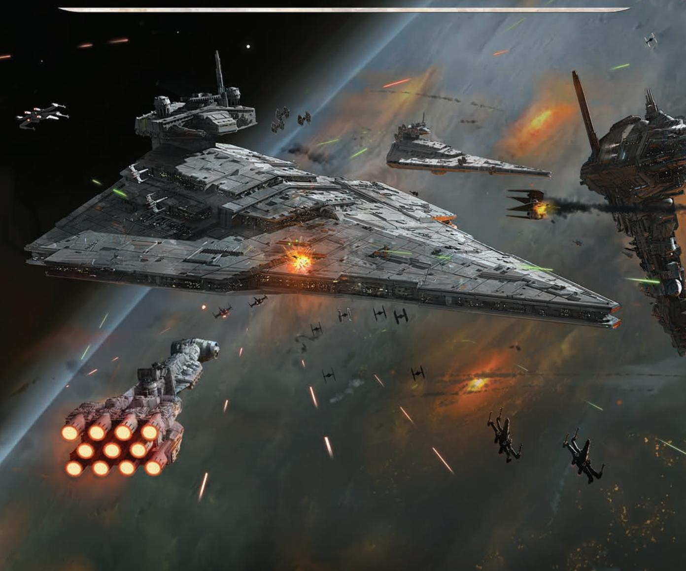

Description: The image depicts a scene of intense space combat featuring multiple spacecraft, including a large capital ship and smaller fighters engaged in battle. The relationships between elements suggest an ongoing conflict, with projectiles and energy blasts illustrating dynamic action and strategic movements. Visual cues, such as the position of the ships and trajectories of fire, imply a tactical engagement where maneuverability and firepower play crucial roles.
{1}------------------------------------------------

*It is a period of civil war. The galaxy's star systems are dominated by the crushing might of the Galactic Empire. Its dreaded Star Destroyers have terrified countless worlds into submission. Despite this threat, a small but determined Rebel Alliance has formed to oppose the Empire. From hidden bases, Rebel commanders lead fleets on daring raids to defend against the threats of bombardment and blockade. Massive starships and swarming fighter squadrons clash in fearsome battles across the galaxy.*

### Using this Learn to Play Booklet

This Learn to Play booklet teaches new players how to play *Star Wars: Armada*. To make your first game easier, this booklet omits some rules exceptions and card interactions. The Rules Reference booklet, also included in this product, addresses rules questions and special exceptions that are not included here and should be consulted as questions arise.

### G A M E OV E RV I E W

*Star Wars: Armada* is a competitive game of space warfare for two players. In each game, players take on the roles of Rebel and Imperial admirals, directing their fleets and countless weapons into explosive conflict. The victorious admiral will send the fiery remnants of his opponent's fleet limping into hyperspace to beg forgiveness for their failure.

### Ship and Squadron Scale

The ship models in *Star Wars: Armada* are produced at a relative scale, not at a true scale. This decision allows the beloved, iconic ships of the *Star Wars* universe to appear as feasible game components while still representing the relative size of all ships in relation to each other.

The plastic fighters are produced at the smallest size possible while still retaining their distinctive silhouettes and details.

### COMPONENTS

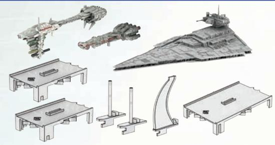

Description: The figure features several spacecraft models alongside various structural components such as bases and stands. The relationships depicted suggest that the spacecraft are designed to be displayed or assembled with the stands, indicating an interactive or operational sequence. The layout implies a rule that these components fit together in a specific manner to support the spacecraft.
3 Ships (3 Ship Models, 3 Plastic Bases, 2 Plastic Support Poles, 1 Plastic Support Fin)

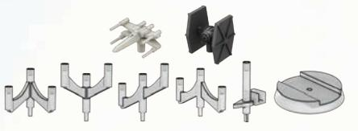

Description: The image displays various game pieces, including miniature spacecraft and supporting components like bases and connectors. The arrangement suggests a spatial relationship where the components can be attached or configured in specific ways, likely indicating movement or positioning during gameplay. Visually, the design implies that certain pieces may have distinct roles or functionalities within the game, governed by rules dictating their placement and interaction.
10 Squadrons (30 Plastic Fighters, 10 Plastic Bases, 10 Plastic Support Pegs, 10 Plastic Tree Pegs)

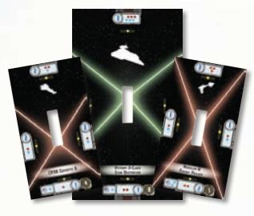

Description: The image features three game cards arranged in a triangular formation, each displaying a unique spacecraft silhouette and various symbols related to gameplay, likely indicating characteristics like strength or abilities. The cards have different colors of borders, suggesting distinct roles or factions within the game. Relationships are visually implied through the arrangement of the cards and the directional components, indicating possible interactions or game mechanics.
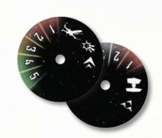

Description: The image features two circular dials, each marked with numerical indicators (1 to 5 and 1 to 2) and various symbols. The relationship between the dials implies a sequencing mechanism where specific actions or events may correspond to the numbers and symbols, suggesting rules for gameplay or decision-making. The use of graphical elements like icons indicates distinct categories or functions, potentially guiding player choices within the game's framework.
3 Ship Tokens 10 Squadron Disks (4 X-wings, 6 TIE Fighters)

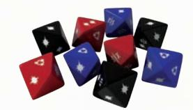

Description: The figure displays a collection of ten multi-colored dice, including red, blue, and black varieties, arranged in a scattered formation. The presence of different colors and the geometric shape of the dice suggest they may serve distinct functions or represent varying values within a game context. Additionally, the visual variety implies a set of rules governing their use, potentially influencing gameplay or outcomes.
9 Attack Dice (3 Blue, 3 Red, 3 Black)

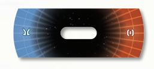

Description: The image presents a rectangular graphic divided into two halves, one shaded in blue and the other in orange, each featuring a grid pattern that transitions toward a central black area. This design suggests a dichotomy or contrast between two elements, possibly representing opposing forces or factions. The central oval cutout may indicate a focal point or pathway, implying a flow or interaction between the two colored sides while visually reinforcing a thematic connection or conflict.
10 Activation Sliders

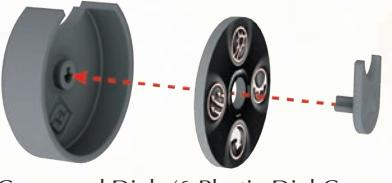

Description: The figure depicts a disassembled component of a device, including a gray plastic disc and a circular piece with several inner features. It illustrates the connection between these parts through a dashed line, indicating a potential interaction or alignment during assembly. The visual cues imply a specific method of connecting or securing the disc to the other piece, highlighting the importance of alignment in the process.
6 Command Dials (6 Plastic Dial Covers, 6 Punchboard Dials, 6 Gray Plastic Fasteners)

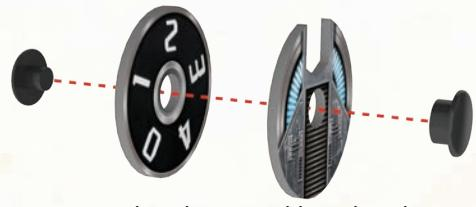

Description: The figure depicts a component assembly consisting of a circular dial with numbered segments, a segmented inner piece, and two black fasteners. Arrows indicate a disassembly or connection process, suggesting a sequence where the components fit together or are separated. The visual arrangement implies a mechanism that must be correctly aligned and secured with the fasteners for proper functionality.
3 Speed Dials (3 Punchboard Dials, 3 Punchboard Faceplates, 3 Plastic Connector Pairs)

{2}------------------------------------------------

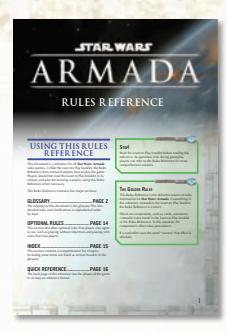

Description: The figure contains various elements, including the title "Star Wars Armada" and sections labeled "USING THIS RULES REFERENCE," "GLOSSARY," "OPTIONAL RULES," and "INDEX." It visually depicts a structured flow of information, guiding the reader through different components of the rules reference, with clear pagination references for easy navigation. The layout implies a systematic approach to understanding the game's rules, suggesting that users can follow a sequence to access detailed information about gameplay.
1 Rules Reference Booklet

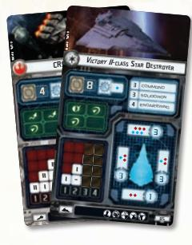

Description: The image features two game cards displaying different starships, including stats and attributes relevant to gameplay. Each card contains components such as maneuver values, shields, and attack capabilities, suggesting a strategic framework for their use in the game. The layout implies relationships between the components, indicating how players might utilize these values to influence their strategy and gameplay decisions.
6 Ship Cards

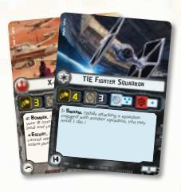

Description: The image features two game cards: one representing an X-Wing and the other a TIE Fighter Squadron. Each card includes statistics detailing attack and defense capabilities, along with special abilities and roles such as "Bomber" and "Escort." The relationships between the cards imply competitive interactions in gameplay, notably how specific abilities can influence engagements between different types of squadrons.
4 Squadron Cards

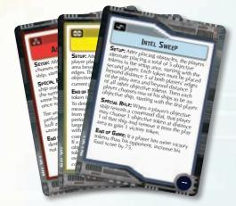

Description: The image displays three game cards, each featuring distinct titles and rule descriptions related to gameplay mechanics. The cards include elements like setup instructions, special rules, and end-of-game conditions that guide player actions and decisions. Relationships among the cards are implied through their sequential use during gameplay, highlighting interactions that impact scoring and strategy.
12 Objective Cards

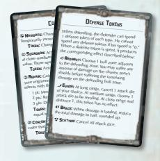

Description: The image depicts two game cards labeled "Defense Tokens," detailing various defensive actions a player can take during gameplay. Each card outlines specific actions, their requirements, and effects, such as canceling attacks or reducing damage. Visually, the cards suggest strategic choices for the defender while indicating the limited nature of actions based on the game's mechanics.
4 Reference Cards

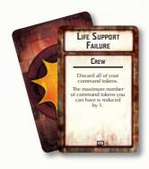

Description: The image features two playing cards, with one card prominently displaying the title "Life Support Failure" along with its designation as a "Crew" card. The card outlines an action that requires players to discard all of their command tokens, and it specifies a constraint reducing the maximum number of command tokens that can be held by one. This implies a gameplay mechanic focused on resource management and the impact of failure within the game's context.
52 Damage Cards

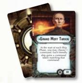

Description: The image features a card labeled "Grand Moff Tarkin" prominently displayed, with a back design that includes gears or mechanical elements behind it. The card outlines a rule for gameplay, indicating that at the start of each ship phase, players can choose a command for their ships, emphasizing a strategic choice affecting gameplay flow. This suggests a relationship between player decisions and the movement or actions of friendly ships in the game.
18 Upgrade Cards

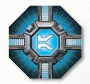

Description: The image features an octagonal platform design with a central blue emblem surrounded by metallic structures. Radiating pathways extend from the center, suggesting potential routes for movement or connection. The design implies a high-tech environment, hinting at rules or concepts related to navigation or interaction within a game or strategic system.
1 Initiative Token

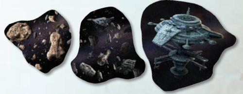

Description: The figure displays three distinct components: a collection of asteroids, a nebulous space background, and a space station. These elements may indicate a sequence of exploration or navigation through space, possibly suggesting a journey from asteroid fields to a space station. The arrangement visually implies a relationship between the dangers of navigating asteroids and the safety or purpose of reaching the space station, emphasizing the themes of exploration and survival in a cosmic environment.
6 Obstacle Tokens (3 Asteroid Fields, 2 Debris Fields, 1 Station)

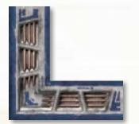

Description: The image depicts a corner section of a game board or area, featuring various geometric shapes and sections that may indicate player zones or resource placements. The arrangement suggests a spatial relationship between different components, implying movement or interaction within the designated area. Visual cues, such as patterns or outlines, may represent specific rules or constraints for gameplay, guiding player actions.
4 Setup Area Markers

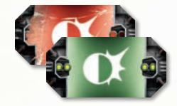

Description: The image features two distinct cards, one displaying a red background and the other green, both adorned with a central circular emblem resembling a stylized burst or explosion. These cards suggest a relationship between different game mechanics, possibly indicating opposing factions or power levels, inferred from the contrasting colors. The visual design implies rules related to gameplay decisions, emphasizing differences in actions or effects associated with each card.
13 Defense Tokens

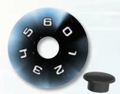

Description: The image features a circular dial marked with numbers 1 through 6, indicating a rotational component, alongside a small black knob or button. The arrangement suggests a mechanism for selecting or adjusting settings in a sequence or flow, likely involving rotation to engage different options. The presence of numbered indicators implies a range of values or settings that may correspond to specific functions or rules within the system it governs.
12 Shield Dials with12 Plastic Connectors

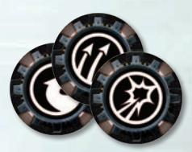

Description: The image features three circular tokens, each with distinct symbols: a curved arrow, a straight arrow, and an explosion. These symbols suggest different actions or effects that can be taken in a gaming context. The display of these tokens implies a relationship where players may choose among the options represented, possibly following specific rules or sequences in gameplay.
12 Command Tokens (3 of each)

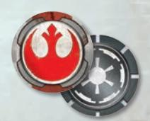

Description: The image depicts two game tokens, one featuring a red symbol associated with the Rebel Alliance and the other a black symbol linked to the Galactic Empire. The tokens represent opposing factions, suggesting a competitive relationship within the gameplay. This visual contrast implies themes of conflict and allegiance that are central to the game’s mechanics and narrative.
10 Victory Tokens (Rebel on front, Imperial on back)

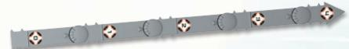

Description: The figure displays a horizontal strip with several circular segments, each marked with a diamond shape in the center. The arrangement suggests a sequence or progression, possibly indicating a path or series of actions to be taken. Visually implied rules may include a specific order for engaging with each component, along with a directional flow indicated by the arrow at the end of the strip.
1 Maneuver Tool (5 Punchboard Numbers, 5 Plastic Segments; see assembly on page 4)

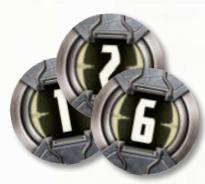

Description: The figure displays three circular tokens, each featuring a numeral (1, 2, and 6) prominently on their surfaces. These tokens may represent distinct game elements, potentially indicating actions, points, or positions within gameplay. The arrangement suggests a relationship among the numbers, possibly denoting sequential or hierarchical order in a gaming context.
6 Round Tokens

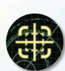

Description: The image features a circular design with a central yellow crosshair symbol, complemented by grid lines and circular arcs, suggesting a focus on precision or targeting. The layout indicates directionality and navigation, which might imply a relationship between different components or sectors as they relate to a central focal point. This design visually conveys concepts of accuracy and control in a strategic context.
7 Objective Tokens

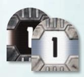

Description: The image features two tokens, both displaying the number "1" prominently, with one featuring a darker background and the other a lighter metallic background. These tokens likely indicate a numerical value or status in a game, suggesting a relationship of equivalence or progression between the two. The visual differentiation in color may imply different functions or contexts in which each token is used.
6 Ship ID Tokens

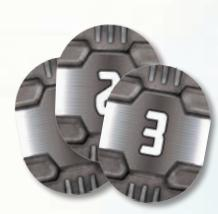

Description: The image features three distinct game tokens, each displaying different numeric values (2 and 3) prominently on a metallic-looking surface. The arrangement suggests a sequence or ranking, with the numbers indicating possible moves, scores, or resource allocation within a game. The visual emphasis on the numbers implies their importance in gameplay mechanics, establishing a rule-based framework for player interaction.
3 Main Ship ID Tokens

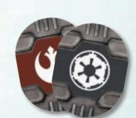

Description: The image features two game tokens, each prominently displaying different faction symbols: one shows a red Rebel Alliance emblem, while the other exhibits a black Galactic Empire symbol. These tokens suggest a dichotomy between opposing factions within the game. The design implies that players may choose a side, invoking a competitive dynamic that shapes gameplay interactions and strategies.
2 Main Flagship ID Tokens (Rebel on front, Imperial on back)

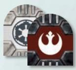

Description: The image features two distinct tokens or markers: one representing the Galactic Empire with a black and gray color scheme and an emblem, and the other representing the Rebel Alliance with a red background and a white emblem. The positioning of these tokens suggests a contrast between opposing factions, implying competitive or adversarial relationships in gameplay. The design and colors may also denote specific roles or abilities associated with each faction within the game's mechanics.
4 Flagship ID Tokens

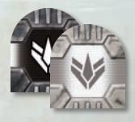

Description: The image features two distinct tokens or icons with a symmetrical design, one appearing in black and the other in gray. Each token likely represents different attributes or factions within a game context, indicated by the central emblem. The visual contrast suggests a relationship between the two elements, possibly signaling opposing forces or choices within gameplay mechanics.
20 Squadron ID Tokens

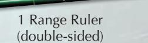

Description: The image displays a range ruler that is double-sided, primarily intended for measuring distances in gameplay. It likely illustrates how to use the ruler to determine ranges and movements, implying that accurate distance measuring is crucial for gameplay mechanics. The design may also suggest specific rules or guidelines attached to utilizing the ruler effectively within the game context.

### FOR YOUR FIRST GAME

For the first game of **Star Wars: Armada**, players are encouraged to play the learning scenario. This scenario is designed for new players to quickly set up and play a game using only the essential components and rules.

Before players begin the learning scenario, they must understand the basic rules presented on pages 5–18 of this booklet. To play the learning scenario, set up the game by following the "Learning Scenario Setup" instructions on page 5.

After players have a better understanding of the gameplay concepts in *Star Wars: Armada*, they will be ready to build their own fleets and incorporate the additional game concepts described in "Expanded Rules" beginning on page 19.

{3}------------------------------------------------

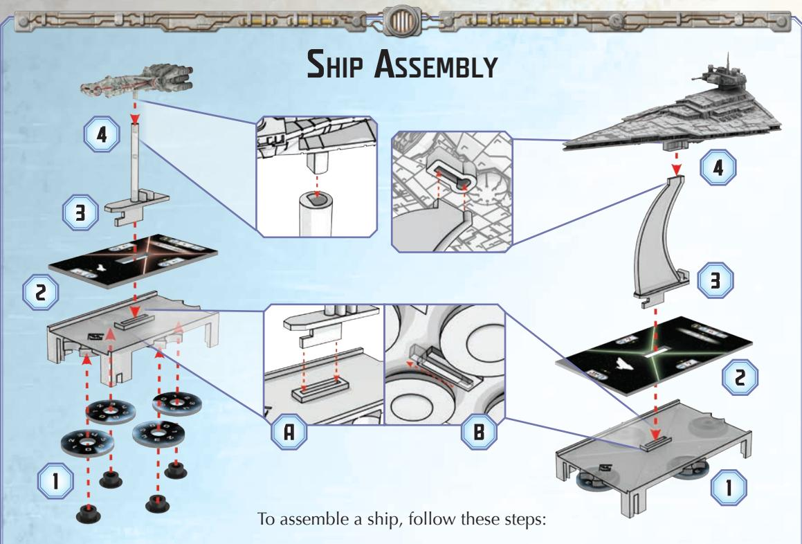

Description: The figure illustrates the assembly process of a ship, featuring various components such as the ship's base, a stand, and a card display. It depicts a sequential flow through four numbered steps, with connections indicated by arrows leading from one component to the next, showing how they interconnect during assembly. Additionally, it includes constraints through labeled parts and arrows that imply the correct order and orientation for assembly.

- 1. Using plastic connectors, attach the shield dials to the bottom of the base so the numbers face upward as shown above.
- 2. Place the ship token on the base so that the illustrated ship icon is placed over the FFG logo, which indicates the front of the base.
- 3. Insert the support pole (or support fin) into the center slot of the base (A) and slide it forward (B) until it locks in place underneath the base.
- 4. Insert the support pole (or support fin) into the ship peg on the bottom of the ship corresponding to the ship token.

## Maneuver Tool Assembly

Proceed through the following steps to assemble the maneuver tool as depicted below.

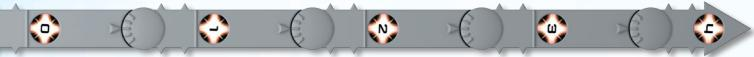

Description: The image consists of a series of circular icons connected by arrows, indicating a linear progression or sequence. Each icon likely represents a specific step or component in a process, with arrows illustrating the direction of flow from one element to the next. Visually, the design implies a systematic approach, suggesting a sequence that must be followed, possibly adhering to specific rules or constraints inherent to the overall system or activity it represents.
Assembled Maneuver Tool

- 1. Align the three hooks of the arrow-shaped
- segment over the ring of a middle segment.

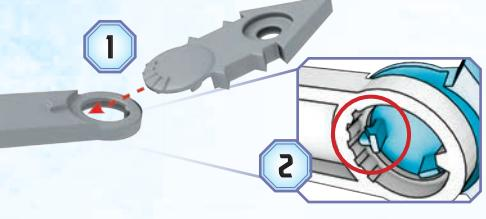

Description: The figure displays two components of a mechanical assembly, labeled as (1) and (2). The first element shows a part with a hole designed for fitting into the second component, which features interlocking teeth that suggest a secure connection or alignment. The visual implies a sequence of assembly where the correct orientation and fitting of the parts are necessary for functionality.
2\. Insert the hook with the arm (the hook closest to the end of the segment) through the ring so that the arm rests gently in the ring's center groove.

1. Press downward to push the remaining two hooks through the ring.

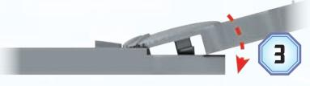

Description: The figure illustrates a mechanical component, showing a pivoting mechanism employed in a game or device. It depicts a sequential flow where the component rotates in relation to a fixed base, indicated by the red arrow suggesting motion. Visually implied constraints include the direction of the pivot and the necessary positioning of parts to ensure proper function.
4\. Repeat steps 1 through 3 to attach the remaining segments to the tool. Then, press the punchboard numbers into the sockets of each segment in sequence from "0" to "4."

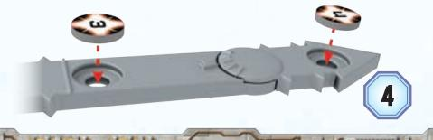

Description: The image depicts a gray, elongated component with two circular slots and a central circular feature. Two game tokens, labeled with numbers 3 and 4, are positioned above the slots, suggesting a placement sequence for gameplay mechanics. The layout implies a specific interaction where the tokens must be inserted into the designated slots, likely following a ruleset or order dictated by the game's instructions.
{4}------------------------------------------------

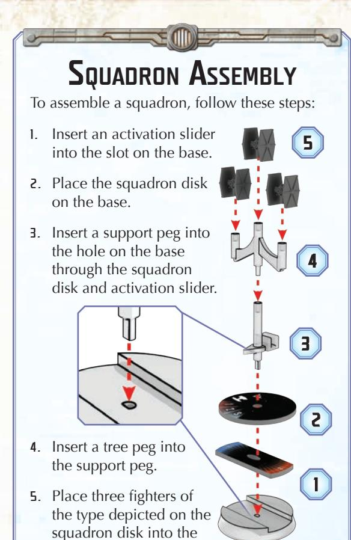

Description: The figure depicts a step-by-step assembly process for a squadron, highlighting five key components: an activation slider, a squadron disk, support pegs, tree pegs, and fighter miniatures. Arrows illustrate the sequential relationships between these elements, indicating the order of assembly from inserting the activation slider to placing the fighter miniatures on the squadron disk. Visually, there are implied constraints regarding the correct orientation and placement of each piece, ensuring proper assembly for functionality.

### SHIPS AND SQUADRONS

tree peg.

Throughout this booklet, the term "ship" refers to a fully assembled ship, complete with plastic ship model, pegs or fins, base, and ship token. The term "squadron" refers to a fully assembled fighter squadron, complete with plastic fighters, tree and support pegs, base, activation slider, and squadron disk.

Ships and squadrons are controlled by a player; therefore, when a ship or squadron is instructed to move, discard tokens, roll dice, etc., the player who controls that ship or squadron resolves those actions on its behalf.

### LEARNING SCENARIO SETUP

- 1. **Establish Play Area:** On a flat, stable surface such as a table, establish a 3' x 3' play area. Use the setup area markers to denote the corners of this area. Players will set up on opposite edges of this play area.
- 2. Choose Faction: Each player chooses a faction, either the Rebels or the Imperials. If both players wish to control the same faction, assign factions randomly.
- 3. Place Initiative Token: The Rebel player has initiative. He places the initiative token next to his edge of the play area with the blue side faceup displaying the **K** icon.
- 4. Prepare Ship and Squadron Cards: The Rebel player gathers the following ship and squadron cards and places them next to his edge of the play area: CR90 Corvette A, Nebulon-B Escort Frigate, X-wing Squadron. The Imperial player does the same with these cards: Victory II-class Star Destroyer, TIE Fighter Squadron.
- 5. Construct Ships and Squadrons: Each player gathers the ship tokens that match his ship cards and constructs his ships as shown in the "Ship Assembly" diagram on page 4. Then each player constructs his squadrons as shown in the "Squadron Assembly" diagram.
- 6. Prepare Ships: For each ship, place a speed dial set to "2" near that ship's card. Then set all four of its shield dials to the maximum values shown on its ship card. Then place one command dial near the CR90 Speed Dial Corvette A ship card, two command dials near the Nebulon-B Escort Frigate ship card, and three command dials near the Victory II-class ship card.

Shield Value

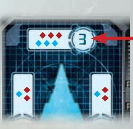

Description: The figure displays a game board featuring various colored shapes, likely representing game pieces or resources, arranged in a grid format. Central to the image is a numbered indicator (3), suggesting a scoring or step progression, while the pieces are positioned in a manner that implies potential interactions or outcomes. The layout suggests a turn-based structure with a focus on strategy, emphasizing player decisions and the management of resources throughout gameplay.
Victory II-class Ship Card

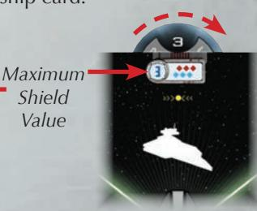

Description: The figure displays a ship card that includes a shield value indicator and a silhouette of a ship. It visually conveys that the ship has a maximum shield value of 3, represented alongside a series of shield icons to denote available points. The design suggests that the shield value is a crucial component for gameplay mechanics, affecting the ship’s resilience in play.
Victory II-class Ship Token and Shield Dial

{5}------------------------------------------------

- Prepare Squadrons: Rotate each squadron's disk to point to the maximum number on the disk and set each activation slider to display the blue side.
- **B. Place Defense Tokens:** Place the defense tokens indicated on each ship card next to that ship card.

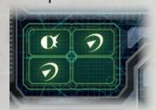

Description: The figure displays four distinct icons arranged in a 2x2 grid, each representing different actions or elements in a system. The relationships implied suggest these elements may interact or transition between states, hinting at a sequence or flow within the overall framework. Visually, the use of shapes and symbols indicates specific rules or constraints governing the interactions among the components.
Victory II-class Ship Card

KE-FEE

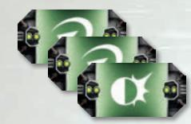

Description: The image features three cards arranged in a sequence, each prominently displaying distinct symbols against a green background. The flow from left to right suggests a progression or sequence of actions, likely representing different phases or options in gameplay. The consistent design implies a set of rules or constraints that govern their use within the game, reinforcing the concept of a structured turn-based or action system.
Victory II-class Defense Tokens

- 9. Place Ships and Squadrons: Each player places all of his ships and squadrons in the play area as close as possible to the positions shown in the diagram below, using the range ruler to guide their placement.
- 10. Prepare Shared Components: Place the range ruler, dice, and the round token marked "1" next to the play area. Shuffle the damage cards and place them facedown next to the play area.
- 11. **Create the Supply:** Place the command tokens to the side of the play area.

### LEARNING SCENARIO SETUP DIAGRAM

- **A.** Victory II-class Ship Card with Speed Dial, Command Dials, and Defense Tokens
- B. TIE Fighter Squadron Card
- C. Setup Area Markers
- D. Imperial Deployment Zone
- E. Play Area
- F. Range Ruler (distance side up)
- 6. Rebel Deployment Zone
- H. Initiative Token
- Nebulon-B Escort Frigate Ship Card with Speed Dial, Command Dials, and Defense Tokens
- J. X-wing Squadron Card
- K. CR90 Corvette A Ship Card with Speed Dial, Command Dial, and Defense Tokens
- L. Command Tokens
- M. Dice
- n. Damage Deck
- Round Token
- P. Maneuver Tool

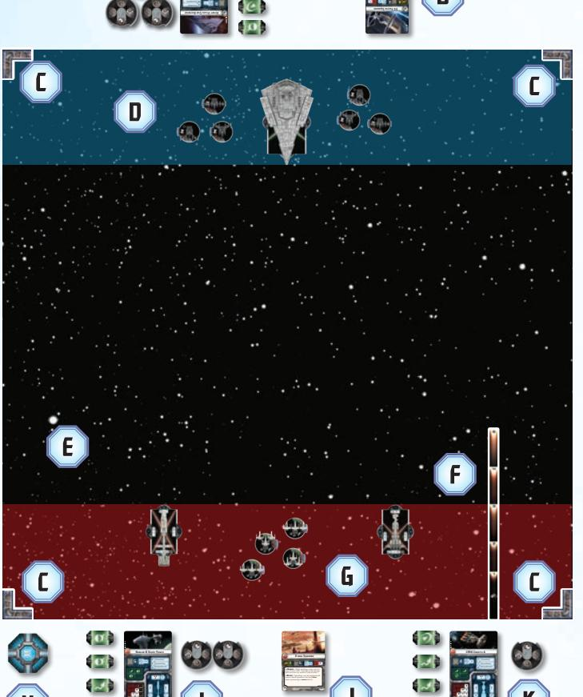

Description: The figure features a game board set in space, divided into two opposing areas, with ships and markers positioned strategically for gameplay. Key elements include icons labeled A through G, representing various game components, and vessels positioned to indicate the starting point or potential movement routes. Visual cues imply rules regarding territory control and movement, with the layout suggesting tactical relationships between players while adhering to game mechanics.
E P P

{6}------------------------------------------------

# OBJECT OF THE GAME

**Star Wars: Armada** is a competitive game in which each player controls a fleet of ships and squadrons. By commanding, attacking, and maneuvering with their ships and squadrons, they damage and destroy each other's fleet. The goal is to destroy as much of the opposing fleet's force as possible by the end of the sixth round. The game ends immediately if all of one player's ships are destroyed.

### PLAYING THE GAME

**Star Wars: Armada** is played over six rounds. Each round consists of the following phases:

- 1. **Command Phase:** Players assign command dials to each of their ships.
- 2. **Ship Phase:** Players take turns attacking with **and** moving each of their ships.
- 3. **Squadron Phase:** Players take turns attacking with **or** moving their squadrons.
- **4. Status Phase:** Players ready all of their defense tokens and flip over the initiative token.

At the end of the Status Phase, the player with the initiative token places the next highest round token next to the play area. Then the next round begins. Players continue playing the game until either one fleet destroys all of the other fleet's ships or the sixth round ends.

### PHASE 1: COMMAND PHASE

During this phase, players secretly and simultaneously use their command dials to choose commands for each of their ships. When revealed, each command provides that ship with a powerful bonus.

To choose a command, rotate the command dial so that the desired command icon is framed by the dial's fastener. Then place that command dial **facedown** next to the ship's ship card, placing it **under** any other command dials already assigned to that ship.

Since command dials are placed facedown, each player can secretly plan his strategy and keep his commands hidden from his opponent. The effects

of each command are briefly described in the "Commands" sidebar on page 8.

During the first Command Phase, the players must assign command dials to their ships so that each ship has a number of command dials equal to its command value. The Rebel player must choose one command for his CR90 and two commands for his Nebulon-B. The Imperial player must choose three commands for his *Victory*-class Star Destroyer.

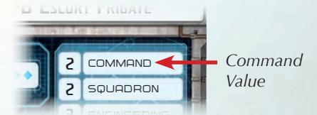

Description: The figure displays an interface element featuring values for "Command" and "Squadron," both marked with the number "2." The highlighted "Command" value indicates its importance in the context, likely affecting gameplay decisions or operations. The visual arrangement implies that these values interact in a way that may influence the player's strategic choices within the game.
Nebulon-B Escort Frigate Ship Card

During the Command Phase of each subsequent round, players choose only one command for each of their ships because each ship reveals only one dial during the Ship Phase. Since newly chosen commands are placed under existing commands, the players are often planning for future rounds.

When both players finish choosing commands for their ships, they proceed to the Ship Phase.

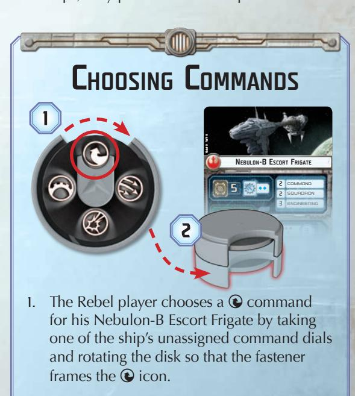

Description: The figure depicts a command selection mechanism for a game, featuring a circular dial with different command icons. It illustrates the process where a player selects a command for their ship by rotating the dial to align a specific icon, indicated by numbered steps. The visual elements imply a sequential choice-making process with clarity on how to frame the selected command.
2\. Then the Rebel player assigns the

command dial to the Nebulon-B Escort

Frigate by placing it next to the Nebulon-

has one command assigned to it, he must place the new ② command under the

command dial that is already there.

B's ship card. Since the Nebulon-B already

{7}------------------------------------------------

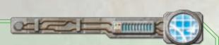

Description: The figure depicts a stylized control panel or interface, featuring various components such as a grid display, circuitry, and a segmented pathway. It suggests a flow of energy or data along the linear structure, potentially indicating a process or sequence of actions. The design implies a technological context, possibly governing operations or interactions within a system, with an emphasis on connectivity and functionality.

### Commands

Commands assist ships in numerous ways. A brief overview is presented below:

Description: The figure consists of a stylized arrow within a circular frame, suggesting a cyclical process or flow. The arrow implies movement or direction, indicating a sequence or progression in the context it represents. The circular design may signify continuity or recurring themes, emphasizing a concept of repetition or ongoing development.
M **Navigate:** Change speed and increase maneuverability.

Description: The image displays a circular icon featuring three upward-pointing arrows, suggesting movement or progression. The arrows are arranged in a way that implies various directions or choices, indicating potential pathways or actions. This design may visually convey concepts of growth, strategy, or multi-directional decision-making within a game or system context.
O **Squadron:** Order nearby squadrons to move and attack early.

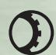

Description: The figure consists of a circular shape with a gear-like component integrated into its edge. This design suggests a mechanical relationship where the circular element may rotate or pivot around the gear, indicating a functional sequence of interaction. The implied concept relates to mechanics or machinery, highlighting an interconnected system that relies on precise movements.
Q **Repair:** Recover shields and hull damage.

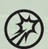

Description: The image features a circular icon with a burst symbol inside it, which may represent an impact or explosion. The outward rays suggest movement or an effect spreading from the center, indicating dynamics or energy release. This visual likely implies concepts of action, reaction, or the effect of certain game mechanics in a strategic context.
P **Concentrate Fire:** Increase the power of one attack.

Each command is described in detail later in this booklet.

During the first round of the learning scenario, players might not know the game well enough to strategically choose commands. If this is the case, they can use the following suggested commands by assigning them in the order presented so that the last command listed for each ship is on the bottom of its stack.

- **CR90 Corvette:** Repair Q
- **Nebulon-B:** Navigate M, Squadron O
- *Victory II*\*\*-class:\*\* Repair Q, Navigate M Concentrate Fire P

### PHASE 2: SHIP PHASE

During this phase, players take turns activating their ships.

The phase starts with the player who has initiative. He chooses one of his ships and activates it by performing the following steps in order:

- 1. Reveal Command Dial
- 2. Attack
- 3. Execute Maneuver

After the ship finishes its activation, the revealed dial is placed **faceup on the ship's ship card**; a faceup command dial on a ship card indicates that the ship has activated this round. Then the opposing player activates one of his own unactivated ships. If a player does not have any unactivated ships, he must pass his turn. This process repeats until both players have activated all of their ships.

### Reveal Command Dial

During this step, the player reveals the top command dial on his chosen ship's stack of command dials and places it **faceup next to the plastic ship**. If the player wants to resolve the revealed command for its full effect this round, he can spend the dial at the appropriate time to do so. If he wants to reserve it for a later round, he immediately spends the dial (placing it faceup on the ship's ship card) and places the matching command token next to the ship.

Command tokens provide players with flexibility, allowing them to use chosen commands in later rounds. However, command tokens produce a lesser effect than a command dial when spent.

### Attack

During this step, the ship can perform up to two attacks. An attack originates from one **hull zone**, and the target must be inside that hull zone's **firing arc** (see "Firing Arcs and Hull Zones" on page 9).

The target of the attack can be either **one** hull zone of an enemy ship or one or more enemy squadrons. Then the attacker rolls attack dice in an attempt to damage the enemy target. The steps of attacking are described in detail on page 13.

After a ship performs its first attack, it can perform a second attack, but the second attack must originate from a **different hull zone**.

During the first round of the learning scenario, players can skip the "Attack" step because their ships and squadrons will not be in attack range.

### Execute Maneuver

During this step, the ship must execute a maneuver; the player uses the maneuver tool to determine a precise position that the ship will move to. The distance the ship moves corresponds to its current **speed**, which is tracked on its speed dial.

To execute a maneuver with a ship, the player performs the following substeps in order:

- 1. Determine Course
- 2. Move Ship

#### Determine Course

First, the player resets the maneuver tool so that all of its joints are straight. Then he may click the joints of the maneuver tool to the left or right to change the final position and facing of his ship. The **speed chart** on the ship's card indicates how far each joint can be clicked away from the center position

{8}------------------------------------------------

# FIRING ARCS AND HULL ZONES

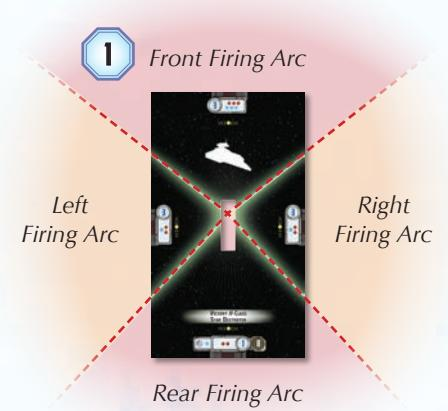

Description: The figure illustrates a game mechanics layout for a spacecraft, showcasing the four firing arcs—front, left, right, and rear—designated by directional lines. Each arc represents a specific combat zone from which the spacecraft can engage in attacks, indicating that movement and firing direction are crucial gameplay elements. Visually, the design implies strategic gameplay consideration, as players must navigate positioning to optimize firing capabilities within defined arcs.

1. Each ship has four firing arcs. Each arc is the area between its **FIRING ARC LINES**, which are printed on the ship token.

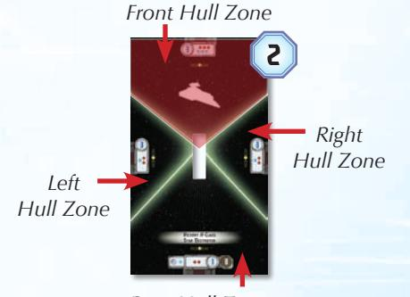

Description: The figure depicts a layout of a ship, divided into distinct zones: Front Hull Zone, Left Hull Zone, and Right Hull Zone. Arrows indicate the orientation of these zones relative to the ship’s structure, suggesting a directional flow or prioritization of actions in gameplay. The design implies rules for movement and interactions that are likely based on these designated areas.
Rear Hull Zone

2. Each ship also has four HULL ZONES. Each hull zone is the area on the ship token between two firing arc lines.

(see "Determine Course Example" on the right). Each column on the speed chart corresponds to the speed number at the bottom of the column.

A column shows the number of times that each joint can be clicked while going at that speed. Each row corresponds to one of the joints on the maneuver tool; the row directly above the speed number relates to the first joint, the second row relates to the second joint, etc. "I" means the joint can be clicked once in either direction, while "II" means it can be clicked twice and "-" means it must remain straight.

The player is allowed to place the maneuver tool on the play area to determine possible positions for his ship before committing to the move.

# DETERMINE COURSE EXAMPLE

Description: The image features a circular dial displaying the number "3" alongside a grid-like interface that includes numbered blocks. An arrow indicates a connection between the dial and the grid, suggesting a relationship where the value on the dial influences the arrangement or selection of the blocks. The arrangement implies a sequence where the numbers on the grid may correlate to actions or outcomes based on the selected value from the dial.
Speed Dial Nebulon-B Escort Frigate Speed Chart

1. The Nebulon-B Escort Frigate's speed dial is set to "3," which corresponds to the "3" column on the ship's speed chart.

Description: The figure presents a user interface comprised of a grid with numerical input and a maneuver tool indicated by an arrow. The numeric elements suggest a sequence or selection process, while the maneuver tool implies an interactive component for adjusting or directing actions. The relationships between the grid and the maneuver tool suggest a decision-making mechanism where inputs from the grid influence the tool's operational settings.
2\. The first row shows a "-," so the first joint must remain straight.

Description: The figure features a segmented control panel on the left, displaying a sequence of digits arranged in two rows, alongside a mechanism on the right that indicates movement through numbered sections. Arrows suggest a flow from the digit display to the turning mechanism, with the numbers likely representing positions or steps in a process. Visually implied rules may include the sequential nature of actions or the need to follow a specific path dictated by the numbers.
3\. The second joint may be clicked once. The Rebel player clicks it once to the right.

Description: The figure features two main components: a grid showing numbered tiles and a gear-like mechanism with rotating indicators. Arrows indicate a flow from the grid to the mechanism, suggesting a process for selecting or manipulating the numbers. Visually implied rules include the sequential progression in the grid and the need to align or rotate the gear according to the selected values.
4\. The third joint may be clicked up to two times. The Rebel player clicks it twice to the left.

{9}------------------------------------------------

#### Move Ship

The player places the maneuver tool on one side of his ship so that the plastic guides of the tool's flat end slide into the notches on the side of the ship's base. If properly inserted, the front of the ship should be parallel with the raised line above the guides.

The player presses the maneuver tool against the table and, without moving the tool, he picks up the ship. Then he places the ship at the joint below the punchboard number that corresponds to the ship's current speed. The notches on the ship's base slide over that joint's plastic guides.

Description: The figure illustrates two components: a grey piece with a circular emblem and a control panel connected to a game board. Arrows indicate the directional flow between the two elements, suggesting an interaction or assembly process. The visual layout implies that the grey piece must align correctly with the control panel to function properly, hinting at a specific connection method or game mechanic.
*Maneuver Tool Placement*

The ship's starting position and final position must be on the same side of the maneuver tool. In addition, the maneuver tool cannot be placed in such a way that the ship would overlap the tool when placed in its final position. If the ship would overlap it, the tool must be placed on the other side of the ship's base before the ship is moved.

Sometimes a ship's movement causes it to overlap a squadron or another ship. If this situation arises, see "Overlapping" on page 17.

### PHASE 3: SQUADRON PHASE

After all ships have been activated, players resolve the Squadron Phase. During this phase, players activate any squadrons that were not activated by a O command during the previous phase. Each squadron that activates during this phase may either move or attack, but not both.

This phase starts with the player who has initiative. He chooses one of his unactivated squadrons and activates it. After that squadron finishes its activation, the player must activate a second unactivated squadron, if able. Then his opponent activates two of his own squadrons in the same way. This process continues until all squadrons are activated.

### Squadron Movement

To move a squadron, the player places the range ruler on the table with the distance side faceup so that the distance 1 end of the ruler is in contact with any part of the squadron's base. Then he picks up the squadron and places it at any point along the range ruler. The squadron cannot be placed with any portion of its base beyond the distance band matching the squadron's speed.

Description: The figure consists of a sequence of five elements, starting with a colored symbol followed by various letters. The flow transitions from the symbol to the letters, suggesting a progression or transformation of ideas or concepts. Visually, the gradient background implies depth or movement, potentially indicating a progression in time or intensity related to the elements depicted.
*Range Ruler (distance side)*

A squadron cannot be placed with any part of its base overlapping another squadron or ship.

## Ship Movement Example

Using the course set in "Determine Course Example," the Rebel player moves his Nebulon-B Escort Frigate.

Description: The figure depicts two spacecraft positioned at distinct points (1 and 2) connected by a pathway that features directional arrows and obstacles. An implied flow suggests movement from point 1 to point 2, with a red dashed line indicating the preferred path and an X marking a blocked route. The presence of directional symbols and obstructions visually conveys the movement rules and constraints that players must navigate to succeed in the game.

- 1. The Rebel player places the maneuver tool's flat end on the right side of the ship.
- 2. The Rebel player realizes that if he moves the ship to the joint below the "3" speed number, it will overlap the maneuver tool at that position. He must place the maneuver tool on the other side of the ship instead.

Description: The image depicts two spacecraft connected by a dashed red line indicating a movement or transition from one point to another. A pathway is illustrated with markers, suggesting a sequence of steps or phases for navigation, while numbers 3 and 4 denote specific stages or checkpoints in that process. The presence of symbols along the pathway may imply constraints or rules governing movement or interactions in the game.

- 3. The Rebel player places the maneuver tool's flat end on the left side of the ship.
- 4. The Rebel player presses down the maneuver tool and moves the ship to the joint below the "3" speed number. Then he moves the ship to its final position, where it does not overlap the maneuver tool.

{10}------------------------------------------------

## SQUADRON MOVEMENT

Description: The image features a central object located at the intersection of concentric circular zones with varying shades of red, suggesting a gradient of intensity or importance. A vertical line extends from the central object to a numbered label at the top, indicating a sequence or a focal point of action. The visual hierarchy implies that the central object is pivotal within the concentric circles, which may represent varying levels of engagement or threat.

Description: The figure includes a vertical pathway with numbered segments (1, 2, 3) and circular elements at both ends, suggesting starting and ending points. A sequence of movement or progress is implied, where players or elements move from the bottom to the top through the numbered stages. The layout indicates potential constraints or rules regarding the movement or actions taken within each stage, possibly linked to game mechanics or objectives.
The Rebel player activates an X-wing squadron and places the distance side of the range ruler faceup.

Description: The image displays a game interface component, featuring a prominent yellow numeral "3" that indicates the speed value. An icon symbolizing speed, represented by a stylized arrow, accompanies the speed value. The arrangement suggests a direct relationship between the icon and the numerical speed, emphasizing that the numerical figure quantifies the speed indicated by the icon.
X-wing Squadron Card

- 1. The X-wing squadron has a speed of "3," so it can move anywhere within distance 1–3, in any direction.
- 2. The Rebel player decides where he will move the X-wing squadron and places the distance 1 end of the ruler in contact with the squadron's base.
- 3. The Rebel player picks up the X-wing squadron and places it at the end of the distance 3 band. Then he removes the range ruler from the play area.

יייייייייייייייייייייייייייייייייייייי

### SQUADRON ATTACKS

A squadron can attack either one enemy squadron or one hull zone of an enemy ship. Squadrons have a 360° firing arc; a squadron can attack any target at distance 1. Squadron attacks are described in "Attacking" on page 13.

### ENGAGEMENT

While a squadron is at distance 1 of an enemy squadron, those squadrons are ENGAGED. An engaged squadron must abide by the following rules:

- An engaged squadron cannot move.
- When an engaged squadron attacks, it must attack a squadron instead of attacking a ship.

Engagement is an important element of strategy. Players can use a screen of squadrons to protect their ships, or they can aggressively maneuver their squadrons to pin down enemy squadron groups.

### Tracking Squadron Activation

When a player activates a squadron, he pushes its activation slider to the other side, showing a different color and icon.

Players know whether their squadrons have been activated

by comparing the color and icon shown on the slider to the color and icon shown on the initiative token. If the colors and icons match, that squadron has not been activated yet.

Description: The figure features a central dial with a moving indicator and numerical markers ranging from 1 to 5, flanked by two colored elements (blue and red). The arrows suggest a flow or directional movement, potentially indicating actions or decisions impacting the values on the dial. Visually, there may be an implication of strategic choices based on the positional relationship between the components and their respective colors.
Activation Slider

### **PHASE 4: STATUS PHASE**

During this phase, players ready their exhausted defense tokens by flipping the tokens to their readied side (defense tokens are described in detail later). Then the player with initiative flips the initiative token over. The color and icon now shown on the initiative token is the color and icon of unactivated squadrons during the next round.

At the end of this phase, the player with initiative places the round token with the next highest number to the side of the play area; the number displayed on that token indicates the round number for the next round. Then players begin a new round starting with the Command Phase. The players continue playing rounds until the game ends.

### WINNING THE GAME

The game immediately ends when all of one player's **ships** are destroyed. That player is eliminated, and his opponent wins the game.

If neither player is eliminated after six rounds, the game ends and the player with the highest score wins. A player's score is equal to the total cost of each enemy ship and squadron that was destroyed; the cost of each ship and squadron is printed in the lower-right corner of its card.

{11}------------------------------------------------

### ADDITIONAL RULES

This section describes all other rules needed to play the learning scenario.

### COMMANDS

Commands enhance a ship's power, giving it additional capability. The effect of each command depends on whether a player spends a command dial or a command token. Each command effect is described below.

### NAVIGATE (

Description: The figure features a stylized arrow within a circular shape, signifying a cyclical process or continuous flow. The arrow suggests movement or progression, indicating an iterative or feedback-driven sequence. The circular design implies constraints on direction, emphasizing that the process may repeat or loop back rather than proceeding linearly.
When a ship is determining course for movement, it may spend its ② command dial to increase or decrease its speed by one. This is the main way that a ship changes its speed. Also, it may adjust one joint by one click more than the speed chart normally allows. The minimum speed for all ships is "0," and the maximum speed is indicated on the speed chart.

A ship with a ② command token may spend the token when determining course for movement to increase or decrease its speed by one.

### SQUADRON W

Description: The image features a circular design containing three arrows pointing outward in different directions. This layout suggests dynamic movement or expansion, indicating multiple options or pathways. The visual representation implies adaptability or flexibility in navigating choices or strategies.
After this icon is revealed on a command dial, the ship may spend its @ command dial to activate a number of friendly squadrons up to its squadron value. It can only activate squadrons that are at close—medium range of it (see the image under "Targeting" on page 13). Each squadron activated in this way can attack **and** move in either order. The ship chooses and activates squadrons one at a time.

Description: The image features a displayed interface element with three primary components: "COMMAND," "SQUADRON," and "ENGINEERING," each accompanied by a numerical value. The flow from top to bottom suggests a ranking or sequential order, indicating that "SQUADRON" has a value of 2, positioning it relative to the other components. This implies a hierarchical structure where different categories are rated or quantified, with specific values assigned to each for gameplay mechanics.
Nebulon-B Escort Frigate Ship Card

A ship with a @ command token may spend the token after revealing its command dial to activate one squadron following the rules above.

## REPAIR ①

After this icon is revealed on a command dial, the ship may spend its command dial to gain engineering points equal to its engineering value. It may spend these points on the following effects in any combination and number.

Description: The image features a segmented interface highlighting components labeled "SQUADRON" and "ENGINEERING," with a numerical indicator for the engineering value. It suggests a hierarchy or sequence where engineering is a crucial element linked to squadron operations. The visual emphasis on the number and the directional arrow indicates the importance of engineering in the context presented, implying a relationship where engineering contributes significantly to the overall value or functionality in the system.
Nebulon-B Escort Frigate Ship Card

- 1 point: Move one shield from one of the ship's hull zones to another of its hull zones (without exceeding the hull zone's maximum shield value).
- 2 points: Recover one shield in any of the ship's hull zones.
- 3 points: Discard any one of the ship's faceup or facedown damage cards.

A ship with a ② command token may spend the token after revealing its command dial. The ship gains engineering points equal to half of its engineering value, rounded up, to spend on the effects listed above.

### CONCENTRATE FIRE

Description: The image features a circular logo with a dynamic explosion graphic inside. The design suggests an impact or action, indicating a potential game mechanic related to damage or attack. The bold style implies a rule or concept associated with offensive strategies or effects in gameplay.
After a ship rolls dice during an attack, it may spend its ② command dial to roll one additional attack die. That die must be of a color that it already rolled

A ship with a ② command token may spend the token after it rolls dice during an attack to reroll one attack die.

#### **COMMAND TOKENS**

When a player reveals a ship's command dial, he can spend the dial to place the matching command token next to that ship. The maximum number of command tokens that a ship can have is equal to its command value, and a ship cannot have more than one copy of each type of command token.

Description: The image depicts a circular emblem featuring a stylized explosion icon at its center, surrounded by a dark, circular border. The explosion symbol suggests an action or event, potentially indicating a triggering effect. The use of black and white colors emphasizes contrast, implying a straightforward representation of a key concept or rule within the context of gameplay.
Command Token

{12}------------------------------------------------

### ATTACKING

The rules below describe how a ship attacks an enemy ship. Squadrons use most of the same rules as ships when attacking and defending; the few exceptions are described in the "Squadron Attacks" and "Squadron Defense" sections.

To perform an attack, the player first chooses one of his ship's hull zones to attack from. Then he declares the defending hull zone on the ship he wants to attack. The defending hull zone must be within firing arc and ATTACK RANGE (see the "Targeting" section later).

After declaring the defending hull zone, the attacker determines his attack dice. These dice are printed in the attacking hull zone.

Description: The image features a grid-based display with symbols representing attack dice, indicated by colored diamonds in red and blue. The arrangement suggests a sequence or allocation process for utilizing these attack dice, possibly related to player actions in a game context. Additionally, the directional arrow emphasizes the significance of the attack dice, implying a specific mechanic or rule governing their use during gameplay.
Victory II-class Ship Card

Then the attacker rolls his attack dice. For each accuracy (♠) icon rolled, he can choose one of the defender's defense tokens; the chosen token cannot be spent during this attack. Then the defender can spend defense tokens, which allow him to negate damage in various ways (see "Defense Tokens" on page 14).

Finally, the defender suffers damage equal to the number of hit (\*) and critical (\*) icons remaining (see "Ship Damage" on page 15).

#### **TARGETING**

The defending hull zone must be inside the attacking hull zone's firing arc (see "Firing Arcs and Hull Zones" on page 9).

In addition, the defending hull zone must be at attack range. The attacker uses the range side of the range ruler to determine the range to the chosen hull zone (see "Measuring Firing Arc and Range" on page 14). Each range band on the ruler depicts which colors of attack dice he can roll.

Description: The figure displays a horizontal scale divided into three sections labeled "Close," "Medium," and "Long." Each section features colored diamonds that likely represent different statuses or conditions associated with the respective range. The sequential arrangement indicates a progression or transition from close to long range, implying distinct rules or constraints that may affect gameplay or interactions based on distance.
Range Ruler (range side)

For example, at long range a ship can roll only its red attack dice. If the attacking hull zone does not have any red dice, then it cannot perform this attack.

### SQUADRON ATTACKS

Squadrons do not have hull zones and therefore do not need to declare an attacking hull zone.

The attack dice that a squadron uses when attacking ships are printed on its squadron card.

Description: The image features a game component displaying an emblem with a red diamond and a stylized spiky icon. The design suggests an interactive element, possibly indicating action or status within gameplay. Relationships between the icons imply rules for player decisions, such as movements or scoring, within the game's mechanics.
When a squadron performs an attack, it can target one enemy ship at distance 1 using the distance side of the range ruler. Squadrons can use all the colors of dice at distance 1, but they ignore * icons when attacking.

Attack Dice on X-wing Squadron Card

Description: The image features a series of five segments, each showcasing a gradient that transitions from dark to light, with a distinct symbol or letter appearing in the first four segments. These segments likely represent a sequence, indicating a progression or flow of concepts within a game or learning context. The visual contrast and arrangement suggest a rule or progression that may correlate with specific actions or states as one moves through the series.
Range Ruler (distance side)

### ATTACK DICE

There are three different colors of attack dice: red, blue, and black. Each ship's hull zone lists different combinations of attack dice.

The colors of the attack dice serve two purposes:

- When attacking a ship from a distance, some dice colors cannot be rolled for that attack (see "Targeting" above).
- Each color has a different distribution of icons.

There are three icons that appear on these dice:

Accuracy: For each & icon rolled, the attacker chooses one of the defender's defense tokens. The chosen token cannot be used during this attack.

Description: The image features a starburst shape that may symbolize impact or emphasis. This shape likely suggests a key point or important information that stands out within the overall context. The visual emphasis may imply urgency or a highlight in the associated content, drawing attention to specific rules or concepts.
Hit: For each **≭** icon rolled, the defender suffers one damage.

Critical: For each icon rolled, if the attacker and defender are both ships, the defender suffers one damage and the first damage card dealt is dealt faceup.

{13}------------------------------------------------

### Measuring Firing Arc and Range

Description: The figure depicts a space navigation scenario featuring three key components: a spacecraft (1), a target or point of interest (2), and a trajectory or path (3). The red arcs suggest ranges of influence or engagement, while the arrow indicates a directional flow from the spacecraft toward the target. Visually implied concepts include movement dynamics in space and the importance of positioning relative to designated zones.

- 1. The X-wing is at close range, but outside the left firing arc of the *Victory II*-class.
- 2. The front hull zone of the CR90 Corvette A is at close range and inside the left firing arc of the *Victory II*-class.
- 3. The left hull zone of the CR90 Corvette A is at medium range and inside the left firing arc of the *Victory II*-class.

### Defense Tokens

Each ship has a number of defense tokens that can be used when defending against an attack to mitigate the damage it suffers.

After attack dice are rolled and the attacker spends his accuracy (G) icons, the defender can spend one or more of his defense tokens as described below:

B **Redirect:** The defender chooses one of his hull zones adjacent to the defending hull zone. When the defender suffers damage, it may suffer any amount of damage on the chosen zone's remaining shields before it must suffer the remaining damage on the defending hull zone.

D **Evade:** If the attack occurs at long range, the defender chooses and cancels one attack die. At medium range, he chooses one attack die to be rerolled. At close range and distance 1, the token has no effect.

C **Brace:** After the damage is totaled, the defender reduces the total to half, rounded up.

A **Scatter:** The defender cancels all attack dice.

When the defender spends a readied defense token, he flips it over to its exhausted side. When he spends an exhausted defense token, he discards the token, returning it to the supply. All exhausted defense tokens are readied during the Status Phase.

Description: The figure features a central circular design with an outward-pointing arrow, flanked by two mechanical components that appear to be sensors or controls. The elements suggest a flow or directionality from the center outward, indicating a process or action. The use of green and highlights indicates a focus on functionality or interaction, potentially implying operational rules within a system.
*Defense Token (readied)*

Description: The image features a central logo, likely representing a brand or concept, set against a red background with lightning-like visual effects. On either side, there are elements that suggest mechanisms or devices, possibly indicating interaction or connectivity. The overall design implies an energetic or dynamic theme, which may suggest speed or action related to the depicted elements.
*Defense Token (exhausted)*

The defender cannot spend any single defense token more than once per attack, and he cannot spend more than one defense token of each type per attack. If the defender's speed is "0," he cannot spend any defense tokens.

{14}------------------------------------------------

#### SHIP DAMAGE

Whenever a ship suffers damage, it suffers each point of damage separately. To suffer a point of damage, the player reduces the shields in his defending hull zone by one by rotating the shield dial to the next lowest number. If he does not have any shields remaining, he instead draws one card from the damage deck and places it facedown near his ship card.

Description: The figure displays a circular dial marked with the number "3" at the top, accompanied by a card featuring the same number alongside a sequence of red diamonds. This suggests a scoring or resource mechanism, likely indicating values or actions within a game context. The alignment of the number and the card implies a relationship between the dial's value and the corresponding game element or action represented by the card.

Description: The image displays a portion of a game interface that includes a hull value indicator, represented by the number "8" prominently highlighted. This component is likely part of a broader system for tracking ship attributes and capabilities, suggesting a relationship between the hull value and the ship's durability or strength. The visual emphasis on the hull value may imply its importance in gameplay mechanics, possibly influencing players’ strategies or decisions.
Victory II-class Ship Shield Dial

Victory II-class Ship Card

If a ship ever has a number of damage cards equal to its hull value, it is destroyed; remove the model from the play area along with any tokens and other associated components.

#### Critical Effect

Before the defender determines the total damage amount from an attack, the attacker can resolve a critical effect. If the attacker has rolled at least one critical (\*) icon, the first damage card that the defender receives is dealt faceup.

Faceup damage cards count as damage against the ship's hull and also inflict the effect described on the card. They remain faceup until an effect flips them facedown or discards them.

### SQUADRON DEFENSE

Attacking a squadron follows all the same rules for attacking a ship with the exceptions described below.

Squadrons do not have hull zones; therefore, the attacker does not need to declare a defending hull zone.

When attacking a squadron, the attacker uses the Anti-Squadron section of his card to determine his attack dice, which is the same for all hull zones.

Description: The image displays a game interface element featuring icons related to attack mechanics, specifically for anti-squadron actions. It includes a numeric value, symbols indicating different attack types or mechanics, and a highlighted element suggesting a flow or sequence for gameplay. The visual design implies rules regarding how attack values are calculated and the types of dice used in the game's mechanics.
Victory II-class Ship Card

Description: The image features a game interface or board section that includes multiple icons and values. Key components include a numerical value (5) alongside symbols representing various game mechanics, potentially indicating resources or actions. The relationships between these elements suggest a sequence of player decisions or actions based on the icons provided, with the highlighted diamond-shaped icon likely representing a specific rule or condition that players must adhere to during gameplay.
Anti-Squadron Attack Dice

X-wing Squadron Card

#### Squadron Damage

components.

When a squadron suffers damage, the player reduces its remaining hull points by the damage amount. He rotates the squadron's disk so that the pointer on the squadron base points to the remaining hull points.

Description: The figure includes a rotating squadron disk that indicates the remaining hull points of a squadron during gameplay. It visually represents a sequence where the pointer indicates hull points, and it implies that if the hull points reach zero, the squadron is destroyed, necessitating its removal from the play area along with any associated tokens. The relationship between the hull points and the squadron's status is a critical game rule that is prominently conveyed.
Squadrons suffer damage equal to the number of

{15}------------------------------------------------

### ATTACK EXAMPLE

Description: The figure features a card representing a "CR90 Corvette A," which includes an image of the ship and relevant game mechanics such as a command icon. Next to the card, a circular token displays multiple action icons, indicating potential actions or commands available to the player. The design implies a connection between the ship's attributes and the strategic choices players must make during gameplay, suggesting rules or constraints that govern how actions can be executed.
The Rebel player activates his CR90 Corvette A, reveals a ② command, and then decides to attack the Victory II-class Star Destroyer.

Description: The figure depicts two spacecraft positioned in a starry background, with arrows indicating a flow from one ship to the other. A numbered hexagon suggests a specific rule or phase, likely indicating a stage in gameplay, while the colored zones around the ships may represent movement or action ranges. The visual elements imply strategic interaction between the ships based on positioning and distances.
2\. The Rebel player declares that the CR90 will attack from its front hull zone and will target the *Victory II*-class' rear hull zone. The Rebel player measures firing arc and range, confirming that the rear hull zone of the *Victory II*-class is within his front hull zone's arc and that the attack is at medium range.

Description: The figure displays a segment labeled "Engineering" with a prominent symbol featuring two red diamonds and a blue triangle within a circular outline. This layout suggests a hierarchical structure, with the central symbol likely indicating a key component or function within the engineering domain. Additionally, the arrangement of elements implies connections or pathways related to gameplay mechanics, emphasizing specific roles or tasks within the system.
CR90 Corvette A Ship Card

Description: The image features a linear scale denoting "Medium Range," highlighted by a circular marker that encompasses two colored diamonds—one red and one blue. This setup indicates a specific range, while the differing colors might represent distinct categories or types within that range. The visual implies a focus on the parameters or limitations associated with the medium range, suggesting a necessary distinction between the two entities represented by the diamonds.
المراق الماليان الماليان

3. The CR90 has 2 red dice and 1 blue die in its front hull zone. The attack is at medium range, so the Rebel player gathers all 3 dice.

Description: The image features several triangular icons in varying colors—red and blue—with specific symbols that likely represent different game elements or actions. A central circular component with multiple apertures suggests a mechanism for interaction, indicated by a flow arrow directing from it to one of the blue triangles, possibly illustrating a selection or transfer process. The presence of the number "4" may imply a rule, constraint, or a required value related to the actions being depicted.
The Rebel player rolls the dice, resulting in 4

Description: The figure features a triangular symbol indicating a recycling or cyclical process, an octagonal element marked with the number 5, and a forbidden symbol superimposed over another circular element. The arrow suggests a flow or transition from the triangular symbol to the octagonal number, indicating a prerequisite or requirement for moving to the next state, while the prohibition symbol implies a constraint on the circular element, signaling that it cannot be used or activated in this context. This design illustrates clear relationships between components and emphasizes restrictions in gameplay or rules.
5\. The Rebel player decides to spend his ♠ icon to prevent the *Victory II*-class from spending its redirect token. The Imperial player decides to spend only his brace defense token. The total damage of 5 (\* + * + * + * + \*) is reduced to 3 (half of 5, rounded up).

Description: The figure displays two circular dials labeled "1" and "0," with a red dashed line and arrows indicating a transition from "1" to "0." A hexagon with the number "6" is positioned above, suggesting a point of reference or requirement in gameplay. This implies a mechanism where moving from one state to another is crucial, potentially indicating a decremental process or countdown related to the game's rules.
**6**. The *Victory II*-class suffers the first point of damage, reducing its rear hull zone's shields to 0.

Description: The image features three components: a ship card depicting a Victory II-class Star Destroyer, a Power Failure card, and a hexagonal token labeled "7." The ship card indicates attributes such as command, engineering, and specific values that may influence gameplay. The Power Failure card suggests an effect that halves the engineering value of the ship, while the hexagonal token likely serves as a marker for damage or points in the game's context. The relationships imply that game dynamics involve managing resources and responding to obstacles like power failures.
7\. The Victory II-class suffers the remaining 2 points of damage on the ship's hull. The Imperial player draws a faceup damage card for the first point of damage because the Rebel player rolled at least 1 ⋈ icon; he immediately resolves the effect on that card. Then he draws a facedown damage card for the second point of damage. He places both cards next to the Victory II-class' ship card.

{16}------------------------------------------------

### OVERLAPPING

Squadrons cannot be placed so that they overlap other ships or squadrons. If a ship would overlap another ship or squadron, players use the following rules depending on the type of plastic model that the ship overlapped.

### Overlapping Squadrons

If the moving ship's final position overlaps one or more squadrons, the moving ship finishes its movement normally and the players move any overlapped squadrons out of the way. Then, the player who is **not** moving the ship places **all** of the overlapped squadrons, regardless of who owns them, next to the ship so that their bases are touching the ship's base.

### Overlapping Ships

If the moving ship's final position would overlap another ship, it **cannot** finish its movement normally. Instead, its speed is temporarily reduced by one and it attempts to move at this speed. This process continues until the moving ship can finish a movement or until its speed is temporarily reduced to "0," in which case it remains in its current position.

After moving, the moving ship and the closest ship that it overlapped both receive one facedown damage card.

Description: The figure depicts multiple squadrons represented by distinct shapes or icons that overlap in various areas. Arrows or lines may indicate interactions or relationships between these squadrons, suggesting a strategic or tactical alignment. The composition implies rules regarding spatial arrangements, emphasizing how overlapping elements can affect outcomes or relationships within the context.

Description: The figure displays two spacecraft linked by a central axis, with arrows indicating their possible movements and interactions. Sequence numbers labeled "1" and "2" suggest a progression of actions or events, emphasizing the directional flow of movement from one position to another. The red dashed lines imply constraints or pathways that must be followed, indicating specific routes for navigating between vessels in the depicted scenario.

- 1. The Rebel player's CR90 attempts to complete a 2-speed movement, but there is a TIE fighter squadron and an X-wing squadron under the ship's final position.
- 2. The Imperial player removes those squadrons so the CR90 can be placed.

Description: The image features a central spacecraft graphic, flanked by two circular components, each with arrows indicating their relationships to the central figure. The central element is labeled with the number "3," suggesting a sequence or level, while the surrounding components imply specific interactions or actions related to the spacecraft. Visually, the design indicates a structured flow of information or responsibilities, potentially defining roles or functions within the gameplay context.
3\. The Imperial player places the TIE fighter and X-wing squadrons as he chooses so that they are touching the CR90.

Description: The image appears to feature a stylized object, possibly a character or vehicle, with notable elements such as a metallic surface and distinct color patterns, including red and green stripes. The relationship between the components suggests a design that integrates both form and function, with implied rules around aesthetic choices and color usage reflecting a thematic or narrative style. Constraints might include the established design motifs and the limitations imposed by the context of the overall work, which could influence how these elements interact visually.

### Size Class

Each ship belongs to a size class as described below:

• **CR90 Corvette:** Small

• **Nebulon-B:** Small

• *Victory*\*\*-class Star Destroyer:\*\* Medium

Size class has no inherent effect, but some card effects may refer to it. Expansion packs with large ships may be released in the future.

{17}------------------------------------------------

### **OVERLAPPING SHIPS**

Description: The figure depicts a large spacecraft positioned above smaller ships arranged vertically. Arrows indicate a directional flow or movement between the components, suggesting an interaction or sequence of actions. The visual layout implies rules regarding the placement and movement of ships, emphasizing the importance of positional strategy in gameplay.

Description: The figure depicts a spaceship positioned above a two-part structure with highlighted zones and directional arrows. It illustrates movement or flow between the ship and the structure, emphasizing action or engagement in designated areas. Additionally, the numbered element suggests a sequence or step in a larger process or set of rules for gameplay or interaction.

Description: The image depicts a game component, specifically a character or vehicle card for a "Victory II-class Star Destroyer," showing various attributes such as command, shields, and hull points. Additionally, a token or card featuring a star-like symbol is present, implying a relationship to the primary card, possibly indicating a cost or action point for gameplay. The arrangement suggests a system of status indicators and resource management that players must consider while planning their moves.

Description: The image features a card representing the CR90 Corvette A and a separate card displaying a symbol potentially indicating an action or effect. The CR90 card includes various statistics such as command, supply, and maneuvering metrics, while the number 3 likely denotes a specific value or an action point related to gameplay. This setup suggests a relationship between the ship's capabilities and corresponding actions or game rules that players must follow.

- 1. The Rebel player's CR90 Corvette A attempts to complete a 2-speed movement, but there is a *Victory II*-class at the ship's final position. The CR90 must temporarily reduce its speed by 1.
- 2. The CR90 completes a 1-speed movement.
- 3. Then the CR90 and the *Victory II*-class both receive 1 facedown damage card.

### **SQUADRON KEYWORDS**

Each squadron benefits from one or more keywords. The rules for each keyword are printed on its squadron card. As an additional reference, each squadron disk depicts

Description: The image contains the text "Bomber," indicating a specific gameplay mechanic or unit type. It visually implies a rule where while a certain condition is met, the associated icons add a numerical value to gameplay. This suggests a unique ability or enhancement tied to the Bomber component within a gaming context.
Keyword on an X-wing Squadron Card

an icon that corresponds to each of its keywords. Unique squadrons, such as Luke Skywalker, have unique special abilities described on their squadron cards.

### STOP!

You now know all the rules needed to play the learning scenario. If any questions arise during gameplay, refer to the Rules Reference booklet.

After you've played your first game, you are ready to learn the rules for building fleets, playing with objectives, and more (see "Expanded Rules" on pages 19–24).

Description: The image features a figure in a military uniform adorned with rank insignias and colorful badges, suggesting a strategic or authoritative role. The background depicts a cosmic scene, creating a sense of vastness or adventure. The relationship implied here is one of command and control within an expansive universe, emphasizing themes of hierarchy and exploration.
{18}------------------------------------------------

### E X PA N D E D RU L E S

After playing the learning scenario, players are ready to learn the rest of the core rules needed to play a full game of *Star Wars: Armada*. This includes using obstacles, building fleets, and using objectives.

### LINE OF SIGHT AND OBSTRUCTION

When a ship or squadron attacks, it must trace **line of sight** from itself to its target. Squadrons and ships have different points from which line of sight is determined, as follows:

**Squadron:** When tracing line of sight to or from a squadron, trace the line using the point on the squadron's base that is closest to the opposing squadron or hull zone.

**Ship:** When tracing line of sight to or from a hull zone, the line is traced using the yellow targeting point printed in that hull zone.

Description: The figure features a targeting point indicated by an arrow, suggesting a focus for aiming or action within a game context. It displays a numerical value (3) along with colored shapes, likely representing game assets or resources. The flow implied by the arrow suggests a relationship between the ship and the targeting point, emphasizing the sequence of targeting actions.
Victory II\*-class Ship Token\*

If line of sight is traced through any hull zone on the defending ship that is not the defending hull zone, the attacker does not have line of sight and **he must declare another target**. If there is no valid target, he cannot perform an attack.

If line of sight is traced through obstacles or ships that are not the attacker or defender, the attack is **obstructed**. When an attack is obstructed, the attacker rolls one less die of his choice.

## Line of Sight Example

Using the range ruler, the Imperial player traces line of sight from the *Victory II*-class' front hull zone to three different hull zones on the CR90 Corvette A and to the X-wing squadron.

Description: The image features multiple spacecraft illustrated in a space setting, with numbered markers indicating specific points of interest or actions. Yellow arrows represent directional flows or movements between these points, while red marks imply a specific constraint or boundary that must not be crossed. The arrangement suggests a sequence of actions or interactions that players must follow during gameplay.

- 1. He lines up the range ruler between the targeting points on the *Victory II*-class' front hull zone and the CR90's front hull zone. This line does not pass through another hull zone on the CR90, so the *Victory II*-class can attack that zone.
- 2. Repeating this process, he finds that the *Victory II*-class also has line of sight to the CR90's left hull zone.
- 3. He also finds that the *Victory II*-class does not have line of sight to the CR90's rear hull zone because the line passes through the CR90's left hull zone.
- 4. He traces line of sight to the closest point on the X-wing squadron's base. The X-wing squadron can be targeted by the attack.

{19}------------------------------------------------

### **OBSTRUCTION EXAMPLE**

Description: The figure depicts several spacecraft positioned within a starry background, with specific markers indicating two numbered points ("1" and "2"). Arrows highlight movement or interaction paths between the vessels, suggesting a sequence of maneuvers or actions. The use of circles around certain ships implies focus or importance, possibly indicating rules or constraints related to their movement or engagement within the game's context.

- 1. The Imperial player traces line of sight to the closest point on the X-wing squadron's base. The line passes through the CR90 Corvette A, so the attack is obstructed.
- 2. The Imperial player traces line of sight to the Nebulon-B's right hull zone. The line passes through an asteroid field, so the attack is obstructed.

### **OBSTACLES**

Obstacles depict hazards and other space elements that have an impact on the battle. Each obstacle is represented by a token that is placed in the play area. Each type of obstacle affects squadrons and ships as described below.

Description: The image depicts a rock with a unique, irregular shape characterized by a dark color and lighter speckles or patches. The texture and patterns imply geological processes that may have caused its formation. There are no visible relationships or sequences depicted, but the rock's variability suggests constraints or concepts related to natural formation processes or classification in geology.
**Asteroid Field:** A ship that overlaps this obstacle receives 1 faceup damage card. Squadrons are unaffected.

Description: The figure displays a abstract shape that appears to be a dark, amorphous blob with flecks of lighter colors, suggesting a textured surface. It does not illustrate specific relationships or flows, but its organic form may imply concepts of fluidity or transformation. There are no clear rules or constraints presented visually, leaving the interpretation open-ended.
**Debris Field:** A ship that overlaps this obstacle suffers 2 damage on any hull zone. Squadrons are unaffected.

Description: The image depicts a detailed, futuristic structure resembling a space station or satellite with various protruding components. Arrows or lines may indicate connections or flows between different elements, suggesting a complex network of interactions or functions. The design implies advanced technological concepts, possibly highlighting rules or constraints related to spatial orientation or operational sequences within the depicted system.
**Station:** A ship that overlaps this obstacle may discard one of its faceup or facedown damage cards. A squadron that overlaps this obstacle may recover one hull point.

Ships and squadrons can move through obstacles without issue; only the final position of the ship or squadron matters.

### FLEET-BUILDING RULES

To play a full game of *Star Wars: Armada*, each player chooses the ships, squadrons, and upgrades that he wishes to use.

All ship, squadron, and upgrade cards display a number in the lower-right corner. This is the FLEET POINT COST of the ship or upgrade, or for each squadron of that type.

Description: The figure features a series of icons representing different roles or actions, likely related to gameplay elements. An arrow points to the number 44, suggesting it may be a reference or identifier within the game's context. The arrangement of components indicates a visual organization that likely represents a sequence or choice in gameplay, implying rules or constraints tied to the roles illustrated by the icons.
Fleet Point

CR90 Corvette A Ship Card

Before playing a game, both players must build a fleet. They do this by choosing any number of ship cards, squadron cards, and upgrade cards whose combined fleet point cost does not exceed 300 fleet points.

Players build fleets without any foreknowledge of their opponents' fleet. During the "Gather Components" step of setup, they simultaneously reveal the cards, ships and squadrons in their fleet (see "Complete Setup" on page 23).

### UNIQUE NAMES

This game includes many famous characters and ships from the *Star Wars* universe. Each of these famous figures is represented by a card with a unique name, which is identified by a bullet (•) to the left of the name. A player cannot field two or more cards that share the same unique name.

#### SQUADRON CARDS

Squadrons of the same type share a single squadron card. The fleet point cost on squadron cards indicates the cost for one squadron of that type; the player must pay the fleet point cost for each squadron of that type that he wants to field.

Some squadron cards have unique names; these correspond to famous pilots from the *Star Wars* universe. These pilots lead powerful squadrons that have extra abilities and defense tokens to separate them from common squadrons. A unique squadron uses its own squadron card instead of the shared card for that type.

A player can field only one copy of each unique squadron. Unique squadrons use the reverse side of the squadron disk of their type, which displays the art piece shown on the unique squadron card.

{20}------------------------------------------------

Description: The image features a horizontal section with a series of interconnected lines and a prominent circular element on one end. The lines suggest a flow or pathway, potentially indicating a sequence of operations or steps. The circular component, adorned with a grid pattern, implies a digital or technological concept, potentially representing a control interface or status indicator.

# BUILDING FLEETS USING ONLY THE CORE SET

In a normal game of *Star Wars: Armada*, each player builds a fleet using his own collection of ships and components before playing the game.

If players only have a single core set, they may choose to share the components. Due to component limitations, they must choose one player to receive all Rebel cards and give all Imperial cards to the other player. Then all remaining upgrade cards are shuffled up and dealt randomly to the players.

Then players secretly and simultaneously build 180 point fleets before setting up the game.

#### UPGRADE CARDS

Players can equip their ships with upgrades such as ion cannons and famous admirals. The upgrade bar along the bottom of each ship card displays icons that represent which upgrades that ship can equip. For each icon shown in the upgrade bar, the ship can equip one upgrade card with the matching icon.

Description: The figure features a set of icons representing different characters or roles, positioned sequentially from left to right. An arrow points to one specific icon, suggesting a focus or selection among them, which may indicate a choice or action to be taken in the context of the game. The layout implies a structured flow where each character or role may have distinct functionalities or rules within the gameplay.
Upgrade Icons

CR90 Corvette A Ship Card

### Faction-Specific Upgrades

Upgrade cards can be used by ships of any faction unless they have a faction symbol next to the card's fleet point cost. A card with a Rebel symbol can only be equipped in a Rebel fleet, and a card with an Imperial symbol can only be equipped in an Imperial fleet.

Description: The image features a circular emblem, likely representing a faction or organization, alongside the numeral "6." This suggests a relationship where the symbol might signify a specific status or level associated with the number. The design implies a structured framework, possibly indicating rules or levels of gameplay following a sequential order.

Description: The figure displays a "Rebel Upgrade Card," likely serving as a component within a game or role-playing context. It suggests a categorization or type of upgrade applicable to a rebel character, implying relationships between units and cards that enhance gameplay. Constraints or concepts highlighted may include the specific attributes or abilities that the upgrade provides within the game's mechanics.

Description: The image features a game component, specifically a token or marker denoted by a circular shape with a symbol, along with a numerical value "7" displayed nearby. This suggests a scoring or resource management element, indicating that the token may represent a specific attribute or status within the game. The design implies a connection between the symbol and its numerical value, possibly indicating progression or a specific game's mechanics.
Imperial Upgrade Card

#### **Modification Upgrades**

Some upgrade cards have the "Modification" trait. A ship cannot equip more than one upgrade with the "Modification" trait.

#### **Titles**

Title upgrade cards display a specific ship icon in the lower-left corner. A title card can only be equipped to a ship with the matching ship icon. A ship cannot equip more than **one** title card.

Description: The image features a stylized silhouette of a hand or object within a bordered label. It suggests a focus on tactile interaction or manipulation, possibly indicating a player action or game mechanic. The design implies rules governing how this component interacts within the broader system or game, emphasizing its significance in gameplay dynamics.
Upgrade Card with Ship Icon

Description: The image features a stylized representation of a hand, indicating interaction or control within a digital interface. It suggests a flow or sequence of user actions, potentially involving selection or navigation. The design implies that user input is central to the operation or experience depicted, highlighting interactivity as a key concept.
Icon on the CR90 Corvette A Ship Card

#### Commanders

Commander upgrade cards have the icon on their card backs and no icon in the lower-left corner. Any ship can equip a commander card regardless of the icons on its upgrade bar, but it cannot equip more than one commander card. A ship with a commander card equipped is a FLAGSHIP.

Description: The figure features a central silhouette encircled by a decorative, mechanical border consisting of various elements that suggest technology or machinery. This arrangement implies a relationship between the central figure and the surrounding components, possibly indicating integration or functionality within a larger system. The design conveys a thematic constraint, suggesting a connection to a specific character or concept within a game or narrative context, inviting curiosity about the figure's role or significance.
Commander Upgrade Card

#### **Using Upgrade Cards**

Many upgrade card effects have a specific time during the game when they occur, which is described on the card. Some cards use a header to indicate when the card can be used as described below:

- Effects that modify attack dice, such as by adding, changing, or rerolling dice, may be resolved after the attack dice are rolled.
- "\*" effects are critical effects; see the "Critical Effects" section on page 22 for more detail.
- "Q:" and other effects with the icon of a command as a header may resolve while the ship is resolving the matching command.

Some card effects require the player to exhaust the card. To exhaust a card, rotate it 90° clockwise. An exhausted card cannot be exhausted again, preventing the ship from using any effects that require it to exhaust the card. During the Status Phase, all upgrade cards are readied by rotating the cards 90° counterclockwise. Readied cards can be exhausted again.

#### Scoring Upgrade Cards

When players determine their scores at the end of the game, the total fleet point cost of all upgrade cards equipped to a ship are added to that ship's fleet point cost.

{21}------------------------------------------------

### FLEET-BUILDING RESTRICTIONS

In addition to the rules described earlier in this section, a fleet must abide by these restrictions:

- The fleet must be either Rebel-aligned or Imperial-aligned. It cannot contain any ships, squadrons, or upgrades that are aligned with the opposing faction as indicated by the presence of that faction's symbol on those cards.
- The fleet must have one flagship (a ship equipped with a commander card). It cannot have more than one flagship.
- The fleet cannot spend more than one third of its fleet points on squadrons.
- A fleet must include three objective cards, one from each category (see "Objectives" on page 22).

#### CRITICAL EFFECTS

Critical effects are devastating effects that the attacker can resolve during an attack before totaling the damage amount. He must have at least one * icon in his attack pool. The attacker can resolve only one critical effect per attack.

Critical effects on upgrade cards are indicated by the "≱:" header. Some critical effects on upgrade cards also specify a color; to

Description: The image features a label for a "Blue Defender," suggesting a character or role within a game context. It visually implies that this defender likely has specific abilities or functions in relation to gameplay. The layout may suggest a structured relationship between this defender and other game elements, indicating a strategic role in player interactions or game mechanics.
BLUE \*: Exhau defender's defe

Critical Effect on an Upgrade Card

resolve a critical effect with a color requirement, the * icon must be on a die of that color.

The standard critical effect is:

If the defender is dealt at least one damage card by this attack, deal the first damage card faceup.

Squadrons cannot resolve or suffer critical effects unless otherwise specified.

### ID TOKENS

Players must use ID tokens to identify their flagships and to differentiate multiple copies of the same ship. This is important for tracking which upgrade cards, damage cards, and command dials are assigned to each ship.

Description: The figure displays a game component featuring a prominent emblem of the Rebel Alliance, set on a game board. It indicates directional pathways with markers that likely represent movement options or strategic actions in the game. The design implies game mechanics related to positioning and maneuvering within the gameplay, suggesting a tactical approach that players must consider.
Ship Base with Flagship ID Token

To assign an ID, insert a ship ID token into the slot behind the ship's support pole or fin. Then place the matching main ship ID token on that ship's card.

### **OBJECTIVES**

Objective cards add variety to each battle by providing a narrative for why the Rebel and Imperial forces are clashing while also changing how players score points. There are three categories of objectives:

Description: The image features a stylized icon that includes triangular shapes arranged to resemble a radiation symbol, presented against a red background. This visual component likely indicates a warning or alert related to hazardous materials or conditions. The use of color and symbol suggests a significant cautionary element, which may imply rules or constraints regarding safety or interactions in a specific context.
**Assault:** Assault objectives typically identify one or more ships that are worth extra fleet points when damaged or destroyed.

Description: The image features a portion of a card or game element with distinct visual components, including symbols and colors that imply specific functions. The central symbol appears to indicate a tactical element related to gameplay mechanics, suggesting rules or actions that players must follow. The design suggests a structured relationship between player decisions and game outcomes, emphasizing strategic interaction within the game.
**Defense:** Defense objectives alter the play area to provide a significant advantage to one player.

Description: The image displays a portion of a user interface featuring buttons or icons, with a focus on a two-way arrow, indicating a flow or sequence of actions. These elements suggest interactivity, potentially enabling navigation or movement within the interface. The visual design suggests rules around user engagement, possibly implying that actions can be reversed or alternate flows can be executed.
**Navigation:** Navigation objectives reward players who maneuver aggressively and precisely.

Objective cards may describe special setup rules which must be followed during the setup process. They also may include special rules that must be used when playing with that objective. Some objectives allow players to collect victory tokens to increase their score; at the end of the game, each victory token is worth the fleet point value listed in the lower-right corner of the objective card.

#### Using Objective Cards

As part of the fleet-building process, each player chooses three objective cards. Each objective card must be from a different category. This means that each player brings three objective cards to the game.

During the "Choose Objective" step of setup, the FIRST PLAYER (the player with initiative) looks at all three of the **SECOND PLAYER**'s objective cards and chooses one of those cards to be the objective for the game. The second player's remaining objective cards and the first player's objective cards are not used this game.

Description: The figure features a stylized graphic interface that includes various components such as circuit-like patterns and a circular element resembling a globe. It visually implies a technological theme, with connections indicating relationships between different parts of a system. Elements suggest flows of information or energy, highlighting possible interactions or sequences essential for functions within the context.

### RANDOM ORIFCTIVE CARD

If playing with only the core set, the players should randomly determine the objective for the game. During the "Choose Objective" step of setup, the second player shuffles all of the objective cards into a single deck. Then he draws two objectives cards and chooses one to use for the game.

{22}------------------------------------------------

### COMPLETE SETUP

Once players are comfortable with the rules of the game, they should use the complete setup rules. To do so, proceed through the following steps in order (see the "Complete Setup" diagram on page 24).

1. **Define Play Area & Setup Area:** Clear a 3' x 6' play area. Then, establish a 3' x 4' setup area by using the length of the range ruler to place the setup area markers 1' from the short edges of the play area. The players sit across from each other on the 6' edges of the play area.

If playing with only the ships and squadrons in the core set, players should instead use a 3' x 3' play area that also functions as the setup area.

- 2. **Gather Components:** Each player places his ships, squadrons, and cards next to the play area and near his edge. Set each shield dial and squadron disk to its maximum shield and hull values. Then set the activation slider of each squadron to display the blue end of the slider with the a icon. Assign the appropriate defense tokens to each ship and unique squadron. Gather enough command dials and speed dials for the fleet. Assign ID tokens to ships and squadrons as necessary.
- 3. **Determine Initiative:** The player whose fleet has the lowest total fleet point cost chooses which player is the first player. The first player places the initiative token next to his edge with the a side faceup. If the players are tied in fleet points, flip a coin to decide which player makes the choice.
- 4. **Choose Objective:** The first player looks at all three of his opponent's objectives cards and chooses one to be the objective for the game (see "Objectives" on page 22).
- 5. **Place Obstacles:** Starting with the second player, the players take turns choosing and placing six obstacles into the play area. Obstacles must be placed within the setup area, beyond distance 3 of the edges of the play area, and beyond distance 1 of each other.

If playing with only the ships and squadrons included in this box, players place only four obstacles.

- 6. **Deploy Ships:** Starting with the first player, the players take turns deploying their forces into the setup area. A single deployment turn consists of placing one ship or two squadrons.

  - Ships must be placed within their player's deployment zone. A player's deployment

- zone is the portion of the setup area that is at distance 1–3 of his edge of the play area.

- When a player places a ship, he must set its speed dial to a speed available on its speed chart.

- Squadrons must be placed within distance 1–2 of a friendly ship.

- If a player only has one squadron remaining when he must place two, he cannot place it until he has placed all of his ships.

- 7. **Prepare Other Components:** Shuffle the damage deck and place it next to the play area along with the command tokens, maneuver tool, range ruler, and the round token marked "1."

- 8. **Clean Up:** Remove the setup area markers from the play area.

After players finish setup, they begin the first round of the game.

### What Now?

You now know the general rules needed to play a complete game of *Star Wars: Armada*. If any questions arise during gameplay, refer to the Rules Reference booklet. The Rules Reference booklet has complete rules for every topic and includes many rules exceptions not explained in this Learn to Play booklet.

To build standard 300 point fleets, you will need additional ships, squadrons, and upgrades to expand your customization options. These additional components are sold separately in expansion packs.

© & TM Lucasfilm Ltd. No part of this product may be reproduced without specific permission. Fantasy Flight Supply is a TM of Fantasy Flight Publishing, Inc. Fantasy Flight Games and the FFG logo are ® of Fantasy Flight Publishing, Inc. Fantasy Flight Games is located at 1995 West County Road B2, Roseville, MN 55113, USA, and can be reached by telephone at 651-639-1905. Retain this information for your records. Actual components may vary from those shown. Made in China. NOT INTENDED FOR USE BY PERSONS AGES 13 YEARS OR YOUNGER.

{23}------------------------------------------------

- A. Round Token

- B. Objective Card

- C. Initiative Token

- Victory II-class Ship Card with Speed Dial, Command Dials, Defense Tokens, and Upgrade Cards

- E. Victory I-class Ship Card with Speed Dial, Command Dials, Defense Tokens, and Upgrade Cards

- F. TIE Fighter Squadron Cards

- G. Maneuver Tool

- H. Command Tokens

- I. Imperial Player's Edge

- J. Setup Area Markers

- K. Imperial Deployment Zone

- L. Setup Area

- M. Obstacle Tokens

- n. Range Ruler

- O. Rebel Deployment Zone

- P. Rebel Player's Edge

- Q. Dice

- R. Damage Deck

- 5. X-wing Squadron Cards

- I. CR90 Corvette B Ship Card with Speed Dial, Command Dial, Defense Tokens, and Upgrade Cards

- U. CR90 Corvette A Ship Card with Speed Dial, Command Dial, and Defense Tokens

- V. Nebulon-B Support Refit Ship Card with Speed Dial, Command Dials, Defense Tokens, and Upgrade Cards

- W. Nebulon-B Escort Frigate Ship Card with Speed Dial, Command Dials, and Defense Tokens

COMMENTE CONTRACTOR OF THE CONTRACTOR OF THE CONTRACTOR OF THE CONTRACTOR OF THE CONTRACTOR OF THE CONTRACTOR OF THE CONTRACTOR OF THE CONTRACTOR OF THE CONTRACTOR OF THE CONTRACTOR OF THE CONTRACTOR OF THE CONTRACTOR OF THE CONTRACTOR OF THE CONTRACTOR OF THE CONTRACTOR OF THE CONTRACTOR OF THE CONTRACTOR OF THE CONTRACTOR OF THE CONTRACTOR OF THE CONTRACTOR OF THE CONTRACTOR OF THE CONTRACTOR OF THE CONTRACTOR OF THE CONTRACTOR OF THE CONTRACTOR OF THE CONTRACTOR OF THE CONTRACTOR OF THE CONTRACTOR OF THE CONTRACTOR OF THE CONTRACTOR OF THE CONTRACTOR OF THE CONTRACTOR OF THE CONTRACTOR OF THE CONTRACTOR OF THE CONTRACTOR OF THE CONTRACTOR OF THE CONTRACTOR OF THE CONTRACTOR OF THE CONTRACTOR OF THE CONTRACTOR OF THE CONTRACTOR OF THE CONTRACTOR OF THE CONTRACTOR OF THE CONTRACTOR OF THE CONTRACTOR OF THE CONTRACTOR OF THE CONTRACTOR OF THE CONTRACTOR OF THE CONTRACTOR OF THE CONTRACTOR OF THE CONTRACTOR OF THE CONTRACTOR OF THE CONTRACTOR OF THE CONTRACTOR OF THE CONTRACTOR OF THE CONTRACTOR OF THE CONTRACTOR OF THE CONTRACTOR OF THE CONTRACTOR OF THE CONTRACTOR OF THE CONTRACTOR OF THE CONTRACTOR OF THE CONTRACTOR OF THE CONTRACTOR OF THE CONTRACTOR OF THE CONTRACTOR OF THE CONTRACTOR OF THE CONTRACTOR OF THE CONTRACTOR OF THE CONTRACTOR OF THE CONTRACTOR OF THE CONTRACTOR OF THE CONTRACTOR OF THE CONTRACTOR OF THE CONTRACTOR OF THE CONTRACTOR OF THE CONTRACTOR OF THE CONTRACTOR OF THE CONTRACTOR OF THE CONTRACTOR OF THE CONTRACTOR OF THE CONTRACTOR OF THE CONTRACTOR OF THE CONTRACTOR OF THE CONTRACTOR OF THE CONTRACTOR OF THE CONTRACTOR OF THE CONTRACTOR OF THE CONTRACTOR OF THE CONTRACTOR OF THE CONTRACTOR OF THE CONTRACTOR OF THE CONTRACTOR OF THE CONTRACTOR OF THE CONTRACTOR OF THE CONTRACTOR OF THE CONTRACTOR OF THE CONTRACTOR OF THE CONTRACTOR OF THE CONTRACTOR OF THE CONTRACTOR OF THE CONTRACTOR OF THE CONTRACTOR OF THE CONTRACTOR OF THE CONTRACTOR OF THE CONTRACTOR OF THE CONTRACTOR OF THE CONTRACTOR OF THE CONTRACTOR OF THE CONTRACTOR OF THE CONTRACTOR OF THE CONTRACTOR OF THE CONTRACTOR OF THE CON
