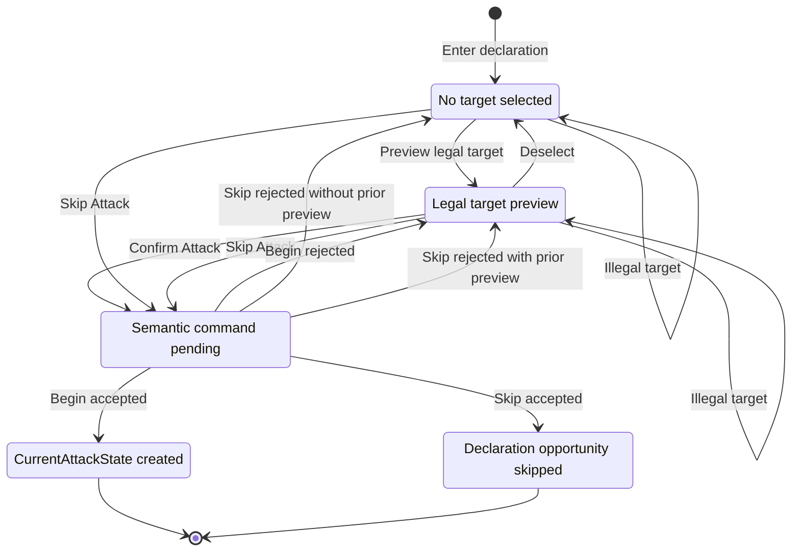
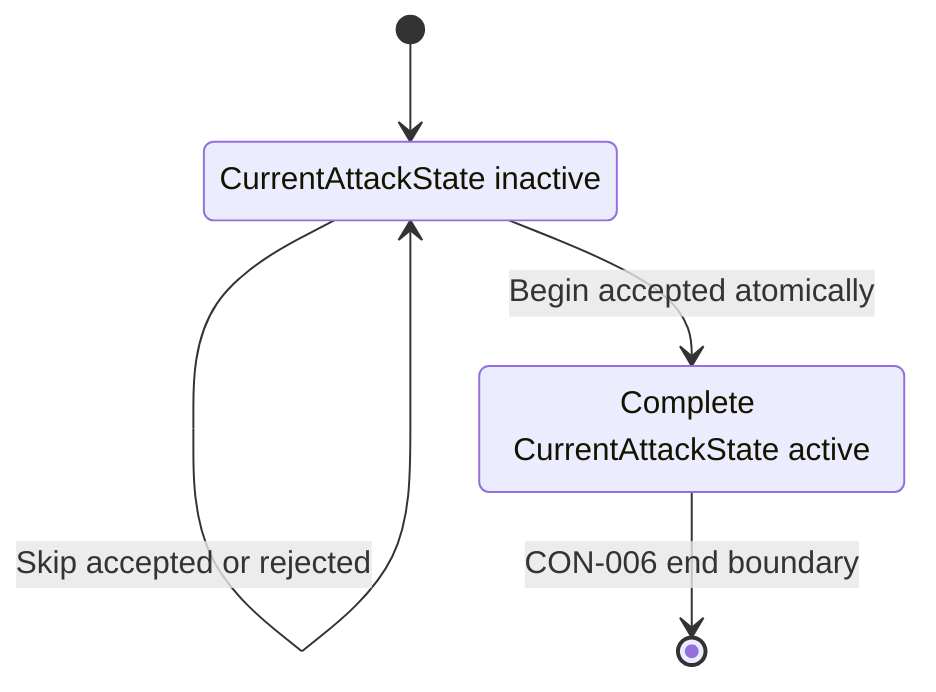
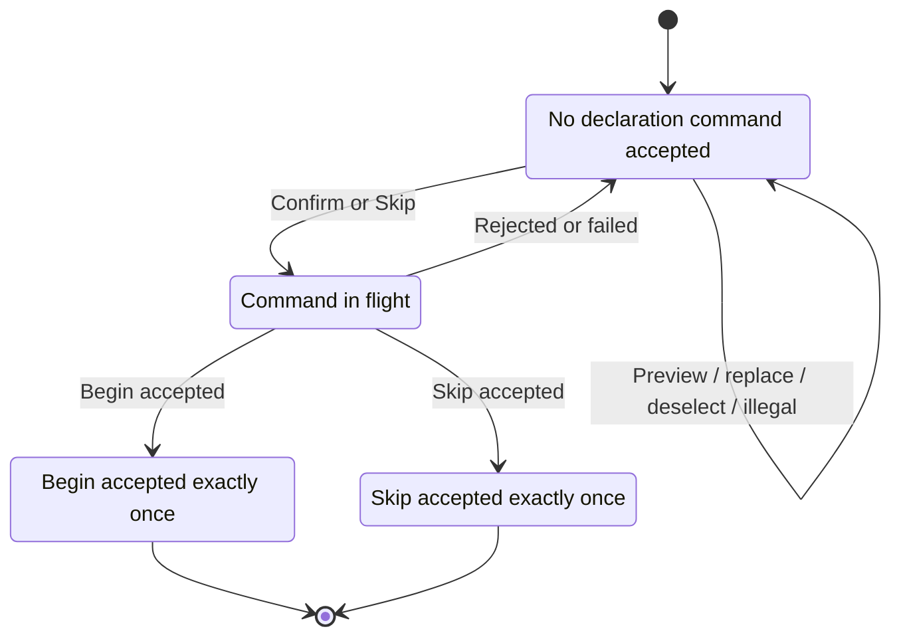

# CON-006: Attack Declaration Lifecycle Contract

Contract ID: CON-006

Title: Attack Declaration Lifecycle Contract

Status: Accepted
Owner: Project Owner accepted on 2026-07-26
Authority: Architecture Contract
Audience: Project Owner, AI Agents, Implementers
Acceptance: Accepted following Architecture Review, Project Owner Decisions, Boundary Authority Assessment, Translation / Acceptance Review, and Acceptance Verification.

Derived From:

- ADR-001
- ADR-003
- ADR-004
- ADR-005
- DR-001

Related Contracts:

- CON-001
- CON-003
- CON-004
- CON-005

Related Architecture Areas:

- AT-001
- AT-002
- BC-001
- BC-002
- BC-003
- BC-007
- BC-008
- BC-009
- BC-010

Supporting Evidence:

- Accepted attack-declaration lifecycle forensic audit
- Architecture Review of CAP-ATTACK-001
- Architecture Consistency Review of D-01 through D-07
- Boundary Authority Assessment of Finding F-01
- `docs/architecture/decision_workbooks/CAP-ATTACK-001-draft.md`
- `docs/architecture/decision_workbooks/DR-001-CON-006-owner-decisions.md`

Supersedes:

- CAP-ATTACK-001 as the proposed implementation-authority form

Superseded by:

- None

## Draft Note

This Contract translates accepted architecture and accepted Project Owner
decisions into mandatory, testable implementation obligations for authoritative
gameplay attack declaration.

Until accepted by the Project Owner, this document is a Draft and is not
normative implementation authority. After acceptance, every implementation of
gameplay attack declaration within the scope of this Contract SHALL conform to
it.

ADR-001, ADR-003, ADR-004, and ADR-005 remain the normative architecture
authorities for their decided topics. CON-001, CON-003, CON-004, and CON-005
remain the governing adjacent implementation Contracts. CON-006 binds concrete
attack-declaration facts to those accepted responsibility surfaces. It does not
create, transfer, duplicate, or redesign architectural ownership.

## 1. Purpose

CON-006 defines the authoritative gameplay attack-declaration lifecycle from an
available declaration opportunity with no selected target through exactly one
of two terminal outcomes:

1. an accepted `BeginAttackCommand` atomically creates one complete
   `CurrentAttackState`; or
2. an accepted `SkipAttackCommand` commits the current declaration opportunity
   without creating `CurrentAttackState`.

This Contract establishes mandatory behavior for:

- transient target preview, replacement, deselection, and illegal selection;
- explicit declaration confirmation;
- authoritative attack-entry validation and mutation;
- authoritative skip semantics;
- adjacent gameplay-state coordination;
- `InteractionFlow`, projection, modal, and presentation boundaries;
- deterministic replay, persistence, networking, and reconnect;
- compatibility handling;
- migration cutover and rollback boundaries; and
- implementation acceptance evidence.

This Contract specifies gameplay behavior and authority. It does not prescribe
visual composition, control labels, layout, styling, animation, concrete APIs,
or internal helper organization.

## 2. Authority

### 2.1 Architectural Authority

ADR-001 governs:

- `GameState` ownership of canonical `CurrentAttackState`;
- replayable-command ownership of semantic attack mutation;
- the `CurrentAttackState` membership boundary;
- atomic cross-owner semantic transactions;
- projection and interaction non-authority; and
- Model C and Model C-S migration constraints.

ADR-003 governs the accepted responsibility surfaces for:

- active serialized state;
- command legality and submitted mutation;
- deterministic resolver calculations;
- interaction payload shape;
- projection and affordances;
- visibility;
- serialization;
- replay; and
- network synchronization.

ADR-004 governs active runtime upgrade instances and mutable upgrade state.

ADR-005 governs timing-window lifecycle and continuation.

CON-006 SHALL preserve those boundaries and SHALL NOT broaden, narrow,
reinterpret, or replace them.

### 2.2 Contract Authority

CON-006 is the implementation Contract for authoritative gameplay attack
declaration.

It SHALL:

- bind declaration gameplay facts to existing accepted owners or accepted
  architectural responsibility surfaces;
- define the semantic protocol for Preview, Replace Preview, Deselect, Illegal
  Selection, Confirm Attack, Begin Attack, and Skip Attack;
- define the complete coordinated effects of Begin and Skip within this scope;
- define deterministic compatibility and reconstruction behavior; and
- define conformance evidence.

It SHALL NOT:

- introduce a new architecture document type;
- establish a new authoritative lifecycle object;
- transfer a fact from an existing owner;
- duplicate an authoritative fact;
- make transient interaction, `InteractionFlow`, projection, scene, modal, or
  UI state authoritative; or
- resolve broader live-state or orchestration architecture outside this
  declaration boundary.

### 2.3 Supporting Decision Authority

DR-001 records accepted Project Owner decisions D-01 through D-07. DR-001 is
supporting decision evidence, not normative implementation authority.

The normative obligations derived from D-01 through D-07 are contained in this
Contract.

## 3. Scope

### 3.1 Start Boundary

This Contract begins when all of the following are true:

- authoritative gameplay state establishes an available attack-declaration
  opportunity;
- authoritative gameplay state identifies the controller authorized to submit;
- `CurrentAttackState` is inactive;
- no authoritative attack has begun; and
- no target is selected in the transient declaration interaction.

The attacker may already be fixed by the enclosing activation or action. A
fixed attacker remains an authoritative reference to its existing runtime
entity owner. It does not become a transient or duplicated entity authority.

Preview SHALL evaluate the incoming actor against that authoritative controller
for advisory legality. Begin and Skip SHALL revalidate the submitting player
authoritatively. Wrong-controller and other invalid Preview attempts or command
submissions remain within CON-006 scope and SHALL be rejected without
authoritative mutation.

### 3.2 Supported Gameplay Contexts

This Contract applies to declaration for:

- a ship attack during the Ship Activation Attack Step;
- a squadron attack during a Squadron Phase activation, including the
  Rogue-specific remaining-action case;
- a squadron attack performed as part of a Squadron command during a Ship
  Phase activation; and
- each supported attacker/defender kind pairing within those contexts:
  ship-to-ship, ship-to-squadron, squadron-to-ship, and
  squadron-to-squadron.

A legal declaration may occur with either a ship hull zone or a squadron as
attacker context, and with either a ship hull zone or a squadron as defender
context, according to accepted gameplay legality.

### 3.3 End Boundary

The successful Begin path ends when:

- `BeginAttackCommand` has been accepted exactly once;
- all required authoritative validation has succeeded;
- all coordinated declaration-commit mutations have committed atomically;
- one complete valid `CurrentAttackState` is authoritative in `GameState`; and
- the accepted result is available for derivation of routing and projection.

The successful Skip path ends when:

- `SkipAttackCommand` has been accepted exactly once;
- the current declaration opportunity has been committed as skipped on its
  existing enclosing owner;
- all required enclosing progress mutations have committed atomically;
- `CurrentAttackState` remains inactive; and
- routing and projection can be derived from the resulting authoritative
  state.

### 3.4 Explicitly Out Of Scope

The following are outside CON-006:

- Attack Simulator behavior and simulator authorization;
- analysis-only or free-form attacker selection;
- dice rolling;
- Concentrate Fire choices;
- attack-dice modification or dice confirmation;
- Accuracy spending;
- defense-token selection or resolution;
- critical-effect selection;
- damage calculation or resolution;
- Counter resolution;
- active-attack completion, cancellation, or replacement;
- active-attack cleanup;
- additional target iteration after an individual attack completes;
- rule-granted or reaction attack lifecycles not already governed by one of
  the supported enclosing contexts;
- UI layout, styling, animation, and control naming; and
- behavior after successful attack entry.

Nothing in CON-006 prohibits a future simulator, preview system, or analysis
tool from consuming deterministic declaration queries. Such a consumer does
not gain gameplay authority from this Contract.

### 3.5 Preconditions Supplied By Accepted Architecture

CON-006 consumes rather than redefines:

- phase, turn, activation, and controlling-player state;
- stable player, ship, squadron, hull-zone, runtime-rule, and timing-window
  identities;
- authoritative entity position, ownership, activation, and status facts;
- firing-arc, range, line-of-sight, obstruction, engagement, Escort, Heavy,
  friendly-target, same-entity, and rule-specific legality;
- command registration, applicability, ordering, serialization, replay, and
  network mirroring;
- canonical `GameState` serialization and reconstruction;
- runtime rule ownership under ADR-003 and CON-003;
- runtime upgrade ownership under ADR-004 and CON-004;
- timing-window ownership under ADR-005 and CON-005; and
- the ADR-001 and CON-001 `CurrentAttackState` membership test.

## 4. Terms

**Attack declaration**: The bounded gameplay interaction in which an authorized
attacker explores target candidates and either confirms one candidate for
authoritative attack entry or skips the current declaration opportunity.

**Declaration opportunity**: The current ability to begin or skip an attack as
derived from authoritative phase, activation, entity, attack-availability, and
rule state. It is not a new lifecycle object or independent state owner.

**Declaration intent**: Stable attacker, defender, applicable hull-zone, and
enclosing-context references sufficient to request Preview or submit
`BeginAttackCommand`. It is not a caller-supplied authoritative state snapshot.

**Preview**: A transient, non-authoritative result derived from current
authoritative state and declaration intent.

**Preview legality**: The deterministic gameplay-legality result for a
declaration intent, excluding transaction-only rejection conditions.

**Transaction-only rejection**: A rejection that can arise only at
authoritative command submission or execution, including stale state, command
ordering, controller change, duplicate delivery, concurrent mutation, or
atomic-commit failure.

**Confirm Attack**: The interaction event that submits exactly one
`BeginAttackCommand` for the current transient candidate. It is not a separate
semantic command.

**Begin Attack**: The atomic semantic transaction performed by an accepted
`BeginAttackCommand`.

**Skip Attack**: The atomic semantic transaction performed by an accepted
`SkipAttackCommand` while no current attack is active.

**Transient declaration owner**: The local interaction surface that holds the
current candidate, preview result, rejection feedback, and in-flight
submission gate. It owns no gameplay authority.

**Adjacent authoritative owner**: An accepted state owner outside
`CurrentAttackState` whose facts are validated or atomically coordinated by
Begin or Skip without ownership transfer.

## 5. Declaration Lifecycle

### 5.1 Expected Interaction Lifecycle

The Pending state is transient. It SHALL NOT become authoritative gameplay
state or a serialized declaration lifecycle.

### 5.2 Canonical Current-Attack Lifecycle

### 5.3 Semantic Command Lifecycle

### 5.4 Lifecycle Invariants

CON-006-LIFE-001: `CurrentAttackState` SHALL be inactive when declaration
interaction begins.

CON-006-LIFE-002: Preview, replacement, deselection, and illegal selection
SHALL NOT create or mutate `CurrentAttackState`.

CON-006-LIFE-003: Preview interaction SHALL be permitted only while
`CurrentAttackState` is inactive and the enclosing authoritative declaration
opportunity remains available.

CON-006-LIFE-004: Exactly one transient target candidate MAY be selected in one
local declaration interaction.

CON-006-LIFE-005: Confirmation SHALL submit at most one in-flight
`BeginAttackCommand`.

CON-006-LIFE-006: Skip SHALL submit at most one in-flight
`SkipAttackCommand`.

CON-006-LIFE-007: While either semantic command is in flight, the interaction
SHALL prevent another Confirm, Skip, or candidate-replacement submission for
that local declaration session.

CON-006-LIFE-008: A rejected command SHALL return to the prior interactive
declaration condition when the enclosing authoritative opportunity remains
available.

CON-006-LIFE-009: A successful Begin SHALL atomically install exactly one
complete `CurrentAttackState`.

CON-006-LIFE-010: A successful Skip SHALL atomically commit the current
declaration opportunity without creating `CurrentAttackState`.

CON-006-LIFE-011: Scene, modal, router, or presentation destruction SHALL NOT
begin, skip, complete, cancel, replace, or clean authoritative attack state.

CON-006-LIFE-012: Pre-confirm candidate replacement SHALL NOT be modeled as
active-attack cancellation or active-attack replacement.

## 6. Responsibility Boundaries

### 6.1 `CurrentAttackState`

`CurrentAttackState` SHALL own, after accepted Begin, only authoritative facts
that satisfy ADR-001 and CON-001 membership.

The complete attack-entry state SHALL contain or canonically represent:

- deterministic current-attack lifecycle identity;
- stable attacker and defender references that canonically represent
  participant identity and kind through their accepted authoritative owners;
- applicable attacking and defending hull-zone references;
- attack kind and accepted semantic entry context;
- committed range and obstruction outcomes;
- the committed ordered attack pool; and
- any additional current-attack-specific fact required for downstream attack
  validation or continuation that cannot be deterministically re-derived from
  another accepted owner.

Attacker and defender identity and kind remain owned by their accepted
authoritative entity owners. `CurrentAttackState` MAY canonically represent
those participants through stable references; it SHALL NOT duplicate
entity-owned participant facts.

The committed range, obstruction outcome, and ordered attack pool listed above
are authoritative semantic attack-entry facts, not stored Preview information.
Before installation, each committed fact SHALL satisfy every ADR-001 and
CON-001 membership requirement. A value that remains deterministically
re-derivable at the point of use from another accepted authoritative owner
SHALL remain derived and SHALL NOT be stored in `CurrentAttackState`.

`CurrentAttackState` SHALL reference rather than duplicate:

- entity identity and kind beyond the stable participant references;
- entity ownership;
- entity activation state;
- entity position and status;
- hull-zone usage history;
- squadron action or attack history;
- runtime rule state;
- runtime upgrade state;
- timing-window lifecycle state; and
- other facts already authoritative elsewhere.

`CurrentAttackState` SHALL NOT own:

- candidate Preview results or preview-only derived information;
- hover, selection, deselection, rejection, or pending state;
- derived overlay geometry;
- `InteractionFlow` payloads;
- rule-specific mutable state;
- timing-window lifecycle;
- scene nodes;
- modal or animation state; or
- UI state.

### 6.2 Active State Classes

Existing serialized runtime state classes SHALL remain authoritative for
entity-local, activation-local, phase, turn, and rule-owned facts according to
the bindings in section 7.

CON-006 does not introduce a declaration-state class. Where declaration
eligibility or attack availability can be derived from existing authoritative
facts, it SHALL remain derived.

### 6.3 Command Surfaces

`CommandProcessor`, `CommandApplicability`, `FlowSpec` command policy where
applicable, and concrete commands SHALL retain the command responsibilities
assigned by ADR-003 and CON-001.

`BeginAttackCommand` SHALL own the atomic submitted transaction for confirmed
attack entry.

`SkipAttackCommand` SHALL own the atomic submitted transaction for committing a
no-active-attack declaration skip.

Command ownership of mutation SHALL NOT make a command the owner of the
underlying state it mutates.

### 6.4 Resolver Surfaces

Mechanic-specific resolvers SHALL own deterministic calculations for:

- target eligibility queries within their rule domain;
- firing arc;
- range;
- line of sight;
- blocked or obstructed outcome;
- engagement and keyword effects;
- attack-pool determination; and
- other declaration calculations assigned to an accepted resolver or rule
  surface.

Resolver output remains derived until an accepted semantic command commits the
applicable current-attack-specific result.

### 6.5 Runtime Rule Owners

Rule-specific legality, guards, costs, mutable effects, and state SHALL remain
on their accepted runtime owners under ADR-003 and CON-003.

Runtime upgrade instances and mutable upgrade state SHALL remain owned under
ADR-004 and CON-004.

Begin and Skip MAY validate or atomically coordinate a rule owner only where
the relevant rule and accepted Contracts require it. Such coordination SHALL
NOT move rule state into `CurrentAttackState`, declaration state,
`InteractionFlow`, or presentation.

### 6.6 Timing-Window Owners

`TimingWindowState` and the Timing Window Orchestrator SHALL retain the
responsibilities assigned by ADR-005 and CON-005.

Ordinary pre-entry Preview, Replace Preview, Deselect, Illegal Selection,
Confirm pending, and no-active Skip SHALL NOT synthesize a timing window,
opportunity queue, timing lifecycle, or timing cleanup.

If an accepted rule-specific declaration interaction participates in an
existing timing window, that timing behavior SHALL conform independently to
CON-005 and its Rule Capability Package. CON-006 does not redefine it.

### 6.7 `InteractionFlow`

`InteractionFlow` MAY own the serialized shape of interaction routing and
visibility payloads assigned by ADR-003.

It SHALL NOT own:

- declaration opportunity existence;
- selected target;
- Preview legality;
- command authorization;
- attack availability;
- hull-zone usage;
- squadron attack history;
- Begin or Skip completion;
- `CurrentAttackState`; or
- authoritative reconstruction of gameplay facts.

An `ATTACK / ATTACK_DECLARE` route with inactive `CurrentAttackState` is a
pre-entry routing representation. It is valid only when canonical phase,
activation, controller, entity, and rule state independently establish an
available declaration opportunity.

### 6.8 Transient Interaction And Presentation

`TargetSelector` SHALL be the sole mutable transient owner of:

- the local attacker/target candidate;
- transient selection identity;
- Preview derivations;
- replacement and deselection;
- illegal-selection feedback; and
- stable intent references prepared for command submission.

`AttackExecutor` SHALL coordinate:

- the transient declaration session;
- communication between selector, presentation, command submission, and
  command result;
- explicit Confirm and Skip intent;
- the one-submission pending gate; and
- transient cleanup after an accepted terminal result.

Presentation and `ModalRouter` SHALL:

- render or route derived declaration information;
- emit user intent;
- retain declaration presentation while the canonical opportunity remains
  available, including while a command is pending; and
- route away after an accepted terminal result or independently authoritative
  enclosing-flow change.

None of these surfaces SHALL own or mutate authoritative gameplay facts.

## 7. Adjacent Authority Matrix

The following matrix is normative. “Responsibility-surface binding” means that
CON-006 binds a concrete declaration fact to an existing ADR-003
responsibility surface without creating a new architectural owner.

| Gameplay fact | Binding kind | Existing authoritative owner or accepted responsibility surface | Validated by | Coordinated mutation | Derived information |
| --- | --- | --- | --- | --- | --- |
| Current phase, round, turn, and enclosing gameplay context | Responsibility-surface binding | Canonical serialized `GameState` phase/turn state | `CommandApplicability`, applicable flow policy, concrete Begin/Skip validation | Begin and Skip SHALL NOT change phase or turn except where the existing enclosing semantic transaction already requires that change | Whether declaration is permitted at the current phase and step |
| Controlling and submitting player | Responsibility-surface binding | Canonical player, turn, activation, and entity-control state | `CommandApplicability` and concrete Begin/Skip validation | No ownership change; accepted enclosing progress MAY change the next controller only through its existing owner | Viewer affordances and read-only/waiting presentation |
| Declaration opportunity existence | Derived binding | Derived from canonical phase, activation, entity, attack-availability, and applicable rule state | Preview query for advisory behavior; Begin/Skip revalidate authoritatively | No separate declaration-opportunity object is created | Availability of Confirm and Skip |
| Declaration opportunity consumption | Responsibility-surface binding | Existing enclosing activation/action state: serialized ship activation state for ship declarations; serialized squadron activation/action state for squadron declarations | Concrete Begin/Skip validation | Accepted Begin or Skip commits the opportunity exactly once on the enclosing owner | Resulting next legal enclosing step |
| Attacker identity, type, ownership, position, status, and activation | Responsibility-surface binding | Existing serialized attacker runtime entity state: ship or squadron state class | Resolver queries and concrete Begin/Skip validation | Begin stores a stable attacker reference that canonically represents the participant in `CurrentAttackState`; it SHALL NOT duplicate the underlying entity facts | Controller, available hull zones, eligible actions, range origin |
| Defender identity, type, ownership, position, and status | Responsibility-surface binding | Existing serialized defender runtime entity state: ship or squadron state class | Resolver queries and concrete Begin validation | Begin stores a stable defender reference that canonically represents the participant in `CurrentAttackState`; it SHALL NOT duplicate the underlying entity facts | Friendly/self prohibition, target kind, range destination |
| Hull-zone identity and static hull-zone facts | Responsibility-surface binding | Existing ship runtime/static entity responsibility surface referenced through stable ship and hull-zone identity | Hull-zone and targeting resolvers; concrete Begin validation | Begin stores stable applicable hull-zone references; static or entity-owned facts remain on their owner | Arc geometry, armament source, hull-zone target geometry |
| Per-activation ship hull-zone usage | Responsibility-surface binding | Serialized `ShipInstance` activation-local state | Preview query and concrete Begin validation | Accepted Begin marks the committed attacking hull zone used exactly once when required; Skip SHALL NOT fabricate hull-zone use | Whether a hull zone remains available |
| Ship attack-step progress and remaining attack availability | Responsibility-surface binding | Serialized `ShipInstance` activation-local state together with canonical enclosing ship-activation state | Preview query and concrete Begin/Skip validation | Begin commits the current attack opportunity; Skip commits the ship Attack Step as skipped according to section 11 | Whether another attack declaration or the Maneuver Step is next |
| Squadron activation and action progress | Responsibility-surface binding | Serialized `SquadronInstance` activation/action state together with canonical enclosing squadron-activation state | Preview query and concrete Begin/Skip validation | Begin commits attack use; Skip commits attack decline; remaining move or completion state is preserved according to context | Whether movement remains legal and whether activation is complete |
| Squadron attack history and already-used attack entitlement | Responsibility-surface binding | Serialized `SquadronInstance` action/attack history | Preview query and concrete Begin validation | Accepted Begin records attack use exactly once; accepted Skip records the opportunity consumed without a target attack | Attack availability and duplicate-use rejection |
| Already-targeted or target-iteration history where applicable | Responsibility-surface binding | Existing serialized attacker-local attack-history owner | Preview query and concrete Begin validation | Accepted Begin records target commitment exactly once when the supported attack context requires it; Skip records no fabricated target | Target eligibility for a later independently valid declaration |
| Firing arc | Derived binding | Mechanic-specific firing-arc resolver reading canonical entity and hull-zone state | Preview and Begin | No independent stored authority unless the committed result satisfies `CurrentAttackState` membership | Arc legality and presentation geometry |
| Range | Derived before Begin; current-attack binding after Begin | Mechanic-specific range resolver; committed range result in `CurrentAttackState` only as an ADR-001/CON-001-conforming attack-entry fact | Preview and Begin | Begin commits the deterministic range result required by the active attack only when it satisfies `CurrentAttackState` membership | Range band and distance presentation |
| Line of sight and blocked/obstructed outcome | Derived before Begin; current-attack binding after Begin | Mechanic-specific line-of-sight and obstruction resolvers; committed attack-specific outcome in `CurrentAttackState` only where required by ADR-001/CON-001 membership | Preview and Begin | Begin commits the required attack-specific outcome only when it satisfies `CurrentAttackState` membership; raw overlay geometry remains derived | Legality, obstruction warning, and presentation geometry |
| Engagement, Escort, Heavy, and other keyword legality | Rule/resolver binding | Existing serialized squadron/entity state plus accepted mechanic-specific and runtime-rule surfaces | Preview and Begin | Only the accepted runtime owner MAY mutate rule-specific state; ordinary Begin normally reads these facts | Eligible target set and rejection category |
| Friendly, self, and same-entity prohibition | Derived binding | Existing entity ownership and stable identity state | Preview and Begin | None | Target eligibility and rejection category |
| Attack pool determination | Derived before Begin; current-attack binding after Begin | Mechanic-specific attack-pool resolver reading authoritative entities, hull zones, range, obstruction, and accepted rule owners; committed ordered pool in `CurrentAttackState` only as an ADR-001/CON-001-conforming attack-entry fact | Preview and Begin | Begin commits the deterministic ordered attack pool exactly once only when it satisfies `CurrentAttackState` membership | Preview dice pool |
| Rule-specific blockers, modifiers, guards, costs, and mutable state | Existing accepted owner | Runtime rule owner under ADR-003/CON-003; runtime upgrade instance under ADR-004/CON-004 when upgrade-owned | Rule query, applicability, and concrete Begin validation | Only mutations required by the accepted rule may be coordinated; ownership remains unchanged | Rule feedback, modified legality, modified attack pool |
| Timing-window lifecycle | Existing accepted owner | `GameState`-owned `TimingWindowState`; Timing Window Orchestrator for lifecycle coordination | CON-005 validation where applicable | No ordinary declaration mutation; any applicable timing mutation follows CON-005 | Derived opportunities and timing projection |
| Current-attack lifecycle identity and committed attack-entry facts | Existing accepted owner | `GameState`-owned `CurrentAttackState` | `BeginAttackCommand` and state invariant validation | Accepted Begin atomically creates the complete state; Skip leaves it inactive | Post-entry projection and routing |
| Command ordering, accepted semantic decision, replay record, and mirror order | Existing accepted surface | `CommandProcessor` history and accepted command infrastructure | Registration, serialization, applicability, command validation, sequence validation | Accepted Begin or Skip is recorded and applied exactly once | Diagnostics and replay comparison |
| Interaction route and viewer-specific payload | Existing non-gameplay responsibility surface | `InteractionFlow`, `FlowSpec`, `UIProjector`, and `StateFilter` within their accepted routing/projection/visibility responsibilities | Derived after canonical mutation; never used as gameplay authorization | Routing payload MAY be republished after accepted Begin/Skip; no gameplay fact is moved into it | Modal, affordance, controller/read-only, and visibility presentation |
| Candidate selection, rejection feedback, and pending submission | Transient non-authoritative binding | `TargetSelector`, `AttackExecutor`, presentation, and modal routing | Local interaction checks plus authoritative command revalidation | Never a canonical mutation | Preview, error message, pending indication |

CON-006-AUTH-001: Every implementation SHALL document its concrete state-class
and field mapping for each applicable responsibility-surface binding in the
matrix without changing the binding.

CON-006-AUTH-002: A concrete mapping SHALL use an existing accepted state
owner. It SHALL NOT introduce a second writable source.

CON-006-AUTH-003: If implementation discovers that a required durable fact has
no existing accepted owner and cannot remain derived, implementation SHALL stop
for Project Owner guidance. It SHALL NOT invent an owner during migration.

CON-006-AUTH-004: Caches, indexes, projections, payloads, scene mirrors, and
preview objects MAY read matrix facts but SHALL remain derived and
non-authoritative.

## 8. Transient Declaration Protocol

### 8.1 Preview

CON-006-PREV-001: Selecting a legal target SHALL establish one transient
Preview and SHALL submit no replayable command.

CON-006-PREV-002: Preview SHALL be derived from current authoritative state,
stable declaration intent, mechanic-specific resolvers, and accepted rule
surfaces.

CON-006-PREV-003: Preview SHALL NOT mutate canonical state, command history,
`InteractionFlow`, runtime rule state, timing-window state, or
`CurrentAttackState`.

CON-006-PREV-004: A preview-legal candidate SHALL remain non-authoritative.
Preview legality does not grant command authority.

CON-006-PREV-005: Preview MAY expose attacker, defender, applicable hull zones,
range, line-of-sight, obstruction, attack pool, target eligibility, and
rejection or warning information. Visual form is outside this Contract.

### 8.2 Replace Preview

CON-006-REPLACE-001: Selecting a different legal target while a Preview exists
SHALL replace the complete transient target candidate and all target-derived
Preview output.

CON-006-REPLACE-002: Replacement SHALL submit no `SkipAttackCommand`, no
`BeginAttackCommand`, no cancellation command, and no active-replacement
command.

CON-006-REPLACE-003: Replacement SHALL leave every authoritative owner and
accepted command history unchanged.

CON-006-REPLACE-004: After replacement, no stale fact from the previous
candidate SHALL remain capable of driving Confirm intent or presentation.

### 8.3 Deselect

CON-006-DESELECT-001: Selecting the currently previewed target again SHALL
clear the target candidate and target-derived Preview.

CON-006-DESELECT-002: Deselect SHALL retain the authoritative or transient
attacker context supplied by the enclosing declaration where that context
remains valid.

CON-006-DESELECT-003: Deselect SHALL submit no semantic command and mutate no
authoritative owner.

CON-006-DESELECT-004: Confirm SHALL be unavailable without one complete
preview-legal candidate. Skip SHALL remain available when the authoritative
declaration opportunity permits it.

### 8.4 Illegal Selection

CON-006-ILLEGAL-001: An illegal target attempt SHALL submit no semantic command
and mutate no authoritative or transient selected candidate.

CON-006-ILLEGAL-002: If a legal Preview already exists, an illegal target
attempt SHALL preserve that Preview.

CON-006-ILLEGAL-003: Illegal selection SHALL return one deterministic,
presentation-safe rejection category.

CON-006-ILLEGAL-004: Applicable rejection categories SHALL distinguish at
least:

- wrong phase or declaration context;
- wrong controller;
- missing or stale entity;
- incompatible attacker or defender kind;
- friendly, self, or same-entity target;
- invalid attacking or defending hull zone;
- out of firing arc;
- out of range;
- blocked line of sight;
- engagement, Escort, Heavy, or keyword restriction;
- attack unavailable;
- hull zone already used;
- target already committed where applicable; and
- rule-specific prohibition.

CON-006-ILLEGAL-005: Rejection wording and visual presentation are outside this
Contract. The semantic rejection category SHALL remain stable for identical
authoritative state and intent.

## 9. Preview And Begin Semantic Parity

CON-006-PARITY-001: Given identical authoritative gameplay state and identical
declaration intent, Preview and `BeginAttackCommand` SHALL produce equivalent
gameplay results for:

- legality;
- target eligibility;
- firing arc;
- range;
- line-of-sight legality;
- blocked or obstructed outcome;
- attack-pool determination; and
- gameplay rejection category.

CON-006-PARITY-002: Semantic parity is behavioral. CON-006 does not require
Preview and Begin to share implementation code.

CON-006-PARITY-003: Preview SHALL read the same authoritative responsibility
surfaces and apply the same accepted rule semantics that Begin applies for
gameplay legality.

CON-006-PARITY-004: `BeginAttackCommand` SHALL re-evaluate legality immediately
before mutation. It SHALL NOT trust stored Preview results.

CON-006-PARITY-005: Begin MAY additionally reject for transaction-only
conditions, including:

- stale authoritative state;
- stale declaration opportunity;
- command sequence or replay ordering;
- controller change;
- duplicate delivery;
- another active `CurrentAttackState`;
- concurrent authoritative mutation;
- invalid lifecycle identity allocation; or
- atomic-commit failure.

CON-006-PARITY-006: A transaction-only rejection SHALL NOT be reported as a
different gameplay-legality result. It SHALL be distinguishable from the
gameplay rejection categories in section 8.4.

CON-006-PARITY-007: If identical non-concurrent authoritative inputs produce
different gameplay legality between Preview and Begin, the implementation is
not CON-006-conformant.

## 10. Confirm And Begin Protocol

### 10.1 Confirm Attack

CON-006-CONFIRM-001: Confirm Attack SHALL require one complete preview-legal
candidate and an authoritative gameplay declaration opportunity.

CON-006-CONFIRM-002: Confirm Attack SHALL construct declaration intent from
stable authoritative references and enclosing context.

CON-006-CONFIRM-003: Confirm Attack SHALL NOT submit:

- a caller-provided `CurrentAttackState`;
- a trusted Preview result;
- a scene snapshot;
- a projection payload;
- an `InteractionFlow` payload as gameplay authority; or
- a separate declaration-confirm command.

CON-006-CONFIRM-004: One Confirm gesture SHALL submit exactly one
`BeginAttackCommand`.

CON-006-CONFIRM-005: The transient interaction SHALL retain the submitted
candidate while the command is pending and prevent duplicate semantic
submission.

CON-006-CONFIRM-006: Confirm pending state SHALL NOT serialize as gameplay
state.

### 10.2 Begin Validation

CON-006-BEGIN-001: `BeginAttackCommand` SHALL validate current authoritative
state immediately before mutation.

CON-006-BEGIN-002: Validation SHALL include every applicable fact in the
Adjacent Authority Matrix, including:

- phase, turn, enclosing step, and declaration opportunity;
- controller authorization;
- absence of another active current attack;
- stable attacker and defender existence and identity;
- attacker and defender ownership and kind compatibility;
- applicable hull-zone validity and use history;
- attack and action availability;
- firing arc, range, line of sight, and obstruction;
- engagement, Escort, Heavy, and other keyword restrictions;
- friendly, self, and same-entity prohibitions;
- already-targeted or attack-history restrictions where applicable;
- rule-specific blockers, modifiers, guards, and costs;
- timing-window legality where CON-005 applies; and
- stale, duplicate, and ordering protection.

CON-006-BEGIN-003: `CommandApplicability`, applicable `FlowSpec` command policy,
registered rule validation, and concrete command validation SHALL agree.

CON-006-BEGIN-004: Projection visibility, modal availability, UI enablement,
Preview legality, and possession of an `InteractionFlow` payload SHALL NOT
authorize Begin.

### 10.3 Begin Mutation

CON-006-BEGIN-005: Accepted Begin SHALL be one replayable atomic semantic
transaction.

CON-006-BEGIN-006: Accepted Begin SHALL atomically:

1. validate every applicable authoritative precondition;
2. deterministically calculate required declaration results;
3. allocate or derive deterministic current-attack lifecycle identity;
4. install one complete valid `CurrentAttackState`;
5. commit attack-opportunity, hull-zone-use, squadron-action, attack-history,
   already-targeted, or rule-owner mutations required by the applicable
   supported context;
6. record the accepted command exactly once; and
7. make the accepted result available for routing, projection, replay, and
   network mirroring.

CON-006-BEGIN-007: Each mutation in item 5 SHALL occur on the existing owner
identified by section 7. It SHALL NOT be copied into `CurrentAttackState` as a
second authority.

CON-006-BEGIN-008: No partially initialized `CurrentAttackState` or partially
mutated adjacent owner SHALL become observable.

CON-006-BEGIN-009: A successful Begin SHALL consume the applicable declaration
opportunity exactly once.

CON-006-BEGIN-010: A successful Begin SHALL NOT roll dice or perform any
out-of-scope attack-resolution behavior.

### 10.4 Begin Failure

CON-006-BEGIN-011: Rejected or failed Begin SHALL:

- leave `CurrentAttackState` inactive;
- leave every adjacent authoritative owner unchanged;
- record no successful Begin;
- perform no cleanup, Skip, cancellation, replacement, or fallback transition;
- preserve or deterministically re-derive the prior transient candidate when
  the declaration opportunity remains available; and
- surface one deterministic failure result.

CON-006-BEGIN-012: If authoritative state changes so that the enclosing
declaration opportunity no longer exists, presentation SHALL route from the
new authoritative state. It SHALL NOT preserve interaction by inventing the
old opportunity.

## 11. Skip Protocol And Effect Matrix

### 11.1 General Skip Obligations

CON-006-SKIP-001: `SkipAttackCommand` in CON-006 scope SHALL be a replayable,
persisted, network-authoritative, exactly-once semantic command.

CON-006-SKIP-002: Skip SHALL be available with or without a current transient
Preview when the authoritative declaration opportunity permits it.

CON-006-SKIP-003: Preview presence SHALL NOT change Skip legality or
authoritative effects.

CON-006-SKIP-004: Skip SHALL validate the current controller, enclosing
context, declaration opportunity, command sequence, and absence of an active
`CurrentAttackState`.

CON-006-SKIP-005: Accepted Skip SHALL atomically commit the current declaration
opportunity on existing enclosing owners and publish or enable the derived next
route.

CON-006-SKIP-006: Accepted Skip SHALL NOT:

- create `CurrentAttackState`;
- fabricate attacker/defender or hull-zone commitment;
- mark a hull zone used;
- fabricate target history;
- synthesize active-attack cancellation, completion, or cleanup;
- synthesize timing-window lifecycle or cleanup;
- mutate rule-owned state unless an accepted rule explicitly assigns a
  no-active declaration-skip effect; or
- use Preview, scene, modal, projection, or `InteractionFlow` state as
  authority.

CON-006-SKIP-007: Rejected or failed Skip SHALL preserve all authoritative
owners and the prior local declaration interaction.

### 11.2 Skip Effect Matrix

The following matrix is normative. It covers every gameplay declaration
context supported by section 3.2. “Resulting `InteractionFlow`” identifies the
derived routing representation after authoritative mutation; it is not the
owner of the semantic result.

| Supported declaration context | Participating authoritative owners | Authoritative mutations | Derived information | Resulting `CurrentAttackState` | Resulting `InteractionFlow` | Replay semantics | Persistence implications |
| --- | --- | --- | --- | --- | --- | --- | --- |
| Ship Activation Attack Step; first or later available ship declaration; with or without Preview; any supported defender kind | Canonical phase/turn state; enclosing ship-activation state; attacking `ShipInstance`; command infrastructure; applicable runtime rule owners read for legality | Commit the Ship Activation Attack Step as skipped; consume the current ship declaration opportunity exactly once; preserve existing hull-zone-use and target history; advance authoritative activation progress to the existing Maneuver Step boundary | Whether the Maneuver Step is available; controller and presentation for the next step | Remains inactive | Derive and publish `SHIP_ACTIVATION / MANEUVER_STEP` or its semantically equivalent accepted representation | Record one accepted Skip in authoritative order; replay applies the same activation mutation exactly once; duplicate, stale, or reordered Skip cannot reapply it | Persist the resulting ship-activation progress and inactive current-attack state through canonical serialization; do not persist Preview; load/reconnect derive the Maneuver Step from authoritative state |
| Squadron Phase activation, non-Rogue squadron; with or without Preview; any supported defender kind | Canonical phase/turn state; enclosing squadron-activation state; attacking `SquadronInstance`; command infrastructure; applicable runtime rule owners read for legality | Record the squadron attack opportunity as declined/consumed; complete that squadron's activation action without recording a target attack; preserve movement and attack history except for the consumed opportunity; advance through the existing squadron-activation completion and turn-control owner | Whether another squadron may be selected, turn handoff is required, or the phase advances | Remains inactive | Derive and publish `SQUADRON_ACTIVATION / WAIT_FOR_SQUAD_SELECT`, turn handoff, or phase transition according to the resulting authoritative activation state | Record one accepted Skip; replay completes the same squadron activation exactly once; duplicate or stale Skip is rejected | Persist squadron activation completion, activation/turn counters, and inactive current-attack state; do not persist Preview; load/reconnect derive selection, handoff, or phase route |
| Squadron Phase activation, Rogue squadron; attack opportunity still unused; with or without Preview; any supported defender kind | Canonical phase/turn state; enclosing squadron-activation state; attacking `SquadronInstance`; command infrastructure; applicable runtime rule owners read for legality | Record the Rogue attack opportunity as declined/consumed; preserve any independently available movement action and its prior completion state; if no action remains, complete the squadron activation through the existing owner | Whether movement remains available; otherwise whether selection, handoff, or phase transition is next | Remains inactive | Derive and publish `SQUADRON_ACTIVATION / ACTION_CHOICE` when movement remains; otherwise derive the normal squadron-activation completion route | Record one accepted Skip; replay preserves the same remaining-action state and applies the decline exactly once | Persist the Rogue action-history state, remaining-action or completion state, and inactive current-attack state; do not reconstruct Preview |
| Squadron-command activation during Ship Phase; attack opportunity still unused; with or without Preview; any supported defender kind | Canonical phase/turn state; enclosing ship activation and Squadron command state; attacking `SquadronInstance`; command infrastructure; applicable runtime rule and runtime upgrade owners read for legality | Record the commanded squadron's attack opportunity as declined/consumed; preserve independently available movement and any prior move completion; return control to the existing Squadron command action coordinator; when no commanded-squadron action remains, continue through the existing Ship Activation Squadron Step owner | Whether movement remains, another commanded squadron remains, or the Ship Activation Repair Step is next | Remains inactive | Derive and publish the existing `SHIP_ACTIVATION / SQUADRON_STEP` continuation; when complete, derive `SHIP_ACTIVATION / REPAIR_STEP` or its semantically equivalent accepted representation | Record one accepted Skip in the same authoritative command stream as the enclosing Ship Phase activation; replay and mirrors apply it exactly once before later squadron-command or ship-activation commands | Persist commanded-squadron action history, enclosing command progress, and inactive current-attack state; do not persist Preview; load/reconnect derive the remaining Squadron command route |

### 11.3 Unsupported And Invalid Skip Contexts

CON-006-SKIP-008: A Skip submitted when `CurrentAttackState` is active is not a
CON-006 declaration Skip. Active-attack cancellation or termination remains
governed by CON-001 and other accepted active-attack authority.

CON-006-SKIP-009: A Skip submitted without an authoritative supported
declaration opportunity SHALL be rejected without mutation.

CON-006-SKIP-010: A Skip for an analysis tool, Attack Simulator, unsupported
reaction attack, or unsupported rule-granted attack is outside CON-006 and
SHALL NOT gain authority by reusing the command name.

CON-006-SKIP-011: A rejected, duplicated, stale, or out-of-order Skip,
including a delayed Skip that has become stale, duplicated, out of order, or
otherwise invalid, SHALL leave `CurrentAttackState`, enclosing activation
state, entity state, rule state, timing-window state, and routing authority
unchanged.

## 12. InteractionFlow, Projection, Modal, And Presentation

CON-006-FLOW-001: Gameplay declaration SHALL remain routable while
`CurrentAttackState` is inactive.

CON-006-FLOW-002: Target-specific Preview churn SHALL NOT be written to
`InteractionFlow` as authoritative or durable gameplay progress.

CON-006-FLOW-003: `InteractionFlow` MAY represent the pre-entry
`ATTACK / ATTACK_DECLARE` route only while independently authoritative state
proves that the declaration opportunity exists.

CON-006-FLOW-004: A stale, missing, mismatched, or visible routing payload SHALL
neither authorize nor prohibit Begin or Skip.

CON-006-FLOW-005: After accepted Begin or Skip, routing and projection SHALL be
derived from the resulting authoritative state before another player action is
presented or routed.

CON-006-FLOW-006: Accepted Begin SHALL make the declaration route terminal
without requiring another player decision or scene-owned semantic transition.
The exact post-entry attack-resolution route is outside CON-006.

CON-006-FLOW-007: Accepted Skip SHALL use the context-specific route in section
11.2.

CON-006-FLOW-008: Presentation and `ModalRouter` SHALL retain the declaration
surface while Begin or Skip is pending.

CON-006-FLOW-009: On command rejection, presentation SHALL remain or be
re-derived only when the authoritative declaration opportunity still exists.

CON-006-FLOW-010: On command acceptance, transient declaration state SHALL be
discarded after authoritative result processing. Discarding it is presentation
cleanup, not gameplay mutation.

CON-006-FLOW-011: A non-controller MAY receive viewer-appropriate projection
but SHALL not receive command authority from visibility.

CON-006-FLOW-012: Presentation wording MAY distinguish declaration
confirmation from later dice confirmation. `ConfirmAttackDiceCommand` remains
outside CON-006.

## 13. Determinism, Failure, And Atomicity

CON-006-DET-001: Identical authoritative state, identical declaration intent,
and identical accepted command order SHALL produce identical canonical
gameplay results.

CON-006-DET-002: Deterministic resolver calculations SHALL be reproduced during
authoritative command execution. Replay SHALL NOT record them as separate
player decisions.

CON-006-DET-003: Begin and Skip SHALL commit all required authoritative
mutations exactly once or commit none.

CON-006-DET-004: Validation, calculation, identity allocation, serialization,
or mutation failure SHALL leave every participating authoritative owner
unchanged.

CON-006-DET-005: Failure SHALL surface a deterministic result or diagnostic and
fail closed.

CON-006-DET-006: Implementations SHALL NOT:

- guess a different target;
- silently convert Begin to Skip or Skip to Begin;
- infer authority from presentation or routing;
- synthesize a fallback semantic transition;
- partially advance enclosing flow;
- reuse an earlier current-attack lifecycle identity; or
- apply a duplicate semantic result.

CON-006-DET-007: If a local transient candidate disagrees with authoritative
state, authoritative command validation SHALL prevail.

## 14. Serialization, Save/Load, And Compatibility

### 14.1 Canonical Serialization

CON-006-SER-001: Accepted Begin and Skip results SHALL be represented entirely
by canonical serialized owners identified in sections 7 and 11.

CON-006-SER-002: Preview, replacement, deselection, illegal-selection feedback,
pending submission, modal state, and presentation state SHALL NOT serialize as
authoritative gameplay state.

CON-006-SER-003: A save boundary SHALL represent either the authoritative
pre-command state or the authoritative post-command state. It SHALL NOT expose
a partially committed in-flight Begin or Skip.

CON-006-SER-004: A save taken before accepted Begin SHALL contain no active
`CurrentAttackState`.

CON-006-SER-005: A save taken after accepted Begin at the CON-006 end boundary
SHALL contain the complete canonical `CurrentAttackState`, lifecycle identity,
and every adjacent-owner mutation required by that Begin.

CON-006-SER-006: A save taken after accepted Skip SHALL contain inactive
`CurrentAttackState` and the complete context-specific enclosing-state
postcondition in section 11.2.

### 14.2 Pre-Entry Reconstruction

CON-006-RECON-001: Reconstruction SHALL establish canonical phase, activation,
entity, runtime-rule, runtime-upgrade, timing-window, and current-attack state
before deriving declaration routing or presentation.

CON-006-RECON-002: A reconstructed `ATTACK / ATTACK_DECLARE` routing
representation SHALL be accepted only when canonical gameplay state
independently establishes the same declaration opportunity.

CON-006-RECON-003: Reconstruction before accepted Begin SHALL not restore a
target Preview. The controller MAY begin a new transient selection session from
the reconstructed authoritative opportunity.

CON-006-RECON-004: Reconstruction after accepted Begin SHALL restore the same
current-attack lifecycle identity and adjacent-owner state without submitting a
new Begin.

CON-006-RECON-005: Reconstruction after accepted Skip SHALL restore the
context-specific resulting activation/action state without submitting a new
Skip or re-offering the consumed opportunity.

### 14.3 Compatibility Policy

CON-006-COMPAT-001: Authoritative gameplay state SHALL never be reconstructed
through inference from projection, UI state, `InteractionFlow`, scene state,
modal state, heuristics, or local Preview state.

CON-006-COMPAT-002: A supported serialized representation that is semantically
equivalent to the canonical representation SHALL be accepted.

CON-006-COMPAT-003: A supported serialized representation with one
deterministic migration to canonical state SHALL be migrated through the
repository's existing authoritative compatibility mechanism.

CON-006-COMPAT-004: An ambiguous, contradictory, structurally invalid,
semantically incomplete, or unsupported authoritative representation SHALL be
rejected or failed closed.

CON-006-COMPAT-005: Compatibility migration SHALL preserve:

- one authoritative owner per fact;
- stable identity;
- accepted command order;
- declaration-opportunity consumption;
- adjacent-owner mutations;
- inactive versus active `CurrentAttackState`; and
- legal next semantic transitions.

CON-006-COMPAT-006: Compatibility migration SHALL NOT create a persistent
reverse-write path from projection, `InteractionFlow`, scene, modal, or UI
state.

## 15. Replay

CON-006-REPLAY-001: Replay history SHALL record only accepted semantic
declaration decisions:

- one accepted `BeginAttackCommand`; or
- one accepted `SkipAttackCommand`.

CON-006-REPLAY-002: Preview, Replace Preview, Deselect, Illegal Selection, local
pending state, presentation changes, and the Confirm gesture SHALL NOT be
independent replay commands.

CON-006-REPLAY-003: Replay SHALL apply Begin and Skip in authoritative
command-history order.

CON-006-REPLAY-004: Replaying the same accepted commands from the same initial
authoritative state SHALL reproduce the same `CurrentAttackState`,
adjacent-owner state, enclosing progress, and legal next transition.

CON-006-REPLAY-005: Replay SHALL reject stale, duplicate, or out-of-order Begin
and Skip commands without partial mutation. A delayed command SHALL be
rejected without mutation only when it has become stale, duplicated, out of
order, or otherwise invalid.

CON-006-REPLAY-006: Replay SHALL not depend on target Preview, scene FSM state,
modal state, projection payloads, or `InteractionFlow` as gameplay authority.

CON-006-REPLAY-007: Replay initialization SHALL reconstruct canonical state
before applying later semantic commands or deriving declaration presentation.

## 16. Networking And Reconnect

CON-006-NET-001: Single-player, hot-seat, authoritative host/server,
authoritative mirrors, and replay SHALL use the same Begin and Skip semantic
command protocol.

CON-006-NET-002: Network clients SHALL NOT synthesize authoritative Begin,
Skip, declaration completion, current-attack creation, or enclosing activation
progress from local Preview or presentation state.

CON-006-NET-003: Preview, Replace Preview, Deselect, and Illegal Selection MAY
remain local and SHALL NOT require a semantic-command network message.

CON-006-NET-004: The authoritative executor SHALL revalidate every Begin and
Skip against current authoritative state.

CON-006-NET-005: Accepted Begin or Skip SHALL be mirrored in authoritative
sequence order before projection presents a later gameplay action.

CON-006-NET-006: Host/server and conforming mirrors SHALL agree on:

- command identity and order;
- Begin versus Skip result;
- current-attack active/inactive state;
- current-attack lifecycle identity after Begin;
- adjacent-owner mutations;
- declaration-opportunity consumption; and
- legal next authoritative transition.

CON-006-NET-007: Viewer-specific projection or filtering MAY differ according
to accepted visibility rules. It SHALL NOT change command authority or shared
gameplay state.

CON-006-NET-008: Network delay alone SHALL NOT invalidate Begin or Skip. A
delayed command that remains valid MAY be buffered where applicable and, if
accepted, SHALL apply exactly once in authoritative sequence order. A delayed
command that has become stale, is a duplicate, is out of order, or is otherwise
invalid SHALL be rejected without mutation.

CON-006-RECONNECT-001: Reconnect SHALL reconstruct canonical authoritative
state before rebuilding declaration routing or presentation.

CON-006-RECONNECT-002: A client-local Preview SHALL not be restored as
authority after reconnect.

CON-006-RECONNECT-003: Reconnect after accepted Begin SHALL restore the same
active attack and lifecycle identity without a second Begin.

CON-006-RECONNECT-004: Reconnect after accepted Skip SHALL restore the
context-specific post-Skip route without re-offering or reapplying the consumed
opportunity.

## 17. Migration Obligations

### 17.1 Migration Classification

Every migration item SHALL be classified as either:

1. an Implementation Slice; or
2. a Semantic Slice.

### 17.2 Implementation Slices

CON-006-MIG-001: An Implementation Slice SHALL be behavior-inert and MAY be
merged independently before semantic cutover.

Implementation Slices MAY include:

- helper extraction;
- deterministic query or validator preparation;
- command registration that is unreachable before cutover;
- projection and UI plumbing that does not change authority or available
  behavior;
- test preparation;
- serialization support that does not change accepted read/write semantics;
  and
- one-way derived adapters.

CON-006-MIG-002: An Implementation Slice SHALL NOT:

- change when an attack begins;
- change Skip semantics;
- create or consume declaration opportunities;
- add a writable authority;
- make Preview durable;
- change replay-visible command history; or
- alter save/load or network semantic outcomes.

### 17.3 Semantic Slices

CON-006-MIG-003: A Semantic Slice is an explicit cutover at which authoritative
gameplay behavior changes.

CON-006-MIG-004: Semantic cutover SHALL be explicit for:

- separating target selection from Begin submission;
- making explicit Confirm the only normal Begin submission path;
- making no-active Skip use the context-specific effects in section 11;
- making accepted Begin the only current-attack creation path in this scope;
- changing replay-visible command order or content;
- changing canonical serialization or compatibility behavior; and
- retiring a legacy authority or reverse-write path.

CON-006-MIG-005: At every cutover, each fact SHALL have exactly one
authoritative owner.

CON-006-MIG-006: A semantic cutover SHALL be complete across live local play,
authoritative command execution, save/load, replay, networking, reconnect,
projection, and the supported declaration contexts before the new behavior is
treated as active.

### 17.4 Rollback And Compatibility

CON-006-MIG-007: Rollback before semantic cutover is unrestricted when no
accepted semantic behavior or canonical data has changed.

CON-006-MIG-008: Rollback after semantic cutover SHALL require an explicit
compatibility strategy satisfying section 14.3.

CON-006-MIG-009: Post-cutover rollback SHALL NOT:

- infer authority from legacy presentation or flow data;
- restore split ownership;
- reuse retired lifecycle identity;
- reinterpret an accepted Begin as Preview;
- reinterpret an accepted Skip as uncommitted; or
- re-offer a consumed declaration opportunity.

CON-006-MIG-010: Temporary compatibility data flow SHALL be one way from
canonical state to a non-authoritative consumer or mirror.

CON-006-MIG-011: Temporary compatibility surfaces SHALL be removed after all
applicable consumers use canonical authority and required evidence passes.

### 17.5 Migration Stop Conditions

Implementation SHALL stop for Project Owner guidance if migration requires:

- a new authoritative owner or lifecycle boundary;
- a second writable source for any declaration or current-attack fact;
- `CurrentAttackState` during Preview;
- target Preview as durable `InteractionFlow` authority;
- Begin validation that trusts projection or scene state;
- active-attack `Skip → Begin` replacement within this scope;
- simulator analysis as gameplay authority;
- mutation after the successful Begin boundary to make declaration entry
  semantically complete; or
- an architectural change to ADR-001, ADR-003, ADR-004, or ADR-005.

## 18. Verification Obligations

### 18.1 Evidence Rules

CON-006-TEST-001: Every applicable normative requirement in CON-006 SHALL have
objective passing evidence before implementation is considered conformant.

CON-006-TEST-002: Automated evidence SHALL be used where practical.
Architectural ownership restrictions that are not meaningfully behavioral
SHALL have objective structural evidence.

CON-006-TEST-003: Tests SHALL use production authority, command, serialization,
replay, networking, reconnect, projection, selector, executor, and routing
paths. A test-only alternate authority is not conformance evidence.

CON-006-TEST-004: Command-stream, canonical-state, adjacent-owner, and
deterministic-hash assertions SHALL accompany presentation assertions where
applicable.

CON-006-TEST-005: Missing, waived, deferred, or incomplete evidence SHALL NOT
be treated as passing or full CON-006 conformance.

### 18.2 Required Test Matrix

| ID | Area | Scenario | Required result |
| --- | --- | --- | --- |
| CON-006-TEST-LIFE-001 | Entry | Enter each supported gameplay declaration context | `CurrentAttackState` is inactive; canonical state establishes the declaration opportunity; no target Preview exists |
| CON-006-TEST-PREV-001 | First Preview | Select each legal attacker/defender kind pairing | One transient Preview appears; canonical serialization and command history remain unchanged |
| CON-006-TEST-PREV-002 | Replacement | Select legal A, then B, then C | Only C drives intent and presentation; no semantic command or canonical mutation occurs |
| CON-006-TEST-PREV-003 | Deselect | Select the current target again | Target Preview clears; valid attacker context and applicable Skip remain; canonical state is unchanged |
| CON-006-TEST-PREV-004 | Illegal selection | Exercise every applicable rejection category with and without an existing legal Preview | Deterministic category; no crash, route change, command, authoritative mutation, or loss of prior legal Preview |
| CON-006-TEST-PARITY-001 | Semantic parity | Evaluate identical authoritative state and intent through Preview and Begin validation | Gameplay legality, target eligibility, range, obstruction, attack pool, and rejection category agree |
| CON-006-TEST-PARITY-002 | Transactional divergence | Change authoritative state after Preview or deliver stale/duplicate intent | Begin rejects with a transaction-only category; no partial mutation; Preview authority is not trusted |
| CON-006-TEST-BEGIN-001 | Begin success | Confirm each supported attacker/defender pairing | Exactly one Begin is accepted; one complete `CurrentAttackState` and all required adjacent-owner mutations commit atomically |
| CON-006-TEST-BEGIN-002 | Begin failure | Fail validation, calculation, identity, and mutation at each seam | `CurrentAttackState` and every adjacent owner remain unchanged; no success or fallback transition is recorded |
| CON-006-TEST-BEGIN-003 | Active attack | Submit Begin while another current attack is active | Existing attack remains unchanged; no cancellation or replacement occurs |
| CON-006-TEST-AUTH-001 | Adjacent authority | Inspect every applicable matrix binding before and after Begin | Each fact has one writable owner; `CurrentAttackState` references rather than duplicates adjacent facts |
| CON-006-TEST-SKIP-001 | Ship Skip | Skip ship declaration with no Preview and with a Preview | One Skip is accepted; Ship Attack Step advances to Maneuver Step; no current attack, hull-zone use, or fabricated target exists |
| CON-006-TEST-SKIP-002 | Non-Rogue squadron Skip | Skip declaration with no Preview and with a Preview | One Skip is accepted; attack opportunity and activation complete exactly once; correct selection/handoff/phase route derives |
| CON-006-TEST-SKIP-003 | Rogue squadron Skip | Skip before or after movement as applicable | Attack opportunity is consumed; independent movement state is preserved; correct action-choice or completion route derives |
| CON-006-TEST-SKIP-004 | Squadron-command Skip | Skip before or after commanded movement as applicable | Attack opportunity is consumed; independent movement and enclosing Squadron command progress are preserved; correct continuation derives |
| CON-006-TEST-SKIP-005 | Invalid Skip | Submit wrong-player, stale, duplicate, out-of-order, no-opportunity, and active-attack Skip | Deterministic rejection; no authoritative owner or route changes |
| CON-006-TEST-FLOW-001 | Interaction routing | Project pre-entry declaration with inactive current attack | Controller can interact; non-controller is read-only; inactive current attack does not dismiss declaration |
| CON-006-TEST-FLOW-002 | Flow non-authority | Supply stale, corrupt, missing, or mismatched routing/Preview payload | Payload cannot authorize Begin/Skip or change canonical result |
| CON-006-TEST-FLOW-003 | Presentation lifecycle | Remove and recreate presentation during no-selection, Preview, and pending states | Canonical state/history remain unchanged; no semantic transition is synthesized |
| CON-006-TEST-REPLAY-001 | Replay Begin | Perform Preview churn then Confirm | History contains one accepted Begin; replay reconstructs the same attack and adjacent-owner state without Preview events |
| CON-006-TEST-REPLAY-002 | Replay Skip | Perform Preview churn then each supported Skip context | History contains one accepted Skip; replay reconstructs the context-specific post-Skip state without Preview events |
| CON-006-TEST-NET-001 | Network Preview | Controller previews, replaces, deselects, and selects illegally | No semantic gameplay command is required; authoritative peers' canonical state remains unchanged |
| CON-006-TEST-NET-002 | Network Begin/Skip | Submit Begin and each supported Skip from controller and non-controller | Authoritative executor validates; accepted result mirrors in order; wrong-controller result is rejected |
| CON-006-TEST-NET-003 | Delivery faults | Delay a still-valid Begin/Skip; duplicate or reorder Begin/Skip delivery | A still-valid delayed command may be buffered and applies exactly once in authoritative order; stale, duplicate, out-of-order, or otherwise invalid delivery cannot mutate state |
| CON-006-TEST-SAVE-001 | Save/load before Begin | Save during no-selection or Preview, then load | No Preview or current attack reconstructs; declaration resumes only if canonical state proves the opportunity |
| CON-006-TEST-SAVE-002 | Save/load after Begin | Save at the CON-006 end boundary, then load | Same complete current attack, lifecycle identity, and adjacent-owner mutations reconstruct; no second Begin |
| CON-006-TEST-SAVE-003 | Save/load after Skip | Save after each supported Skip, then load | Same consumed opportunity, inactive current attack, enclosing progress, and next route reconstruct; no second Skip |
| CON-006-TEST-RECON-001 | Reconnect | Reconnect before Begin, after Begin, and after each supported Skip | Canonical state reconstructs first; local Preview is discarded; accepted semantic result is neither lost nor duplicated |
| CON-006-TEST-COMPAT-001 | Equivalent representation | Load a supported semantically equivalent representation | Representation is accepted and produces canonical state |
| CON-006-TEST-COMPAT-002 | Deterministic migration | Load each supported migratable representation | Exactly one documented migration result is produced across load, replay initialization, and reconnect |
| CON-006-TEST-COMPAT-003 | Ambiguous representation | Load contradictory, incomplete, or ambiguous declaration/current-attack state | State is rejected or failed closed; no authority is inferred from flow, projection, UI, or heuristics |
| CON-006-TEST-MIG-001 | Migration cutover | Verify each Implementation Slice and Semantic Slice | Implementation Slices are behavior-inert; semantic behavior changes only at explicit complete cutover |
| CON-006-TEST-MIG-002 | Rollback | Roll back before and after semantic cutover | Pre-cutover rollback changes no semantics; post-cutover rollback satisfies an explicit deterministic compatibility strategy |

### 18.3 Evidence Completeness

CON-006-TEST-006: Unit evidence SHALL cover Preview/Begin parity, resolver
results, command validation, state invariants, serialization, and atomic
failure.

CON-006-TEST-007: Protocol or integration evidence SHALL cover the complete
declaration lifecycle from entry through accepted Begin or each supported Skip.

CON-006-TEST-008: Network, replay, save/load, and reconnect evidence SHALL use
the canonical production command and serialization paths.

CON-006-TEST-009: Rule-specific declaration behavior SHALL also satisfy
CON-003 and its Rule Capability Package.

CON-006-TEST-010: Upgrade-specific declaration behavior SHALL also satisfy
ADR-004 and CON-004.

CON-006-TEST-011: Timing-window-participating declaration behavior SHALL also
satisfy ADR-005, CON-005, and applicable TEST-003 evidence.

CON-006-TEST-012: Live-route evidence SHALL prove that selector, executor,
presentation, modal, scene, projection, and `InteractionFlow` paths perform no
parallel semantic mutation.

## 19. Contract Conformance

An implementation is CON-006-conformant only when:

1. it implements only the authoritative gameplay scope in section 3;
2. Preview, replacement, deselection, and illegal selection are transient and
   command-free;
3. Preview and Begin satisfy semantic parity;
4. Confirm submits exactly one `BeginAttackCommand`;
5. accepted Begin atomically creates exactly one complete
   `CurrentAttackState`;
6. accepted Begin coordinates adjacent owners according to section 7 without
   transferring or duplicating ownership;
7. accepted Skip satisfies the exact context-specific effects in section 11;
8. rejected Begin and Skip leave every authoritative owner unchanged;
9. each gameplay fact has one owner or remains deterministically derived;
10. `InteractionFlow`, projection, scene, modal, and UI remain
    non-authoritative for gameplay facts;
11. rule, upgrade, and timing-window state remain on their accepted owners;
12. serialization and reconstruction satisfy the Accept/Migrate/Reject
    compatibility policy;
13. replay, networking, save/load, and reconnect reproduce the same semantic
    result and command order;
14. migration distinguishes behavior-inert Implementation Slices from explicit
    Semantic Slices;
15. post-cutover rollback has an accepted deterministic compatibility
    strategy;
16. no new architecture, owner, lifecycle boundary, generic framework, or
    reverse-write authority is introduced; and
17. all applicable verification obligations have sufficient passing evidence.

## 20. Explicit Non-Goals

CON-006 does not define:

- a new Architecture Capability document type;
- a generic attack engine;
- a generic rule engine;
- a generic timing framework;
- a generic effect-composition framework;
- a generic interaction-state channel;
- a simulator architecture;
- concrete class APIs or inheritance;
- JSON field names or command payload schemas;
- transport protocols, RPCs, packets, or reliability mechanics;
- visual layout, styling, animation, or control text;
- behavior after accepted Begin;
- active-attack replacement or cancellation;
- attack-resolution mechanics; or
- broader `GameManager`, live-state, or non-attack interaction architecture.

## 21. Architecture Translation Summary

The accepted architecture was translated into CON-006 as follows:

- CAP-ATTACK-001 was reclassified as a Contract under existing repository
  governance; no new document type was introduced.
- Simulator behavior was removed from normative scope while preserving the
  ability of future analysis tools to consume non-authoritative declaration
  queries.
- ADR-001 current-attack ownership and replayable semantic mutation were
  translated into the no-active-to-active Begin boundary and the command-free
  Preview boundary.
- ADR-003 responsibility surfaces were used to bind every concrete declaration
  gameplay fact in the Adjacent Authority Matrix.
- Existing ship, squadron, rule, upgrade, timing-window, command, routing,
  projection, and visibility owners were preserved.
- No declaration-specific authoritative owner or lifecycle object was added.
- `BeginAttackCommand` was specified as one atomic cross-owner semantic
  transaction.
- `SkipAttackCommand` was specified as a persisted, replayable,
  network-authoritative, exactly-once semantic transaction with complete
  context-specific effects.
- Preview/Begin gameplay parity was made normative while permitting additional
  Begin transaction-only rejections.
- Compatibility was reduced to three deterministic outcomes: accept an
  equivalent representation, deterministically migrate it, or reject it.
- Migration was divided into behavior-inert Implementation Slices and explicit
  behavior-changing Semantic Slices, with compatibility required for rollback
  after cutover.
- Projection, `InteractionFlow`, modal, scene, and UI non-authority was
  preserved across live play, replay, persistence, networking, and reconnect.

## 22. Owner Decision Traceability

| Owner Decision | Contract sections |
| --- | --- |
| D-01 — Document Classification | Document header; Draft Note; sections 2.2, 20, and 21 |
| D-02 — Scope Boundary | Sections 3.1 through 3.4, 11.3, 20, and 21 |
| D-03 — Adjacent Authority Ownership | Sections 6, 7, 10.3, 11.2, 13, 19, and 21 |
| D-04 — Skip Semantics | Sections 5, 11, 13 through 16, 18.2, 19, and 21 |
| D-05 — Preview / Begin Semantic Parity | Sections 8, 9, 10.2, 13, 18.2, 19, and 21 |
| D-06 — Repository Compatibility Policy | Sections 12, 14, 15, 16, 17.4, 18.2, 19, and 21 |
| D-07 — Migration Strategy | Sections 17, 18.2, 19, and 21 |

## 23. Architecture Traceability

| Accepted authority | Derived CON-006 sections |
| --- | --- |
| ADR-001 — Authoritative Current-Attack State And Transition Ownership | Sections 1, 2, 5, 6.1, 6.3, 7, 10, 11, 13 through 17, 19, and 20 |
| ADR-003 — Rule And Validation Surfaces | Sections 2, 3.5, 6.2 through 6.8, 7 through 10, 12, 14 through 16, 18, and 19 |
| ADR-004 — Upgrade Runtime Ownership | Sections 2.1, 3.5, 6.5, 7, 10.2, 11.2, 18.3, and 19 |
| ADR-005 — Timing-Window Ownership And Continuation | Sections 2.1, 3.5, 6.6, 7, 10.2, 11, 14 through 16, 18.3, and 19 |
| CON-001 — Current Attack State And Semantic Transition Contract | Sections 1 through 7, 9 through 19, and 21 |
| CON-003 — Rule Capability Contract | Sections 2.1, 3.5, 6.5, 7 through 10, 18.3, and 19 |
| CON-004 — Upgrade Runtime Contract | Sections 2.1, 3.5, 6.5, 7, 10.2, 11.2, 14 through 16, 18.3, and 19 |
| CON-005 — Timing Window Implementation Contract | Sections 2.1, 3.5, 6.6, 7, 10.2, 11, 14 through 16, 18.3, and 19 |
| DOCUMENT_AUTHORITY.md | Document classification, authority posture, Draft status, Owner acceptance requirement, and sections 2, 20 through 23 |

## 24. Assumptions

No unresolved architectural assumptions remain.
