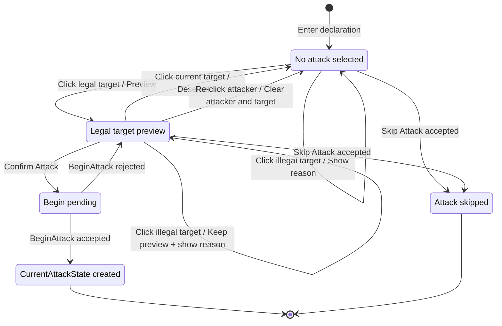
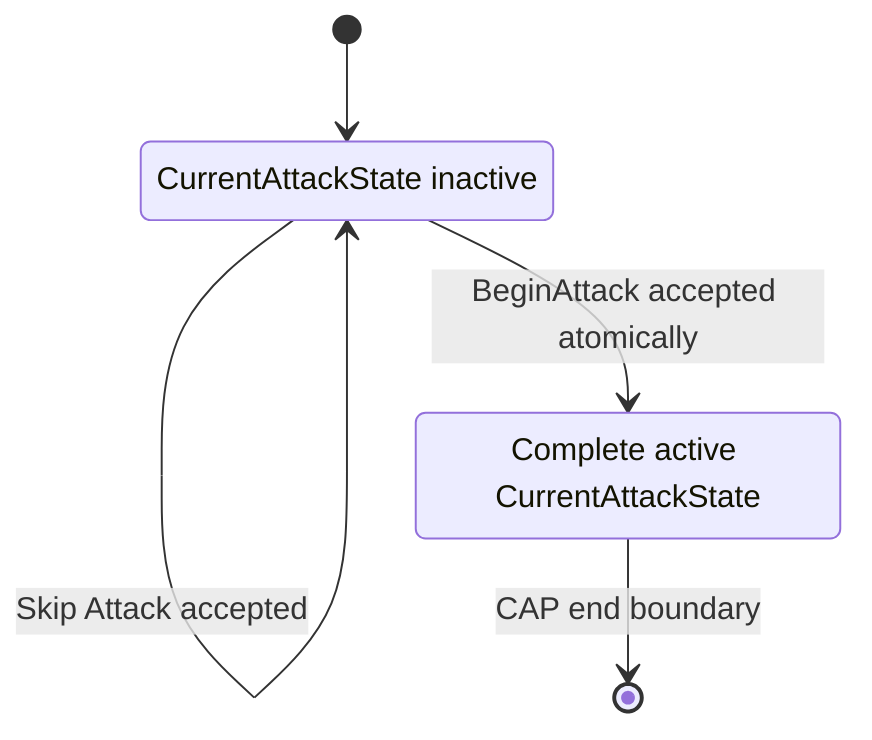
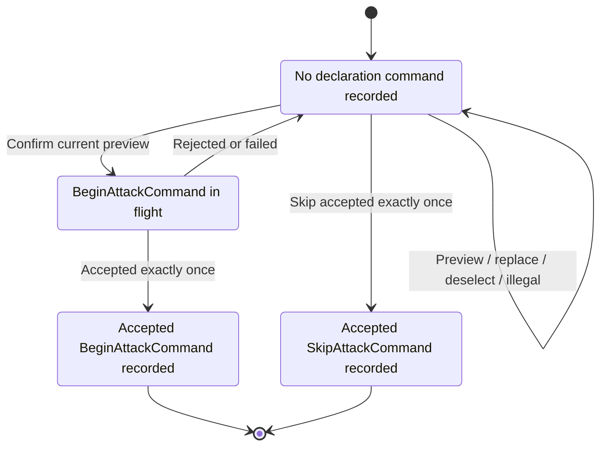
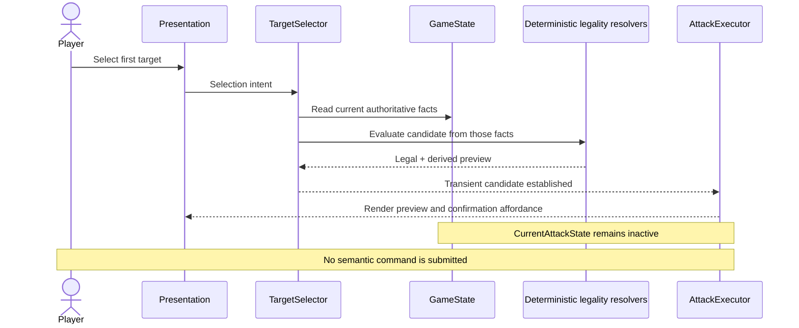
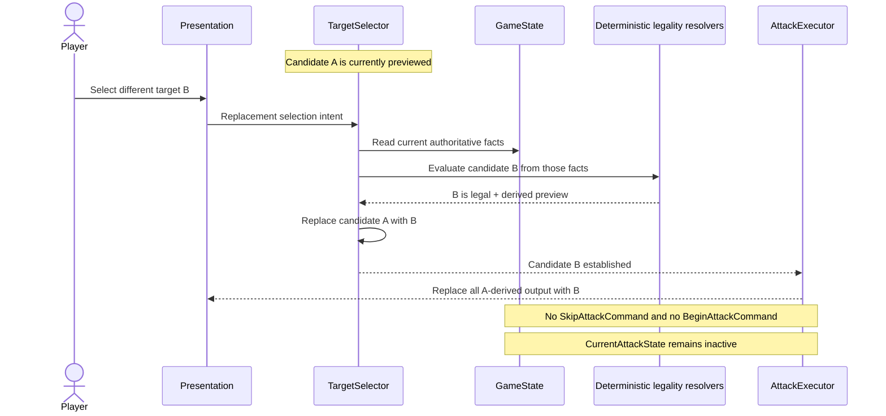

# CAP-ATTACK-001: Attack Declaration Lifecycle

Status: Superseded Draft

Purpose:
This document is retained as historical design input.
It is not an authoritative architecture document.
The accepted architecture is expected to be published as CON-006.

Package ID: CAP-ATTACK-001
Title: Attack Declaration Lifecycle
Artifact Type: Owner-directed architecture implementation specification
Governing ADR: ADR-001
Governing Contract: CON-001
Evidence Basis: Accepted attack-declaration lifecycle forensic audit
Related Requirements: AT-002, AT-007, AT-060 through AT-063,
SQA-ATK-001 through SQA-ATK-003, AS-TGT-001 through AS-TGT-030,
AS-ARC-001 through AS-ARC-002, AS-RNG-010 through AS-RNG-014
Related Workbook: TWI-002, especially section 15.3.1
Created: 2026-07-26
Owner: Project Owner

Normative language in this document uses **SHALL**, **SHALL NOT**, **MAY**, and
**SHOULD**. It becomes implementation authority for this bounded lifecycle
only after Owner acceptance. ADR-001 and CON-001 remain higher authority and
prevail if this document conflicts with either.

Repository classification note: existing repository `CAP-*` artifacts are Rule
Capability Packages governed by ADR-003 and CON-003. CAP-ATTACK-001 uses the
Owner-requested identifier but is not a Rule Capability Package, does not
describe a concrete rule source, and is not governed by the Rule Capability
Package status lifecycle. It therefore resides outside
`docs/architecture/rule_capability_packages/`.

## 1. Purpose

CAP-ATTACK-001 defines the implementation-ready architecture for attack
declaration from an uncommitted declaration surface through authoritative
creation of `CurrentAttackState`.

The package replaces the interaction model in which selecting the first legal
target immediately begins an attack. It establishes a strict boundary between:

- transient attacker/target selection and preview;
- the player's semantic decision to skip or confirm;
- authoritative command validation and mutation; and
- presentation and interaction routing derived from command results.

This package applies the accepted lifecycle forensic findings without
repeating the forensic investigation. It translates those findings into
lifecycle, ownership, command, replay, networking, persistence, presentation,
and verification obligations.

This is an architecture implementation specification, not a UI design. It
defines which interaction outcomes must be available and who owns them. It
does not prescribe visual composition, control labels, layout, styling, or
animation.

## 2. Scope

### 2.1 Start Boundary

The CAP begins when all of the following are true:

- a gameplay declaration opportunity or a free-form Attack Simulator session
  has entered declaration interaction;
- `CurrentAttackState` is inactive;
- no complete attacker-target declaration is currently previewed; and
- the entering interaction defines which attacker context is available or
  selectable.

For a squadron activation, the attacker context may already identify the
activated squadron. For a ship activation, it may identify the active ship
while the attacking hull zone remains part of transient declaration
selection. For the free-form Attack Simulator, no attacker need be preselected;
attacker selection remains an analysis interaction and does not by itself
grant authority to begin an attack.

Within this CAP, **No attack selected** means that no complete attacker-target
declaration is currently previewed and no authoritative current attack exists.
An entry route MAY already have selected or constrained the attacker, but that
selection remains transient or derived until accepted Begin.

### 2.2 Included Behavior

This CAP includes:

- first legal target preview;
- replacement of one preview with another legal preview;
- re-click deselection of the current target;
- rejection and explanation of an illegal target;
- skipping the available attack;
- confirming the current preview;
- submission, validation, acceptance, and failure of `BeginAttackCommand`;
- authoritative creation of one complete `CurrentAttackState`;
- command, replay, network, save/load, reconnect, projection, and modal-routing
  boundaries needed to preserve that lifecycle; and
- ship and squadron attacker contexts, including ship-to-ship,
  ship-to-squadron, squadron-to-ship, and squadron-to-squadron declaration.

### 2.3 End Boundary

The successful path ends when `BeginAttackCommand` has atomically installed one
valid authoritative `CurrentAttackState` in `GameState` and the accepted
command result is available for projection. The created state is the
authoritative attack-entry state required by ADR-001, CON-001, and TWI-002.

The skip path ends when the replayable skip decision succeeds, no
`CurrentAttackState` has been created, and the enclosing interaction may route
away from declaration.

### 2.4 Explicitly Excluded

Everything after successful attack entry is out of scope, including:

- attack-dice rolling;
- Concentrate Fire choices;
- attack-dice modification or confirmation;
- Accuracy spending;
- defense-token selection or resolution;
- critical-effect selection;
- damage calculation or resolution;
- Counter resolution;
- additional squadron-target iteration after a completed target;
- attack completion, cancellation, or active-attack replacement; and
- cleanup of an active attack.

In particular, `ConfirmAttackDiceCommand` is outside this CAP. Declaration
confirmation and attack-dice confirmation are different semantic moments.

### 2.5 Preconditions Supplied By Existing Architecture

This CAP consumes, but does not redefine:

- controlling-player and phase/activation authority;
- stable ship, squadron, hull-zone, and player identity;
- firing-arc, range, line-of-sight, obstruction, engagement, Escort, Heavy,
  same-ship, friendly-target, and rule-specific legality;
- command registration, applicability, ordering, serialization, replay, and
  network mirroring;
- `GameState` serialization and reconstruction;
- the ADR-001 `CurrentAttackState` membership test; and
- TWI-002's individual-attack lifecycle boundary.

## 3. Architecture Summary

### 3.1 Core Decision

Attack declaration has two distinct state domains:

1. **Transient declaration state** contains the current attacker/target
   candidate and derived preview information. `TargetSelector` owns this state
   for the local interaction session. It may be replaced, deselected, or
   rejected without a replayable command.
2. **Authoritative attack state** begins only when an accepted
   `BeginAttackCommand` atomically creates `CurrentAttackState` in `GameState`.

The declaration surface SHALL NOT create, cancel, or replace
`CurrentAttackState` in response to target clicks. A legal click changes only
the transient preview. A second legal click replaces only that preview. A
same-target click deselects it. An illegal click changes no selected preview
and no authoritative state.

Where the entering interaction allows attacker selection, that selection uses
the same transient ownership boundary. Re-clicking the attacker MAY clear both
attacker and target as required by AS-TGT-021, returning to No attack selected,
without a semantic command.

Confirmation is an interaction boundary, not an additional authoritative
state. Confirming submits exactly one `BeginAttackCommand` for the current
candidate. Until that command succeeds, `CurrentAttackState` remains inactive.

Skipping is a replayable semantic decision. It uses `SkipAttackCommand` in its
no-active-attack declaration context, leaves `CurrentAttackState` inactive,
and routes the enclosing activation or action through its existing authority.

### 3.2 Authoritative And Replay Boundaries

The accepted replay stream records:

- one accepted `BeginAttackCommand` for a confirmed declaration; or
- one accepted `SkipAttackCommand` for a skipped declaration.

It does not record:

- preview;
- preview replacement;
- deselection;
- illegal selection;
- presentation changes; or
- the confirm gesture separately from the resulting
  `BeginAttackCommand`.

Replay, network mirroring, and reconstruction therefore reproduce the accepted
semantic decision, not the exploratory click history that preceded it.

### 3.3 Known Input Inconsistencies

The following inconsistencies are explicit inputs to this CAP:

1. **TWI-002 replacement violation.** TWI-002 section 15.3.1 documents
   `SkipAttackCommand(reason=flow_replaced)` followed by a fresh
   `BeginAttackCommand` and explicitly states that this is not a CON-001 atomic
   active-attack replacement. CON-001-LIFE-010 requires active replacement to
   be one atomic semantic transaction. This CAP does not use active replacement
   before confirmation: no active `CurrentAttackState` exists, so a second
   legal click performs transient preview replacement. Active-attack
   replacement remains out of scope and the TWI-002 inconsistency remains
   unresolved for any caller that uses it after attack entry.
2. **Click-to-declare wording.** Historical SQA-ATK-002 says that clicking a
   target declares it. The accepted product requirement for this CAP says that
   clicking produces an uncommitted preview and explicit confirmation commits
   the declaration. This CAP adopts the Owner-provided product requirement for
   the replacement lifecycle. The historical squadron document is itself
   marked superseded and is not architecture authority.
3. **Free-form simulator versus gameplay authorization.** Attack Simulator
   requirements permit analysis selections from either faction, while AT-063
   prohibits friendly attacks and CON-001 requires authoritative
   controller/legality validation. Simulator analysis MAY preview combinations
   allowed by its requirements, but such a preview does not authorize
   `BeginAttackCommand`. Only a gameplay declaration opportunity accepted by
   authoritative validation may begin an attack.
4. **Confirmation terminology.** Existing attack presentation uses
   confirmation after dice modification. In this CAP, **Confirm Attack** means
   confirm the declaration candidate and submit `BeginAttackCommand`.
   `ConfirmAttackDiceCommand` remains the later, out-of-scope dice decision.
5. **CAP identifier classification.** Repository CAP documents currently mean
   Rule Capability Packages. The Owner has requested CAP-ATTACK-001 as a
   lifecycle implementation specification. This document records that naming
   overlap explicitly and does not silently adopt CON-003 rule-package
   semantics.
6. **Pre-entry flow reconstruction.** TWI-002 section 17 treats legacy flow or
   projection data that indicates an in-progress attack without
   `CurrentAttackState` as invalid. This CAP deliberately defines
   `ATTACK / ATTACK_DECLARE` as a pre-entry routing state in which
   `CurrentAttackState` is inactive. The states are not semantically
   equivalent. Under this CAP, serialized `ATTACK_DECLARE` with no active
   current attack is valid declaration routing; a post-entry attack step with
   no active current attack remains inconsistent and fails closed. Preview
   target data is not reconstructed in either case.
7. **Same-ship simulator wording.** AS-TGT-003 permits a different hull zone on
   the same ship as an analysis target, while the later AS-TGT-030 and
   AC-AS-40 reject every same-ship hull-zone target. Gameplay declaration must
   reject self/same-ship attack entry under AT-063 and authoritative rules.
   This CAP does not attempt to reconcile the historical analysis-only
   simulator wording beyond preventing that analysis state from authorizing
   Begin.

No unresolved inconsistency above grants permission to weaken ADR-001 or
CON-001. If a later implementation cannot satisfy both this CAP and the
accepted ADR/Contract, implementation SHALL stop for Owner resolution.

## 4. Lifecycle Overview

### 4.1 Expected Declaration Lifecycle

This diagram expresses the accepted product interaction. “Preview” is
transient and does not mean “attack begun.”



### 4.2 Canonical Lifecycle

All preview interaction occurs while canonical attack state remains inactive.
“Begin pending” is deliberately absent from canonical state; it belongs to the
transient interaction coordinator.



The self-transitions above mean “no canonical
`CurrentAttackState` mutation.” An accepted skip may change the enclosing
activation or flow owner, but it SHALL NOT synthesize a current attack.

### 4.3 Semantic Command Lifecycle



Only accepted commands enter authoritative command history. A local submission
sentinel, pending animation, or modal state is not a semantic command result.

### 4.4 Lifecycle Invariants

At every point in the CAP:

- zero or one `CurrentAttackState` is active;
- preview interaction is legal only while zero are active;
- the preview candidate has one transient owner;
- target preview facts are not reconstructed from `InteractionFlow`;
- target clicks do not submit semantic attack commands;
- confirmation submits at most one in-flight `BeginAttackCommand`;
- a failed command leaves authoritative state unchanged;
- a successful begin installs a complete state in one transaction; and
- a successful skip leaves current-attack state inactive.

## 5. Ownership Table

“Authoritative owner” identifies the owner of gameplay truth at that stage.
“Transient owner” identifies mutable interaction state that may be discarded
without changing gameplay truth.

| Stage | Authoritative owner | Transient owner | Presentation owner | Command owner |
| --- | --- | --- | --- | --- |
| Entered declaration; no target | Existing `GameState` phase, activation, entity, and controller state; `CurrentAttackState` is inactive | `AttackExecutor` owns the declaration session; `TargetSelector` has no target candidate and may own transient attacker selection | Presentation renders declaration affordances from the session and projection | None |
| First legal target preview | Existing authoritative entity/rule state remains truth; accepted deterministic resolvers supply derived legality | `TargetSelector` owns attacker/target candidate, validation result, and preview derivations | Attack presentation and board overlays render the candidate | None |
| Preview replaced | Same authoritative owners as first preview; no current attack exists | `TargetSelector` atomically replaces its local candidate | Presentation replaces old preview output with new output | None |
| Preview deselected | Same authoritative owners; no current attack exists | `TargetSelector` clears only the target candidate and target-derived preview | Presentation removes target preview and retains applicable attacker context and skip affordance | None |
| Illegal target attempted | Authoritative entity/rule state determines illegality; no canonical mutation occurs | `TargetSelector` owns the transient rejection result and preserves the prior legal candidate, if any | Presentation communicates the rejection reason without routing away | None |
| Confirmation pending | Authoritative state is still unchanged and `CurrentAttackState` remains inactive | `AttackExecutor` owns the in-flight submission gate; `TargetSelector` retains the submitted candidate until result | Presentation shows pending/non-duplicating interaction and retains the preview | `BeginAttackCommand` owns the attempted semantic transaction; command infrastructure owns ordering |
| Begin rejected or failed | Prior authoritative state remains unchanged | `AttackExecutor` clears pending; `TargetSelector` retains or safely re-derives the candidate | Presentation returns to an interactive preview and exposes the deterministic failure reason | Rejected command is not recorded as an accepted transition |
| Begin accepted | `GameState` owns the newly active, complete `CurrentAttackState` | Declaration transient state has no further authority and is discarded after success | Presentation/router derive the terminal declaration result and route out of this CAP | Accepted `BeginAttackCommand` |
| Skip pending | Authoritative state is unchanged and `CurrentAttackState` remains inactive | `AttackExecutor` owns the in-flight submission gate; candidate is retained until result | Presentation prevents duplicate skip/confirm while preserving context | `SkipAttackCommand` owns the attempted semantic decision |
| Skip rejected or failed | Prior authoritative state remains unchanged | Pending state clears; prior candidate state remains available | Presentation remains in declaration and shows the deterministic failure reason | Rejected command is not recorded as an accepted transition |
| Skip accepted | Existing activation/action authority owns the resulting semantic progress; `CurrentAttackState` remains inactive | Declaration transient state is discarded after success | Presentation/router derive the accepted skip and route away | Accepted `SkipAttackCommand` |

`InteractionFlow` is intentionally absent from the authoritative-owner column
for current-attack facts. It is a serialized routing/projection surface, not
the authority for the selected target, attack legality, or attack creation.

## 6. State Boundaries

### 6.1 `CurrentAttackState`

Permitted ownership:

- the canonical current-attack lifecycle identity after successful begin;
- stable attacker and defender references and applicable hull-zone identity;
- attack kind/context and semantic entry stage;
- committed range band and obstruction outcome where required by the accepted
  membership boundary;
- the ordered attack pool and other attack-entry facts required by ADR-001,
  CON-001, and TWI-002; and
- only additional current-attack-specific facts that satisfy the ADR-001
  membership test.

Required creation behavior:

- it SHALL remain inactive for preview, replacement, deselection, illegal
  selection, and command-pending interaction;
- only successful `BeginAttackCommand` may create it in live semantic
  progression;
- creation SHALL validate before installation;
- creation SHALL atomically install a complete valid state with deterministic
  lifecycle identity; and
- stable facts owned elsewhere in `GameState` SHALL be referenced, not copied
  as a second authority.

Prohibited ownership:

- current preview target;
- hover, selection, deselection, illegal-selection reason, or pending flags;
- modal visibility, control enablement, overlay geometry, or animation;
- `InteractionFlow` payloads;
- scene nodes or local object identity;
- deterministic preview calculations that can be re-derived; or
- simulator-only analysis state.

### 6.2 `InteractionFlow`

Permitted ownership:

- serialized interaction-routing state;
- the declaration step, controlling player, visibility, and modal routing
  information;
- non-authoritative mirrors of stable context needed for viewer-appropriate
  projection; and
- command affordances derived from accepted authority.

During gameplay declaration, the existing `ATTACK / ATTACK_DECLARE` surface
SHALL be interpreted as a pre-entry routing state. It SHALL represent that the
controller may select, confirm, or skip while `CurrentAttackState` is inactive.
An enclosing squadron or ship activation surface MAY route into that
declaration surface through its existing authority.

Prohibited ownership:

- the mutable preview target;
- attack legality;
- canonical attacker/defender facts;
- `CurrentAttackState` creation or mutation;
- command authorization; or
- reconstruction of an attack from a preview payload.

Target-specific preview churn SHALL NOT be written to `InteractionFlow` as
durable gameplay progress. After a successful semantic command, routing and
projection SHALL be derived from the resulting authority before another player
action is routed, as required by CON-001-BOUND-009.

For reconstruction:

- `ATTACK / ATTACK_DECLARE` plus inactive `CurrentAttackState` is a valid
  pre-entry declaration window;
- no target preview is reconstructed for that window;
- an accepted Begin supplies the canonical state required by every post-entry
  attack step; and
- any post-entry attack step with inactive `CurrentAttackState` fails closed.

### 6.3 `TargetSelector`

Permitted ownership:

- the local attacker/target candidate for the current declaration session;
- transient legal/illegal selection results;
- derived range, line-of-sight, obstruction, arc, dice-preview, engagement,
  and rule-feedback data;
- preview replacement and target deselection; and
- stable intent references used to request authoritative validation.

Required behavior:

- a first legal target establishes one preview;
- a different legal target replaces that preview without a command;
- a same-target click clears the target preview;
- an illegal click preserves any existing legal preview;
- every illegal outcome provides a reason suitable for presentation; and
- the selected candidate remains non-authoritative even when all preview
  checks pass.

Prohibited ownership:

- durable gameplay facts;
- command authorization;
- command history;
- `CurrentAttackState`;
- authoritative lifecycle identity; or
- direct semantic mutation.

The selector MAY use shared resolvers and authoritative read models to produce
an accurate preview. `BeginAttackCommand` SHALL nevertheless validate again
against current authoritative state immediately before mutation.

### 6.4 `AttackExecutor`

Permitted ownership:

- transient declaration-session coordination;
- collaboration between `TargetSelector`, presentation, submission
  infrastructure, and command results;
- confirm and skip event handling;
- one in-flight semantic submission gate;
- retention of the submitted candidate until an authoritative result; and
- cleanup of transient declaration state after an accepted terminal result.

Prohibited ownership:

- authoritative attacker, defender, range, obstruction, dice, lifecycle, or
  semantic-stage facts;
- mutation of `CurrentAttackState`;
- use of scene state as command authority;
- automatic begin on target selection;
- split active replacement through local `Skip → Begin` choreography; or
- treating modal destruction as semantic attack cancellation.

`AttackExecutor` coordinates; replayable commands own semantic mutation.

### 6.5 Presentation

Presentation includes `AttackSimPanel`, board selection visuals, range and
line-of-sight overlays, messages, and viewer-specific mirrored surfaces.

Permitted ownership:

- rendering the transient candidate and derived preview;
- rendering legal/illegal feedback;
- emitting user intent for select, deselect, confirm, and skip;
- showing pending state without creating gameplay truth;
- controlling local visual lifetime; and
- viewer-specific interactivity derived from projection/controller ownership.

Prohibited ownership:

- target legality or command authorization;
- durable selected-target state;
- canonical attack state or lifecycle;
- semantic mutation;
- command success inference from local UI state; or
- teardown that silently cancels, replaces, or begins an attack.

Presentation SHALL not expose declaration confirmation in a simulator-only
analysis session unless the authoritative command surface permits attack
entry. A visible or enabled control never grants command authority.

### 6.6 `ModalRouter`

Permitted ownership:

- choosing which presentation surface reflects the current projected
  interaction;
- opening, retaining, or closing presentation after projection and command
  results;
- controller/read-only routing between peers; and
- teardown of transient presentation after an accepted terminal declaration
  result.

Prohibited ownership:

- selected target, legality, command intent, or command authorization;
- `CurrentAttackState` creation, replacement, or cancellation;
- clearing a declaration merely because `CurrentAttackState` is inactive;
- inferring command success from a flow gap or scene teardown; or
- reconstructing target preview from stale `InteractionFlow` payload.

An inactive `CurrentAttackState` is the expected canonical condition throughout
declaration. The router SHALL therefore retain the declaration surface while
the declaration interaction is valid, including while a begin or skip command
is pending. It SHALL route away only from an accepted terminal result or an
authoritatively derived enclosing-flow change.

### 6.7 Command Infrastructure And `GameState`

Although not transient interaction owners, these existing boundaries complete
the lifecycle:

- `GameState` owns canonical entity, phase, activation, flow, and
  `CurrentAttackState` data according to their governing boundaries.
- `CommandProcessor` and existing submission infrastructure order, validate,
  record, mirror, and replay accepted commands.
- network transport carries command intent/results but does not create a
  second mutation owner.
- save/load and reconnect reconstruct canonical state before projection.

## 7. Semantic Transitions

### 7.1 Transition Matrix

| Transition | Command | Owner | Replayability | Canonical mutation | Presentation update |
| --- | --- | --- | --- | --- | --- |
| **Preview** | None | `TargetSelector` | Not replayed | None. `CurrentAttackState` remains inactive. | Show candidate attacker/target identity and derived LOS, range, dice, obstruction, and legality information. Enable declaration confirmation only when the session is gameplay-authorized and the candidate is preview-legal. |
| **Replace Preview** | None | `TargetSelector` | Not replayed | None. No skip, cancellation, replacement, or begin command occurs. | Replace all target-derived preview output as one coherent local update; no stale data from the prior candidate remains visible. |
| **Deselect** | None | `TargetSelector` | Not replayed | None. Clear only transient target state. | Remove target-derived preview, retain applicable attacker context, return to target-selection guidance, and keep Skip Attack available where the enclosing opportunity permits it. |
| **Illegal Selection** | None | Accepted read-only legality surfaces supply facts; `TargetSelector` owns the transient result | Not replayed | None. Preserve prior authoritative state and any prior legal preview. | Show a deterministic reason such as wrong controller, friendly/self target, same ship, out of arc, out of range, blocked LOS, engagement/Escort restriction, already targeted, or rule-specific prohibition. |
| **Skip Attack** | `SkipAttackCommand` in its no-active declaration context | Replayable command owns the semantic decision; `AttackExecutor` coordinates submission | Accepted skip is replayed exactly once | `CurrentAttackState` remains inactive. The accepted command records the skip and changes only the enclosing authoritative owners required by the existing activation/action contract. It SHALL NOT synthesize active-attack cleanup. | Retain declaration while pending. On rejection, remain in the prior preview/no-preview state. On success, clear transient declaration and route away from this CAP. |
| **Confirm Attack** | Submit `BeginAttackCommand`; there is no separate declaration-confirm command | `AttackExecutor` owns the interaction and pending gate; `BeginAttackCommand` owns the attempted semantic transaction | The gesture is not separately replayed; accepted Begin is replayed | None until command success. `CurrentAttackState` remains inactive while pending. | Preserve preview while pending and prevent duplicate confirmation/skip. On rejection, restore interactive preview and show the deterministic failure. |
| **BeginAttack** | `BeginAttackCommand` | Replayable command operating through authoritative command infrastructure | Accepted Begin is replayed and mirrored exactly once | Validate current authority, then atomically install one complete `CurrentAttackState` with deterministic lifecycle identity and any coordinated declaration-commit mutations on their existing owners. Failure leaves every authoritative owner unchanged. | On success, derive terminal declaration projection and route to the post-entry surface, which is outside this CAP. No dice-roll or later-resolution behavior is specified here. |

### 7.2 Preview

A target click MAY produce a rich preview only after the selector has evaluated
the candidate using the applicable existing resolvers and rule-query surfaces.
That preview is advisory. It SHALL NOT be serialized as current-attack state,
submitted as a semantic command, or trusted by the command as an authoritative
calculation.

The preview SHOULD express the information required by the accepted product
interaction:

- attacker and defender identity;
- applicable hull zones;
- line-of-sight result;
- range band;
- obstruction result;
- attack-dice preview; and
- any legality restriction or warning.

Visual form is outside scope.

### 7.3 Replace Preview

Selecting a different legal target while a preview exists SHALL replace the
transient candidate in one local interaction transition. The old candidate
SHALL cease to drive all target-derived presentation.

Because `CurrentAttackState` is inactive, this transition is not a CON-001
active-attack replacement and SHALL NOT submit either `SkipAttackCommand` or
`BeginAttackCommand`.

### 7.4 Deselect

Selecting the same currently previewed target SHALL deselect that target.
Where the attacker context remains valid, it SHALL remain available. Target
preview output SHALL be removed, declaration confirmation SHALL be unavailable,
and Skip Attack SHALL remain available when permitted by the enclosing
opportunity.

No authoritative state, command history, or `InteractionFlow` target payload
changes. In an interaction that permits transient attacker selection,
re-clicking the attacker MAY clear both attacker and target in conformance with
AS-TGT-021; that action also remains transient and command-free.

### 7.5 Illegal Selection

An illegal target attempt SHALL:

- not crash;
- not submit a semantic attack command;
- not change `CurrentAttackState`;
- not change `InteractionFlow` as though declaration progressed;
- not discard a previously legal preview;
- return one deterministic, presentation-safe reason; and
- leave the controller able to choose another target, deselect, or skip.

Preview-time rejection does not replace command validation. Between preview and
confirmation, authoritative state may change because of network order,
reconstruction, or another accepted command. `BeginAttackCommand` therefore
revalidates every applicable condition and may reject a formerly legal
preview.

### 7.6 Skip Attack

Skip is available with or without a current preview when the enclosing attack
opportunity permits skipping. The accepted skip:

- is one replayable semantic decision;
- leaves `CurrentAttackState` inactive;
- atomically commits every enclosing authoritative state change required to
  make the skip decision complete at this boundary;
- does not open or close an active-attack timing lifecycle;
- does not run active-attack cleanup;
- does not use target-preview data as authority; and
- routes the enclosing activation/action according to its existing
  authoritative semantics.

A failed or rejected skip leaves the declaration session and preview unchanged.
Presentation or scene teardown SHALL NOT be required to make an accepted skip
semantically complete.

### 7.7 Confirm Attack

Confirm Attack is the controller's decision to request authoritative attack
entry for the currently previewed candidate.

The interaction SHALL:

1. require one current preview candidate;
2. require a gameplay-authorized declaration opportunity;
3. create command intent from stable attacker/defender references, applicable
   hull-zone references, and existing authoritative context;
4. omit any caller-supplied `CurrentAttackState` or trusted preview snapshot;
5. submit exactly one `BeginAttackCommand`;
6. retain the preview while awaiting the authoritative result; and
7. prevent another confirm, skip, or replacement submission until that result
   resolves.

This pending gate is transient and SHALL NOT be serialized as authoritative
attack state.

### 7.8 BeginAttack

Immediately before mutation, `BeginAttackCommand` SHALL validate every
applicable authoritative condition, including:

- current phase, activation, declaration step, and controlling player;
- absence of another active `CurrentAttackState`;
- stable existence and identity of attacker and defender;
- attacker and defender ownership/kind compatibility;
- attacking and defending hull-zone validity where applicable;
- self/friendly-target prohibitions;
- firing arc, attack range, line of sight, and blocked/obstructed outcome;
- squadron engagement, Escort, Heavy, and other applicable keyword rules;
- per-activation attack availability, used hull-zone, and already-targeted
  constraints;
- applicable RuleRegistry target blockers and validators; and
- duplicate or stale submission protection.

The command MAY call existing deterministic resolvers. It SHALL derive results
from current authoritative state and validated command intent, not from scene
or preview authority.

On success, the command SHALL atomically:

- create a complete valid `CurrentAttackState`;
- create deterministic current-attack lifecycle identity;
- establish the accepted semantic attack-entry stage;
- commit the attack-entry facts required by the ADR-001 membership test and
  TWI-002 boundary;
- coordinate any declaration-commit mutation required on another existing
  authoritative owner without transferring ownership; and
- produce one accepted command result for history, replay, network mirrors,
  routing, and projection.

On rejection or failure, it SHALL:

- install no partial `CurrentAttackState`;
- mutate no adjacent authoritative owner;
- record no successful begin;
- perform no cleanup or alternative transition; and
- surface one deterministic failure result.

## 8. Architectural Obligations

Each obligation below is independently verifiable and avoids prescribing
class APIs, payload fields, transport protocols, or visual controls.

### 8.1 Lifecycle Obligations

| ID | Obligation | Independent verification |
| --- | --- | --- |
| CAP-ATTACK-001-LIFE-001 | Entry into declaration SHALL have inactive `CurrentAttackState` and no target preview. | Observe canonical state and declaration projection at entry. |
| CAP-ATTACK-001-LIFE-002 | A first legal target SHALL create one transient preview and no semantic command. | Compare candidate state, command history, and canonical serialization before/after the click. |
| CAP-ATTACK-001-LIFE-003 | A different legal target SHALL replace the preview without exposing an empty intermediate authoritative attack state. | Observe candidate/presentation replacement and unchanged canonical state/history. |
| CAP-ATTACK-001-LIFE-004 | A same-target click SHALL deselect only the target preview. | Observe retained attacker context, cleared target preview, and unchanged authority. |
| CAP-ATTACK-001-LIFE-005 | An illegal target SHALL preserve any prior legal preview and every authoritative owner. | Compare all authoritative owners and prior candidate before/after rejection. |
| CAP-ATTACK-001-LIFE-006 | Confirm SHALL leave `CurrentAttackState` inactive until accepted Begin completes. | Inspect canonical state while submission is pending. |
| CAP-ATTACK-001-LIFE-007 | Rejected Begin SHALL return to declaration without partial mutation or synthetic cleanup. | Compare canonical state/history and available interaction before/after rejection. |
| CAP-ATTACK-001-LIFE-008 | Accepted Begin SHALL atomically create exactly one complete `CurrentAttackState`. | Observe the command transaction boundary and validate the installed state. |
| CAP-ATTACK-001-LIFE-009 | Accepted skip SHALL end declaration without creating a `CurrentAttackState`. | Observe accepted skip history, inactive current attack, and enclosing route. |

### 8.2 Ownership Obligations

| ID | Obligation | Independent verification |
| --- | --- | --- |
| CAP-ATTACK-001-OWN-001 | `GameState` SHALL remain the only owner capable of exposing authoritative `CurrentAttackState`. | Structural write-path review plus mutation-path tests. |
| CAP-ATTACK-001-OWN-002 | `TargetSelector` SHALL own only transient candidate and preview state. | Verify selector state is absent from canonical serialization and cannot mutate current attack. |
| CAP-ATTACK-001-OWN-003 | `AttackExecutor` SHALL coordinate submission but SHALL NOT perform parallel semantic mutation. | Trace live confirm/skip paths to accepted commands and compare canonical writes. |
| CAP-ATTACK-001-OWN-004 | `InteractionFlow` SHALL route declaration but SHALL NOT authorize Begin or own the preview target. | Force disagreement between flow payload and authoritative state and verify command-side authority prevails. |
| CAP-ATTACK-001-OWN-005 | Presentation SHALL remain renderer/input only. | Destroy or recreate presentation and verify canonical state/history are unchanged. |
| CAP-ATTACK-001-OWN-006 | `ModalRouter` SHALL route only from projection/results and SHALL NOT synthesize attack transitions. | Exercise open/close/recreate paths and compare command history/canonical state. |
| CAP-ATTACK-001-OWN-007 | No migration stage SHALL retain two writable owners for attacker, target, range, obstruction, dice pool, or lifecycle identity. | Structural ownership inventory at each migration checkpoint. |

### 8.3 Command Obligations

| ID | Obligation | Independent verification |
| --- | --- | --- |
| CAP-ATTACK-001-CMD-001 | Preview, replacement, deselection, and illegal selection SHALL submit no replayable attack command. | Count submissions/history for each interaction. |
| CAP-ATTACK-001-CMD-002 | Declaration confirmation SHALL submit exactly one `BeginAttackCommand` and no separate declaration-confirm command. | Observe production command stream for one confirm. |
| CAP-ATTACK-001-CMD-003 | Begin intent SHALL contain stable references/context, not a caller-supplied authoritative state snapshot. | Command serialization/validation review. |
| CAP-ATTACK-001-CMD-004 | Begin SHALL validate current authoritative state immediately before mutation. | Change an applicable authoritative precondition after preview and verify deterministic rejection. |
| CAP-ATTACK-001-CMD-005 | Accepted Begin SHALL commit all declaration-entry authoritative mutations exactly once. | Duplicate-delivery and atomic-state comparison. |
| CAP-ATTACK-001-CMD-006 | Failed Begin SHALL leave every touched authoritative owner unchanged. | Inject validation/calculation/mutation failure and compare deterministic state hashes. |
| CAP-ATTACK-001-CMD-007 | Skip SHALL be one replayable command and SHALL not synthesize active-attack cleanup while no attack is active. | Inspect accepted history and all attack/timing/rule owners after skip. |
| CAP-ATTACK-001-CMD-008 | Pre-confirm preview replacement SHALL never use `SkipAttackCommand → BeginAttackCommand`. | Observe command stream during repeated legal target selection. |
| CAP-ATTACK-001-CMD-009 | Repeated, duplicated, delayed, or out-of-order Begin delivery SHALL not create more than one active attack. | Apply duplicate and reordered delivery through production command paths. |
| CAP-ATTACK-001-CMD-010 | Accepted Skip SHALL leave the enclosing authoritative state semantically complete without scene-owned progression. | Remove presentation immediately after success and verify the reconstructed next route. |

### 8.4 Flow And Presentation Obligations

| ID | Obligation | Independent verification |
| --- | --- | --- |
| CAP-ATTACK-001-FLOW-001 | A gameplay declaration surface SHALL remain routable while `CurrentAttackState` is inactive. | Project `ATTACK_DECLARE` with inactive state and verify the controller can interact. |
| CAP-ATTACK-001-FLOW-002 | Target-specific preview churn SHALL not become durable `InteractionFlow` authority. | Compare serialized flow before/after preview, replacement, and deselection. |
| CAP-ATTACK-001-FLOW-003 | `InteractionFlow` disagreement SHALL not override canonical command validation. | Supply stale/mismatched projection and verify authoritative rejection or canonical result. |
| CAP-ATTACK-001-FLOW-004 | After accepted Begin or Skip, projection/routing SHALL derive from the resulting authoritative state before another action. | Observe result-to-projection ordering. |
| CAP-ATTACK-001-FLOW-005 | `ModalRouter` SHALL not dismiss declaration solely because current attack is inactive or a command is pending. | Exercise no-preview, preview, and pending states. |
| CAP-ATTACK-001-FLOW-006 | Declaration teardown SHALL follow accepted terminal result or authoritative enclosing-flow change, not local scene teardown. | Remove/recreate modal and compare lifecycle/result behavior. |
| CAP-ATTACK-001-FLOW-007 | Illegal selection SHALL produce a presentation-safe reason without changing route or current preview. | Exercise each supported illegality category. |
| CAP-ATTACK-001-FLOW-008 | Simulator-only analysis affordances SHALL not grant gameplay command authority. | Preview an analysis-only pairing and verify Begin is unavailable or authoritatively rejected. |
| CAP-ATTACK-001-FLOW-009 | Accepted Begin SHALL leave routing/projection able to exit declaration without another player decision or a scene-owned semantic transition. | Reconstruct immediately from the accepted Begin result and verify the post-entry route is derivable. |

### 8.5 Distributed And Durable Obligations

| ID | Obligation | Independent verification |
| --- | --- | --- |
| CAP-ATTACK-001-DIST-001 | Preview interaction SHALL remain client-local/transient and SHALL not create a network semantic-command message. | Compare host/client command streams during preview churn. |
| CAP-ATTACK-001-DIST-002 | Multiplayer confirmation and skip SHALL use the same authoritative semantic command stream as local play. | Compare accepted command types/order across execution modes. |
| CAP-ATTACK-001-DIST-003 | The authoritative command executor SHALL revalidate Begin; a client preview SHALL never be accepted as authority. | Change host authority after client preview and verify rejection. |
| CAP-ATTACK-001-DIST-004 | Accepted Begin SHALL produce equivalent canonical `CurrentAttackState` and lifecycle identity on host and conforming mirrors. | Compare canonical serialization/hash after mirrored application. |
| CAP-ATTACK-001-DIST-005 | Replay history SHALL omit preview churn and contain only the accepted Begin or Skip decision for this lifecycle. | Inspect and replay histories after multiple preview interactions. |
| CAP-ATTACK-001-DIST-006 | Save/load before Begin SHALL not persist or reconstruct a target preview or active current attack. | Round-trip a save during preview and inspect canonical/projected outcome. |
| CAP-ATTACK-001-DIST-007 | Reconnect before Begin SHALL reconstruct authoritative declaration routing before presentation and SHALL not restore authority from client-local preview. | Reconnect during preview and compare authoritative state/routing. |
| CAP-ATTACK-001-DIST-008 | Save/load, replay, and reconnect after accepted Begin SHALL use the canonical state created by that same accepted command, without submitting another Begin. | Reconstruct at the CAP end boundary and inspect history/identity. |

## 9. Mermaid Sequence Diagrams

### 9.1 First Target



### 9.2 Replacement



### 9.3 Deselection

```mermaid
sequenceDiagram
    actor Player
    participant Presentation
    participant TargetSelector
    participant AttackExecutor
    participant Authority as GameState

    Note over TargetSelector: Candidate A is currently previewed
    Player->>Presentation: Select target A again
    Presentation->>TargetSelector: Same-target selection intent
    TargetSelector->>TargetSelector: Clear target candidate and preview data
    TargetSelector-->>AttackExecutor: No target selected
    AttackExecutor-->>Presentation: Hide target preview; retain attacker context and Skip
    Note over Authority: CurrentAttackState remains inactive
    Note over Player,Authority: No semantic command is submitted
```

### 9.4 Illegal Target

```mermaid
sequenceDiagram
    actor Player
    participant Presentation
    participant TargetSelector
    participant GameState
    participant Resolvers as Deterministic legality resolvers
    participant AttackExecutor

    opt A legal candidate is already previewed
        Note over TargetSelector: Preserve current candidate
    end
    Player->>Presentation: Select illegal target
    Presentation->>TargetSelector: Selection intent
    TargetSelector->>GameState: Read current authoritative facts
    TargetSelector->>Resolvers: Evaluate candidate from those facts
    Resolvers-->>TargetSelector: Illegal + deterministic reason
    TargetSelector-->>AttackExecutor: Rejection; candidate unchanged
    AttackExecutor-->>Presentation: Show reason; keep declaration interactive
    Note over GameState,AttackExecutor: No canonical transition and no command
```

### 9.5 Confirmation

```mermaid
sequenceDiagram
    actor Player
    participant Presentation
    participant AttackExecutor
    participant TargetSelector
    participant Commands as Command infrastructure
    participant Authority as GameState
    participant ModalRouter

    Player->>Presentation: Confirm Attack
    Presentation->>AttackExecutor: Confirm current preview
    AttackExecutor->>TargetSelector: Read stable candidate intent
    TargetSelector-->>AttackExecutor: Attacker/target references and context
    AttackExecutor->>AttackExecutor: Enter one-submission pending state
    AttackExecutor->>Commands: Submit BeginAttackCommand
    Commands->>Authority: Validate current authority and execute atomically
    alt Begin accepted
        Authority->>Authority: Install complete CurrentAttackState
        Authority-->>Commands: Accepted result
        Commands-->>AttackExecutor: Authoritative success
        AttackExecutor->>ModalRouter: Derive terminal declaration route
        ModalRouter-->>Presentation: Route beyond CAP boundary
    else Begin rejected or failed
        Authority-->>Commands: Deterministic failure; no mutation
        Commands-->>AttackExecutor: Rejection
        AttackExecutor->>AttackExecutor: Clear pending; retain/re-derive preview
        AttackExecutor-->>Presentation: Resume preview and show reason
    end
```

### 9.6 Skip

```mermaid
sequenceDiagram
    actor Player
    participant Presentation
    participant AttackExecutor
    participant Commands as Command infrastructure
    participant Authority as GameState + enclosing activation owner
    participant ModalRouter

    Player->>Presentation: Skip Attack
    Presentation->>AttackExecutor: Skip intent
    AttackExecutor->>AttackExecutor: Enter one-submission pending state
    AttackExecutor->>Commands: Submit SkipAttackCommand
    Commands->>Authority: Validate and execute skip
    alt Skip accepted
        Authority->>Authority: Apply enclosing skip semantics
        Note over Authority: CurrentAttackState remains inactive
        Authority-->>Commands: Accepted result
        Commands-->>AttackExecutor: Authoritative success
        AttackExecutor->>ModalRouter: Clear transient declaration and derive route
        ModalRouter-->>Presentation: Route away
    else Skip rejected or failed
        Authority-->>Commands: Deterministic failure; no mutation
        Commands-->>AttackExecutor: Rejection
        AttackExecutor->>AttackExecutor: Clear pending; retain candidate
        AttackExecutor-->>Presentation: Remain in declaration and show reason
    end
```

## 10. Implementation Strategy

This section identifies affected architecture surfaces and migration order. It
does not prescribe code structure, method signatures, payload schemas, or
specific line edits.

### 10.1 Affected Components

| Surface | Expected responsibility after migration |
| --- | --- |
| `GameState` / `CurrentAttackState` | Remain inactive throughout preview; atomically expose the complete accepted begin result. |
| `BeginAttackCommand` | Own authoritative attack-entry validation, deterministic construction, lifecycle identity, atomic mutation, failure, replay, and mirroring. |
| `SkipAttackCommand` | Own the replay-visible no-active declaration skip and leave current-attack authority inactive. Active cancellation semantics remain outside this CAP. |
| Command registration, applicability, processor, and submitters | Permit Begin/Skip only from accepted surfaces; order and apply exactly once in local, host, mirror, and replay modes. |
| `TargetSelector` | Become the sole mutable owner of declaration candidate, preview replacement, deselection, and illegal-selection feedback. |
| `AttackExecutor` | Coordinate declaration interaction, explicit confirm/skip submission, pending results, and transient cleanup; stop auto-beginning on legal target selection. |
| `AttackFlowFSM` / `AttackFlowExecutor` | Represent declaration routing without treating target preview as semantic progression or active attack state. |
| `InteractionFlow`, `FlowSpec`, and `UIProjector` | Route the controller and declaration affordances while remaining non-authoritative for preview and Begin legality. |
| `ModalRouter` | Retain declaration through inactive/pending states and route away only after accepted result or authoritative enclosing-flow change. |
| `AttackPanelController`, `AttackPanelMirror`, and `AttackSimPanel` | Render transient or projected state and emit intent without owning attack facts. Distinguish declaration confirmation from later dice confirmation. |
| Ship and squadron activation controllers | Supply the existing attacker/activation context and consume accepted Begin/Skip outcomes without creating another attack owner. |
| Target/range/LOS/rule resolver surfaces | Supply deterministic preview queries and authoritative Begin validation without changing their existing rule ownership. |
| Save/load, replay, network, reconnect, and state filtering | Persist/mirror accepted authority only; omit local preview history and rebuild routing after canonical reconstruction. |

The migration SHALL preserve unrelated user changes and existing accepted
ownership boundaries. It SHALL not introduce a generic attack engine, rule
engine, effect framework, or second interaction-state channel.

### 10.2 Expected Migration Order

1. **Freeze the semantic boundary.** Establish executable evidence that target
   clicks do not create current attack state and that accepted Begin alone does.
2. **Make Begin self-sufficient.** Ensure authoritative validation and atomic
   complete state construction do not depend on preview, scene, or
   `InteractionFlow` authority.
3. **Establish transient declaration ownership.** Make first preview,
   replacement, deselection, and illegal feedback one coherent
   `TargetSelector` lifecycle.
4. **Separate selection from submission.** Remove semantic begin from the legal
   target-selection event and expose declaration confirmation as the only
   Begin submission interaction.
5. **Establish pending and failure behavior.** Preserve preview during in-flight
   submission, prevent duplicate intent, and return to declaration on failure.
6. **Align skip and enclosing flow.** Preserve one replayable no-active skip,
   with no attack cleanup and no transient replacement choreography.
7. **Align projection and modal routing.** Keep `ATTACK_DECLARE` routable while
   current attack is inactive, prevent inactive-gap teardown, and derive
   terminal routing from accepted results.
8. **Align distributed and durable paths.** Prove local, host, mirror, replay,
   save/load, and reconnect semantics with preview omitted from authority.
9. **Retire obsolete compatibility behavior.** Remove any pre-confirm
   target-lock, `Skip → Begin` replacement, flow-payload authority, or
   scene-mutates-first path after all consumers use the new boundary.

Each migration checkpoint SHALL preserve one owner per fact. A checkpoint that
requires a scene or flow mirror to write back into canonical state is not a
valid Model C-S stage.

### 10.3 Migration Stop Conditions

Implementation SHALL stop for Owner guidance if:

- it requires `CurrentAttackState` to exist during preview;
- it requires a second authoritative selected-target owner;
- it requires active-attack `Skip → Begin` replacement inside this scope;
- `BeginAttackCommand` cannot validate without trusting presentation or flow
  payload;
- a simulator analysis preview must become gameplay authority;
- accepted ADR-001 and CON-001 obligations conflict with an unmodified
  higher-authority requirement not identified in section 3.3; or
- a change after successful Begin is required to make declaration work.

## 11. Testing Obligations

Tests SHALL use production authority, command, serialization, replay, and
network paths. A test-only alternate authority is not evidence.

### 11.1 Implementation-Independent Test Matrix

| ID | Mode / concern | Scenario | Required result |
| --- | --- | --- | --- |
| CAP-ATTACK-001-TEST-SP-001 | Single player | Enter gameplay declaration with no target. | Declaration is interactive; `CurrentAttackState` is inactive; no target preview exists. |
| CAP-ATTACK-001-TEST-SP-002 | Single player | Select a legal first target. | Preview shows correct derived facts; canonical serialization and command history are unchanged. |
| CAP-ATTACK-001-TEST-SP-003 | Single player | Confirm a legal preview. | Exactly one Begin is accepted and exactly one complete current attack is created. |
| CAP-ATTACK-001-TEST-SP-004 | Single player | Skip with no preview, then repeat with a preview. | Exactly one skip is accepted in each case; no current attack is created; enclosing flow advances correctly. |
| CAP-ATTACK-001-TEST-RPL-001 | Replacement | Select legal A, legal B, then legal C before confirmation. | Only C remains previewed; no semantic command is submitted; no current attack exists. |
| CAP-ATTACK-001-TEST-RPL-002 | Replacement | Replace a ship target with a squadron target and vice versa where legal. | All old target-derived identity, geometry, range, LOS, obstruction, and dice preview is replaced coherently. |
| CAP-ATTACK-001-TEST-RPL-003 | Replacement | Observe command stream during replacement. | No `SkipAttackCommand`, `BeginAttackCommand`, active cancellation, or active replacement is present. |
| CAP-ATTACK-001-TEST-DES-001 | Deselection | Re-click the current ship hull-zone target. | Target preview clears; attacker context and applicable Skip remain; authority/history are unchanged. |
| CAP-ATTACK-001-TEST-DES-002 | Deselection | Re-click the current squadron target. | Same outcome as ship-target deselection. |
| CAP-ATTACK-001-TEST-DES-003 | Deselection | Deselect, then select another legal target. | A fresh preview appears without stale data and without a semantic command. |
| CAP-ATTACK-001-TEST-ILL-001 | Illegal target | Attempt same-ship, friendly/self, out-of-arc, out-of-range, blocked-LOS, engagement/Escort, already-targeted, and rule-blocked candidates as applicable. | Each rejects without crash or state/flow/history change and supplies the applicable deterministic reason. |
| CAP-ATTACK-001-TEST-ILL-002 | Illegal target | Attempt an illegal candidate while a legal preview exists. | The legal preview remains selected and renderable; only rejection feedback changes. |
| CAP-ATTACK-001-TEST-ILL-003 | Stale preview | Make an authoritative precondition illegal after preview but before Begin executes. | Begin rejects atomically; no current attack is created; declaration remains usable. |
| CAP-ATTACK-001-TEST-FLOW-001 | Interaction flow | Project gameplay `ATTACK_DECLARE` with inactive current attack. | Correct controller can interact; non-controller is read-only/waiting; router does not dismiss. |
| CAP-ATTACK-001-TEST-FLOW-002 | Interaction flow | Corrupt or stale a preview-like flow payload while authoritative state differs. | Payload cannot authorize Begin or alter the authoritative result. |
| CAP-ATTACK-001-TEST-FLOW-003 | Interaction flow | Remove and recreate presentation during preview. | Canonical state/history remain unchanged; no active attack is synthesized. |
| CAP-ATTACK-001-TEST-FLOW-004 | Interaction flow | Hold Begin/Skip result pending. | Declaration remains present, duplicate confirm/skip is unavailable, and current attack remains inactive. |
| CAP-ATTACK-001-TEST-NET-001 | Network | Controller previews, replaces, deselects, and tries illegal targets. | No semantic command is sent; host and passive peer canonical states remain unchanged. |
| CAP-ATTACK-001-TEST-NET-002 | Network | Controller confirms one legal preview. | Host validates one Begin; accepted command order and resulting current attack agree on all conforming mirrors. |
| CAP-ATTACK-001-TEST-NET-003 | Network | Host state changes after client preview. | Host rejection wins; client does not synthesize success or close as though Begin succeeded. |
| CAP-ATTACK-001-TEST-NET-004 | Network | Duplicate, delayed, or reordered Begin result/delivery. | At most one attack is created; stale/duplicate application is rejected or ignored by authoritative protocol. |
| CAP-ATTACK-001-TEST-NET-005 | Network | Non-controller attempts confirm or skip. | Authoritative validation rejects; no current attack or enclosing progress changes. |
| CAP-ATTACK-001-TEST-REP-001 | Replay | Live session performs A→B→deselect→C→confirm. | History contains one accepted Begin and replay reconstructs the same current attack without replaying preview clicks. |
| CAP-ATTACK-001-TEST-REP-002 | Replay | Live session performs preview churn then skip. | History contains one accepted Skip, no Begin, and replay ends with no current attack. |
| CAP-ATTACK-001-TEST-REP-003 | Replay | Replay accepted Begin more than once or out of order. | Exact-once and ordering guards prevent a duplicate current attack. |
| CAP-ATTACK-001-TEST-SAVE-001 | Save/load | Save while a target is previewed, then load. | No preview target or active current attack is reconstructed; authoritative declaration routing resumes before presentation where the enclosing state permits it. |
| CAP-ATTACK-001-TEST-SAVE-002 | Save/load | Save with no target in declaration, then load. | The same legal next semantic choices are available and no current attack is synthesized. |
| CAP-ATTACK-001-TEST-SAVE-003 | Save/load | Save immediately after accepted Begin at the CAP boundary, then load. | The same canonical current attack and lifecycle identity reconstruct; no new Begin is submitted. |
| CAP-ATTACK-001-TEST-SAVE-004 | Reconnect | Reconnect while the former client had a local preview. | Canonical state and declaration routing reconstruct first; the local preview does not become authority or an active attack. |
| CAP-ATTACK-001-TEST-CAS-001 | `CurrentAttackState` | Inspect every pre-Begin transition. | Canonical inactive representation is unchanged. |
| CAP-ATTACK-001-TEST-CAS-002 | `CurrentAttackState` | Accept Begin for each attacker/defender kind combination. | One complete valid state is installed with stable references, correct semantic entry facts, and deterministic lifecycle identity. |
| CAP-ATTACK-001-TEST-CAS-003 | `CurrentAttackState` | Reject Begin during another active attack. | Existing attack is unchanged; no replacement or cancellation occurs. |
| CAP-ATTACK-001-TEST-CAS-004 | `CurrentAttackState` | Fail validation or deterministic construction at each failure seam. | No partial current attack or adjacent-owner mutation remains and no success is recorded. |
| CAP-ATTACK-001-TEST-SQ-001 | Squadron activation | Enter declaration with activated squadron preselected; preview legal enemy squadron and ship targets subject to engagement/Escort rules. | Same preview/confirm boundary as ship attacks; no attack begins on target click. |
| CAP-ATTACK-001-TEST-SIM-001 | Attack Simulator | Exercise analysis-only selections allowed by AS-TGT requirements. | Preview and deselection work, but analysis selection alone cannot authorize gameplay Begin. |
| CAP-ATTACK-001-TEST-SIM-002 | Attack Simulator | Re-click a transiently selected attacker after a target preview. | Both attacker and target clear without a semantic command or canonical mutation. |

### 11.2 Test Evidence Requirements

Implementation acceptance SHALL include:

- state or deterministic-hash comparisons around every no-mutation and failure
  boundary;
- command-stream assertions, not only final presentation assertions;
- complete interaction paths through production selector, executor, router,
  and panel surfaces;
- both ship and squadron attacker coverage;
- host authority and client-mirror coverage;
- replay from accepted command history;
- save/load and reconnect through canonical serialization;
- rejection-reason coverage at the interaction surface and independent
  command-side validation coverage; and
- structural evidence that no reverse write from scene, flow, projection, or
  presentation can install current-attack facts.

Passing geometry-only, resolver-only, command-only, or UI-only tests is
insufficient. Evidence must cover the lifecycle boundary from no selection to
accepted Begin or accepted Skip.

## 12. Acceptance Criteria

The replacement attack-declaration implementation is acceptable only when all
of the following are true.

### 12.1 Lifecycle Acceptance

- [ ] A legal target click produces preview only.
- [ ] A different legal target replaces preview without a command.
- [ ] Re-clicking the selected target deselects it without a command.
- [ ] An illegal target produces a deterministic reason, no crash, no route
      change, and no authoritative mutation.
- [ ] Skip is available according to the enclosing opportunity with or without
      a preview.
- [ ] Confirmation is explicit and submits exactly one
      `BeginAttackCommand`.
- [ ] `CurrentAttackState` remains inactive until that command succeeds.
- [ ] Rejected Begin and Skip retain a usable declaration interaction and
      preserve all authoritative owners.
- [ ] Accepted Begin atomically creates exactly one complete authoritative
      `CurrentAttackState`.
- [ ] Accepted Skip creates no current attack and routes through existing
      enclosing authority.

### 12.2 Ownership And Command Acceptance

- [ ] `GameState` is the only owner of authoritative `CurrentAttackState`.
- [ ] `TargetSelector` is the only mutable owner of the current transient
      candidate.
- [ ] `AttackExecutor`, Presentation, `ModalRouter`, and `InteractionFlow`
      perform no parallel attack mutation.
- [ ] Preview target facts are absent from canonical current-attack state and
      are not durable `InteractionFlow` authority.
- [ ] `BeginAttackCommand` validates from authoritative state rather than
      trusting preview or projection.
- [ ] Begin success and failure satisfy CON-001 atomicity, exact-once, and
      lifecycle-identity requirements.
- [ ] Pre-confirm replacement never uses active cancellation or
      `SkipAttackCommand → BeginAttackCommand`.
- [ ] Simulator-only analysis cannot grant gameplay command authority.

### 12.3 Replay, Network, And Persistence Acceptance

- [ ] Single-player, host, client mirror, and replay use the same accepted
      Begin/Skip semantic command order.
- [ ] Preview, replacement, deselection, illegal clicks, and the confirm gesture
      are absent from replay history as independent commands.
- [ ] Network clients do not synthesize attack entry or teardown from local
      preview state.
- [ ] Host and mirrors agree on the complete current attack and lifecycle
      identity after accepted Begin.
- [ ] Duplicate, stale, delayed, and out-of-order Begin cannot create duplicate
      attacks.
- [ ] Save/load and reconnect before Begin do not reconstruct a preview as
      authority or synthesize an active attack.
- [ ] Save/load and reconnect after Begin reconstruct the same accepted current
      attack without a second Begin.
- [ ] Projection and modal routing are derived after canonical reconstruction
      and after each accepted semantic command.

### 12.4 Evidence And Scope Acceptance

- [ ] Every applicable obligation in section 8 has objective passing evidence.
- [ ] Every applicable test in section 11 passes through production paths.
- [ ] No missing evidence is treated as passing.
- [ ] The implementation remains consistent with ADR-001 and CON-001.
- [ ] The TWI-002 non-atomic active-replacement violation is not used to
      implement pre-confirm preview replacement.
- [ ] No behavior after successful `BeginAttackCommand` is changed or claimed
      by this CAP.
- [ ] No new generic attack, rule, timing, effect, interaction-state, or
      presentation framework is introduced.

### 12.5 Traceability Baseline

This CAP derives its architecture from:

- `docs/architecture/adr/ADR-001-authoritative-current-attack-state-and-transition-ownership.md`;
- `docs/architecture/contracts/CON-001-current-attack-state-and-semantic-transition-contract.md`;
- the Owner-accepted attack-declaration lifecycle forensic audit;
- `docs/architecture/implementation_workbooks/TWI-002-timing-window-core-and-h9-pilot-implementation-workbook.md`,
  especially section 15.3.1;
- `docs/requirements/mvp_learning_scenario.md`, especially AT-002, AT-007,
  AT-060 through AT-063, and the network requirements;
- `docs/requirements/squadron_activation_ui.md`, especially SQA-ATK-001
  through SQA-ATK-003, with its historical/superseded status preserved;
- `docs/requirements/attack_simulator.md`, especially target selection,
  deselection, illegal-target feedback, arc, LOS, and range behavior;
- `docs/game_flow.md`, especially `ATTACK / ATTACK_DECLARE`, as descriptive
  evidence of the current flow vocabulary; and
- `docs/architecture/DOCUMENT_AUTHORITY.md`.

No existing architecture document is modified or silently superseded by this
Draft. Owner acceptance is required before CAP-ATTACK-001 becomes normative
implementation authority for this scope.
